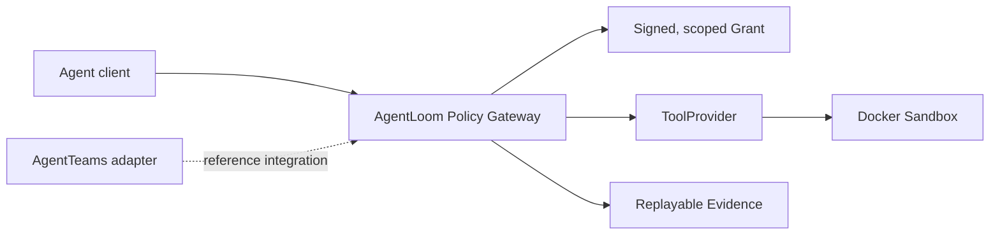

<p align="center">
  
</p>

# AgentLoom

[简体中文](README.md) | English

AgentLoom is an Agent Tool Policy Gateway prototype. It gives Agent tool calls
identity-bound, short-lived single-use Grants, parameter and path restrictions,
approval checks, replay protection, and replayable Evidence.

The project originally validated this control path through a software-repair
scenario on [AgentTeams](https://github.com/agentscope-ai/AgentTeams). AgentTeams,
Higress, Matrix, and MinIO are reference integrations, not the Gateway's core
runtime boundary.

> **Verification baseline (2026-08-25):** AgentTeams `v1.1.2` completed the
> `Administrator -> Manager -> Investigator -> Verifier -> authenticated Higress
> -> Policy Broker -> immutable Docker pytest sandbox` path with
> `minimax-cn / MiniMax-M2.5` and exactly one governed `SUCCEEDED` ToolCall.
> Historical clean-clone Lite evidence is **339 passed / 0 failed / 3 skipped
> (opt-in Docker tests)**; the frozen `v0.1.0` gate is **375 passed / 3 skipped**.
> The latest public-main GitHub Actions gate built the immutable sandbox
> image and passed **380 tests / 0 skipped**; the current worktree collects 380 tests. The
> versioned Task 24 benchmark is **6 PASSED / 0 NOT_RUN**. The Skill catalog is
> **2 PUBLISHED / 4 QUARANTINED**; team-original `patch-scope-validator` v1.0.1
> has three strictly replayed governed invocations. Human L2 approval is `APPROVED`,
> and upstream PR [#1141](https://github.com/agentscope-ai/AgentTeams/pull/1141) remains
> `OPEN`. The real recording, anonymous public playback, and formal `v0.1.0`
> Release are verified. The audited eight-entry P0 package is complete with
> SHA-256 `0c5dfeb0ba6665609a14129a76cc1c239aed882a17e930c144aa5d3b88f6c306`;
> The project is now frozen as a reproducible resume-grade prototype; new
> AgentTeams features and competition-page work are out of scope.

## Project Positioning

- Problem: Agents can call tools, but usually lack enforceable identity,
  authorization, and result boundaries
- Core: Policy Broker, SkillExecutionGrant, ToolProvider, Docker Sandbox, Evidence
- Reference integration: AgentTeams/HiClaw `v1.1.2`, Higress Streamable HTTP,
  Matrix, and MinIO
- Key verification: allowed calls succeed; path escape, parameter tampering,
  identity mismatch, and Grant replay are rejected
- Boundary: this is not a code-review product or an Agent orchestrator, and it
  does not replace OpenCodeReview or AgentTeams

## Verification Evidence

- Paid evidence Provider: `minimax-cn / MiniMax-M2.5`
- Task 24 completed the three-case, two-mode matrix 6/6; Task 17 proves one
  complete governed ToolCall path
- Latest public-main gate: 380 passed / 0 skipped with the immutable Docker
  sandbox tests enabled; frozen `v0.1.0` gate: 375 passed / 3 skipped;
  current local Lite snapshot: 377 passed / 3 skipped / 0 failed (380 collected);
  Ruff, strict
  mypy, and pip-audit pass
- Skill status: `code-review-and-quality` and team-original
  `patch-scope-validator` v1.0.1 are `PUBLISHED`; four upstream Skills remain
  `QUARANTINED`

Historical competition evidence remains indexed in the
[preliminary submission record](docs/competition/agentloom-preliminary-submission.md).
The Gateway boundary and migration plan are in the
[product specification](docs/specs/agent-tool-policy-gateway.md).

## Architecture



The Gateway does not trust an Agent's self-declared identity, path, or success
result. Every governed ToolCall requires an authenticated Principal, a short-lived
one-time `SkillExecutionGrant`, a canonical parameter digest, and Provider
constraints. The Gateway persists nonce consumption and replayable event digests,
then runs untrusted pytest only in a fresh, network-disabled Docker sandbox.

The full design is in the [AgentLoom architecture](docs/architecture/agentloom-architecture.md).

## Model-Free Quick Start

Prerequisites: Python 3.12 and Git. These commands make no model or paid API call.

```powershell
python -m venv .venv
.venv\Scripts\python -m pip install -e ".[dev]"
.venv\Scripts\python -m pytest
.venv\Scripts\ruff check .
.venv\Scripts\mypy src tests
```

Run either deterministic repair case without an LLM or cloud quota:

```powershell
.venv\Scripts\python -m agentloom.mock_repair `
  --case-root .\demo\cases\severity-normalization `
  --output-root .\artifacts\demo\severity-normalization
```

Replace `severity-normalization` with `pagination-boundary` for the second case.
Launch the local evidence control panel with:

```powershell
.venv\Scripts\agentloom tui
```

For the fail-closed clean-clone gate, run the single
[`verify-clean-reproduction.ps1`](scripts/verify-clean-reproduction.ps1) entry
point. It creates new evidence, runs the deterministic Demo and all quality gates,
and emits a redacted JSON summary plus SHA-256. See the
[clean-environment reproduction guide](docs/deployment/clean-environment-reproduction.md)
and the [five-minute quickstart](docs/deployment/quickstart.md).

## AgentTeams Reference Integration

The historical AgentTeams deployment, Provider activation, Policy Broker, Higress,
and strict E2E instructions are in
[deploy/agentteams/README.md](deploy/agentteams/README.md). This reference
integration requires the pinned AgentTeams/HiClaw `v1.1.2` runtime; the repository
does not currently claim to ship a production standalone Gateway distribution.

Maintainer-paid live probes currently use MiniMax. Downstream administrators may
instead supply their own quota through a validated, public-HTTPS
[OpenAI-compatible Provider Profile](docs/specs/openai-compatible-provider-profile.md).
The secret-free Profile stores provider metadata and an environment-variable
name, never the API key. Provider activation occurs only after validation, and a
paid connection probe requires an explicit opt-in switch.

Provider Profile validation proves configuration shape only. Configuration,
connection testing, and strict AgentTeams E2E are separate gates. “OpenAI
compatible” does not prove that an arbitrary model supports the required role
messages, streaming, tool calling, reasoning parameters, context length, or
repair behavior. Private vendor protocols require a separate Adapter and are not
claimed as drop-in compatible.

## Implemented Capabilities

- Stable Capability, Provider, and Consumer boundaries for Skills, Tools, and
  Verifiers, with shared contract tests across implementations
- Strict Pydantic contracts for Agent identity, Skill metadata, Evidence,
  verification, detection, grants, tasks, and replayable task events
- HMAC-signed Grants with expiry, consumer, approval, parameter, and replay
  protection; consumed nonce digests persist across Broker restarts
- Fail-closed detection pipeline and deterministic L1 Skill checks
- Skill catalog with provenance locking, strict schemas, and publish/quarantine
  state: one published Skill and four quarantined Skills
- FastAPI task API, optimistic state transitions, append-only causal events, and
  reversible SQLite/Alembic persistence
- Streamable HTTP Policy Broker behind an authenticated Higress allowlist
- Governed ToolCall events with request/result digests and local Evidence
- Bounded pytest Tool Provider running in a pinned, network-disabled Docker image
  with a read-only workspace, output limits, timeout, and cleanup checks
- Pinned AgentTeams Manager, three business Agent identities, and Human resource
- Secret-free Provider Profiles with model-free validation and opt-in probes
- Investigator-to-Verifier governed delegation bound to exact Matrix event IDs
- Deterministic local repair cases, hidden tests, patch-scope enforcement,
  replay viewers, and a Textual evidence control panel
- Human L2 approval evidence and the `humanMembers` fix in upstream PR #1141,
  which remains open for maintainer review

## Local Broker Development

Create a local database and run the verification-only stdio Broker with a
process-injected development key of at least 32 bytes:

```powershell
.venv\Scripts\alembic upgrade head
$env:AGENTLOOM_POLICY_SIGNING_KEY = "replace-with-a-local-development-secret"
.venv\Scripts\python -m agentloom.policy_mcp
```

The legacy host pytest runner is restricted to trusted local development and
requires both `AGENTLOOM_SANDBOX_BACKEND=local-development` and the explicit
`AGENTLOOM_ALLOW_HOST_TEST_EXECUTION=true` acknowledgement. It is not a container
or network sandbox and must never run untrusted tests. The AgentTeams launcher
uses the pinned Docker backend and does not export that acknowledgement. Never
put the signing key, model credentials, or raw provider secrets in committed MCP,
Worker, or Provider Profile configuration.

## Historical Evidence

> The items below are retained for audit and reproduction. They are **not the
> current evidence baseline**. Qwen and DeepSeek remain disabled because their
> accounts have no balance. MiniMax and StepFun are authorized subscription
> Providers, but every new run must use a unique run ID and exact Provider/model
> evidence. The accepted Task 24 report remains immutable MiniMax history; a
> future MiniMax or StepFun diagnostic must never overwrite it. Do not replay
> historical paid paths as if they were new.

- On 2026-08-04, Qwen `qwen3.7-plus` completed an unattended repair that passed
  independent visible, host-only hidden, and static checks. The generated patch
  SHA-256 is
  `7d9d571a833eabaedf97eac73dad50f6290bfa332d3ef504882398ba2e6d0833`.
  Strict run evidence remains at
  `artifacts/agentteams/live-repair-pagination-qwen-unattended-03.json`; independent
  verification remains under
  `artifacts/live-repair/AL-LIVE-PAGINATION-UNATTENDED-20260804-03/verified/artifacts/`.
- The earlier StepFun four-role rollback and DeepSeek message-baseline evidence
  remain historical inputs to the Human L2 approval record. Their redacted
  summary is in
  [L2 approval and upstream contribution evidence](docs/competition/l2-approval-and-upstream-contribution-evidence.md).
- Historical replay entry points remain `scripts/competition-demo.ps1 -Mode replay`
  and `scripts/competition-rollback-demo.ps1 -Mode replay`. Replay is model-free;
  live mode is a separate, explicitly paid and authorized operation.

## Project Status

The resume-grade prototype is complete and the feature scope is frozen. Future
work is limited to:

1. Fixing reproducible quality or security issues; and
2. Implementing a standalone Gateway profile or another Provider only when a
   real trial user requires it.

The second-host Full bootstrap and evaluation of the four quarantined Skills are
historical extension items, not claims about current completion or production
readiness.

## Provenance

AgentLoom code in this repository is licensed under Apache-2.0. Upstream runtime,
Skill content, dependencies, and design references retain their original
licenses and attribution. See [THIRD_PARTY.md](THIRD_PARTY.md),
[provenance/sources.yaml](provenance/sources.yaml), and [CHANGELOG.md](CHANGELOG.md).

## Security

Use only synthetic fixtures and isolated repositories during the MVP. Do not
mount personal SSH directories, production credentials, or unrelated host paths
into Workers or sandboxes. Report security issues privately to the repository
owner.
