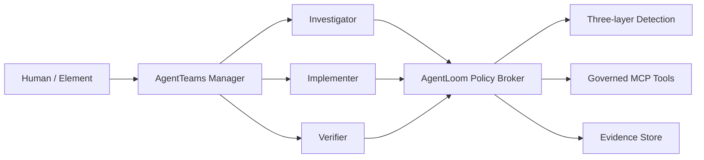

# AgentLoom

Governed, evidence-first SkillOps for multi-Agent software repair on
[AgentTeams](https://github.com/agentscope-ai/AgentTeams).

AgentLoom turns third-party Agent Skills into reviewable, authorized, testable,
and auditable capabilities. Its first competition scenario is a controlled loop
from a GitHub-style issue and failing test to a verified patch and evidence report.

> Status: early MVP. Contracts, grant authorization, static detection, task API,
> optimistic state projection, SQLite persistence, and migrations work. The
> complete repair workflow, Policy Broker MCP transport, and TUI are still in progress.

## Competition Scope

- Track: Agent Infra
- Direction: software-development lifecycle collaboration
- Runtime: AgentTeams/HiClaw `v1.1.2`
- Language: Python 3.12
- Initial storage: SQLite
- Safety default: fail closed

## Architecture



Workers do not receive raw provider credentials. Tool calls require a signed,
short-lived `SkillExecutionGrant`; L2/L3 operations require explicit approval.

Full design: [AgentLoom architecture](docs/architecture/agentloom-architecture.md).

## Implemented

- Strict Pydantic boundary contracts for agents, skills, evidence, verification,
  detection, grants, and tasks
- HMAC-signed Skill grants with expiry, approval, parameter binding, and replay
  protection
- Fail-closed detection pipeline and deterministic L1 Skill checks
- Pinned quarantine catalog and strict input/output schemas for five upstream Skills
- FastAPI create/list/get task API
- Optimistic task state transitions with append-only reasoned events
- Internal Policy Broker boundary for one-time Grant verification
- SQLite persistence and reversible Alembic migration
- Unit and integration test suite

## Local Development

Prerequisites: Python 3.12 and Git.

```powershell
python -m venv .venv
.venv\Scripts\python -m pip install -e ".[dev]"
.venv\Scripts\python -m pytest
.venv\Scripts\ruff check .
.venv\Scripts\mypy src tests
```

Create a local database:

```powershell
.venv\Scripts\alembic upgrade head
```

All model credentials and deployment-specific settings must be supplied through
ignored environment files or process environment variables. Never commit them.

### Automatic development dispatcher

The dispatcher reads the architecture, development backlog, Git state, and task
acceptance commands. It then chooses Luna, Terra, or Sol and runs one bounded Codex
task at a time. Credentials, payment, publication, external writes, destructive
operations, and irreversible changes always stop for a human decision.

```powershell
.venv\Scripts\python -m pip install -e ".[dev]"
.venv\Scripts\agentloom-dev plan
.venv\Scripts\agentloom-dev start
.venv\Scripts\agentloom-dev status
```

`start` executes one task by default. Use `--max-tasks 2` or `3` only when the
previous task boundaries and expected Codex usage are acceptable. The dispatcher
never commits or pushes changes; review its diff before the next task.

Full dispatcher design:
[Development Dispatcher architecture](docs/architecture/development-dispatcher-architecture.md).

## Roadmap to Demo

1. Verify AgentTeams/HiClaw `v1.1.2` deployment.
2. Evaluate and publish the five quarantined upstream Skills.
3. Register Manager, Investigator, Implementer, Verifier, Team, and Human resources.
4. Expose the Policy Broker through MCP.
5. Complete normal, failure, approval, and rollback repair paths.
6. Add the Textual/Rich TUI and reproducible Docker launch.

## Provenance

AgentLoom code in this repository is licensed under Apache-2.0. Upstream runtime,
Skill content, dependencies, and design references retain their original licenses
and attribution. See [THIRD_PARTY.md](THIRD_PARTY.md) and
[provenance/sources.yaml](provenance/sources.yaml).

## Security

Use only synthetic fixtures and isolated repositories during the initial MVP.
Do not mount personal SSH directories, production credentials, or unrelated host
paths into workers. Report security issues privately to the repository owner.
