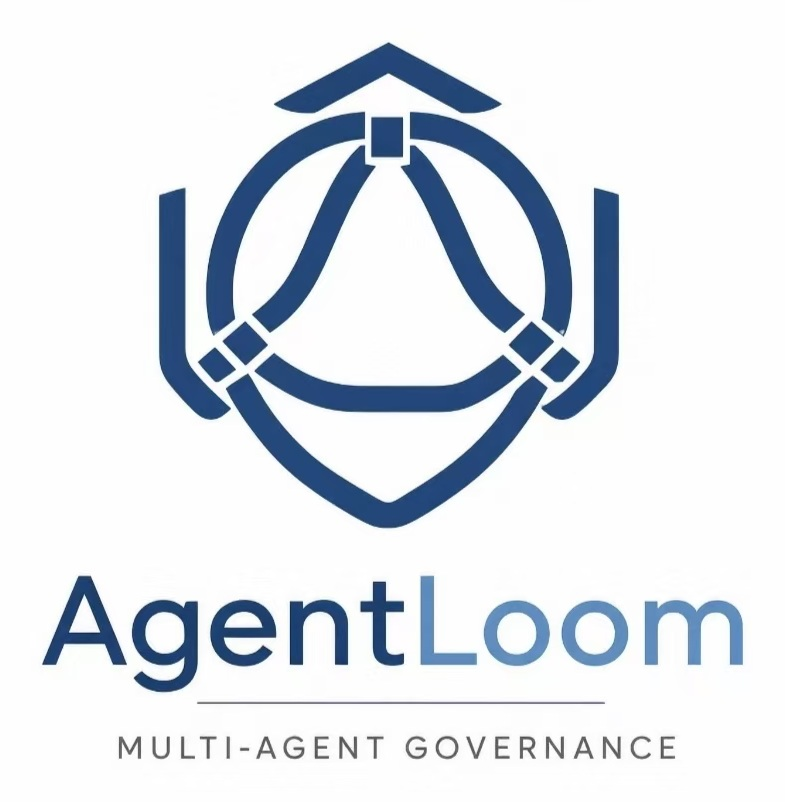
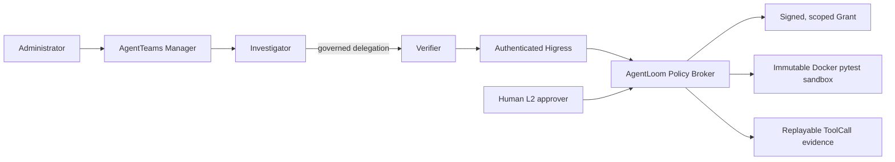

<p align="center">
  
</p>

# AgentLoom

[English](README.md) | [简体中文](README.zh-CN.md)

Governed, evidence-first SkillOps for multi-Agent software repair on
[AgentTeams](https://github.com/agentscope-ai/AgentTeams).

AgentLoom turns third-party Agent Skills into reviewable, authorized, testable,
and auditable capabilities. Its competition scenario starts with a production-style
repair task and ends with independently verified, replayable evidence.

> **Current evidence baseline (2026-08-15):** AgentTeams `v1.1.2` completed the
> `Administrator -> Manager -> Investigator -> Verifier -> authenticated Higress
> -> Policy Broker -> immutable Docker pytest sandbox` path with
> `minimax-cn / MiniMax-M2.5` and exactly one governed `SUCCEEDED` ToolCall.
> The repository gate is **323 passed / 2 failed (TUI tests, non-blocking) / 3 skipped
> (opt-in Docker tests)**. The Skill catalog is **1 PUBLISHED / 4 QUARANTINED**; the
> original supply-chain audit is still a prototype. Human L2 approval is `APPROVED`,
> and upstream PR [#1141](https://github.com/agentscope-ai/AgentTeams/pull/1141) remains
> `OPEN`. The deterministic P0 package is complete; the real recording, public upload,
> and competition-page submission remain Human-owned checkpoints.

## Competition Evidence

- Track: Agent Infra
- Direction: software-development lifecycle collaboration
- Runtime: AgentTeams/HiClaw `v1.1.2`
- Current paid evidence Provider: `minimax-cn / MiniMax-M2.5`
- Current result: one governed successful ToolCall through Higress, the Policy
  Broker, and a fresh Docker sandbox
- Quality gate: 323 passed / 2 failed (TUI tests, non-blocking) / 3 skipped
  (opt-in Docker); Ruff, strict mypy, pip-audit, syntax, migration, diff, and
  secret checks passed
- Skill status: `code-review-and-quality` is `PUBLISHED`; four upstream Skills
  are `QUARANTINED`
- Submission status: P0 artifact package complete; recording, upload, and final
  submission pending

The current evidence and submission claims are indexed in the
[preliminary submission record](docs/competition/agentloom-preliminary-submission.md).

## Architecture



The Manager is not authorized to call the Policy Broker. Workers do not receive
the Broker signing key. A governed ToolCall requires an authenticated Worker
identity plus a short-lived, consumer-bound, parameter-bound, one-time
`SkillExecutionGrant`. The Broker persists nonce consumption and replayable event
digests, then runs untrusted pytest only in a fresh, network-disabled Docker
sandbox with a read-only workspace. Policy, identity, sandboxing, and Agent scope
are runtime controls rather than prompt-only instructions.

The full design is in the [AgentLoom architecture](docs/architecture/agentloom-architecture.md).

## Model-Free Quick Start

Prerequisites: Python 3.12 and Git. These commands make no model or paid API call.

```powershell
python -m venv .venv
.venv\Scripts\python -m pip install -e ".[dev]"
.venv\Scripts\python -m pytest
.venv\Scripts\ruff check .
.venv\Scripts\mypy src tests
```

Run either deterministic repair case without an LLM or cloud quota:

```powershell
.venv\Scripts\python -m agentloom.mock_repair `
  --case-root .\demo\cases\severity-normalization `
  --output-root .\artifacts\demo\severity-normalization
```

Replace `severity-normalization` with `pagination-boundary` for the second case.
Launch the local evidence control panel with:

```powershell
.venv\Scripts\agentloom tui
```

For the guided Windows path, use `scripts/bootstrap.ps1 -Profile lite`, then
`scripts/demo.ps1`. See the [five-minute quickstart](docs/deployment/quickstart.md).

## Full AgentTeams Deployment

The authoritative deployment, Provider activation, Policy Broker, Higress, and
strict E2E instructions are in [deploy/agentteams/README.md](deploy/agentteams/README.md).
Full mode requires the pinned AgentTeams/HiClaw `v1.1.2` runtime; AgentLoom does
not provide a standalone one-container distribution.

Maintainer-paid live probes currently use MiniMax. Downstream administrators may
instead supply their own quota through a validated, public-HTTPS
[OpenAI-compatible Provider Profile](docs/specs/openai-compatible-provider-profile.md).
The secret-free Profile stores provider metadata and an environment-variable
name, never the API key. Provider activation occurs only after validation, and a
paid connection probe requires an explicit opt-in switch.

Provider Profile validation proves configuration shape only. Configuration,
connection testing, and strict AgentTeams E2E are separate gates. “OpenAI
compatible” does not prove that an arbitrary model supports the required role
messages, streaming, tool calling, reasoning parameters, context length, or
repair behavior. Private vendor protocols require a separate Adapter and are not
claimed as drop-in compatible.

## Implemented Capabilities

- Stable Capability, Provider, and Consumer boundaries for Skills, Tools, and
  Verifiers, with shared contract tests across implementations
- Strict Pydantic contracts for Agent identity, Skill metadata, Evidence,
  verification, detection, grants, tasks, and replayable task events
- HMAC-signed Grants with expiry, consumer, approval, parameter, and replay
  protection; consumed nonce digests persist across Broker restarts
- Fail-closed detection pipeline and deterministic L1 Skill checks
- Skill catalog with provenance locking, strict schemas, and publish/quarantine
  state: one published Skill and four quarantined Skills
- FastAPI task API, optimistic state transitions, append-only causal events, and
  reversible SQLite/Alembic persistence
- Streamable HTTP Policy Broker behind an authenticated Higress allowlist
- Governed ToolCall events with request/result digests and local Evidence
- Bounded pytest Tool Provider running in a pinned, network-disabled Docker image
  with a read-only workspace, output limits, timeout, and cleanup checks
- Pinned AgentTeams Manager, three business Agent identities, and Human resource
- Secret-free Provider Profiles with model-free validation and opt-in probes
- Investigator-to-Verifier governed delegation bound to exact Matrix event IDs
- Deterministic local repair cases, hidden tests, patch-scope enforcement,
  replay viewers, and a Textual evidence control panel
- Human L2 approval evidence and the `humanMembers` fix in upstream PR #1141,
  which remains open for maintainer review

## Local Broker Development

Create a local database and run the verification-only stdio Broker with a
process-injected development key of at least 32 bytes:

```powershell
.venv\Scripts\alembic upgrade head
$env:AGENTLOOM_POLICY_SIGNING_KEY = "replace-with-a-local-development-secret"
.venv\Scripts\python -m agentloom.policy_mcp
```

The legacy host pytest runner is restricted to trusted local development and
requires both `AGENTLOOM_SANDBOX_BACKEND=local-development` and the explicit
`AGENTLOOM_ALLOW_HOST_TEST_EXECUTION=true` acknowledgement. It is not a container
or network sandbox and must never run untrusted tests. The AgentTeams launcher
uses the pinned Docker backend and does not export that acknowledgement. Never
put the signing key, model credentials, or raw provider secrets in committed MCP,
Worker, or Provider Profile configuration.

## Historical Evidence

> The items below are retained for audit and reproduction. They are **not the
> current evidence baseline**. Qwen, DeepSeek, and StepFun are disabled for
> maintainer-paid calls until quota is restored and use is explicitly
> reauthorized. Do not run these historical paid paths by default.

- On 2026-08-04, Qwen `qwen3.7-plus` completed an unattended repair that passed
  independent visible, host-only hidden, and static checks. The generated patch
  SHA-256 is
  `7d9d571a833eabaedf97eac73dad50f6290bfa332d3ef504882398ba2e6d0833`.
  Strict run evidence remains at
  `artifacts/agentteams/live-repair-pagination-qwen-unattended-03.json`; independent
  verification remains under
  `artifacts/live-repair/AL-LIVE-PAGINATION-UNATTENDED-20260804-03/verified/artifacts/`.
- The earlier StepFun four-role rollback and DeepSeek message-baseline evidence
  remain historical inputs to the Human L2 approval record. Their redacted
  summary is in
  [L2 approval and upstream contribution evidence](docs/competition/l2-approval-and-upstream-contribution-evidence.md).
- Historical replay entry points remain `scripts/competition-demo.ps1 -Mode replay`
  and `scripts/competition-rollback-demo.ps1 -Mode replay`. Replay is model-free;
  live mode is a separate, explicitly paid and authorized operation.

## Remaining Roadmap

1. Record the real public competition demo from verified evidence, upload it,
   validate the public link, and complete the competition-page submission.
2. Publish a repository release/tag and verify public repository access.
3. Evaluate the four quarantined upstream Skills; publish only those that pass
   the Skill Eval and provenance gates.
4. Validate Full bootstrap on additional clean Windows machines and publish a
   deployment compatibility matrix.

## Provenance

AgentLoom code in this repository is licensed under Apache-2.0. Upstream runtime,
Skill content, dependencies, and design references retain their original
licenses and attribution. See [THIRD_PARTY.md](THIRD_PARTY.md),
[provenance/sources.yaml](provenance/sources.yaml), and [CHANGELOG.md](CHANGELOG.md).

## Security

Use only synthetic fixtures and isolated repositories during the MVP. Do not
mount personal SSH directories, production credentials, or unrelated host paths
into Workers or sandboxes. Report security issues privately to the repository
owner.
