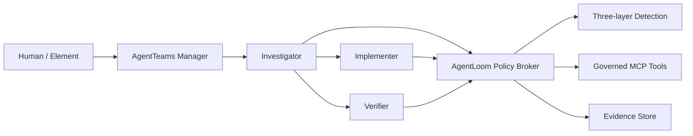

# AgentLoom

Governed, evidence-first SkillOps for multi-Agent software repair on
[AgentTeams](https://github.com/agentscope-ai/AgentTeams).

AgentLoom turns third-party Agent Skills into reviewable, authorized, testable,
and auditable capabilities. Its first competition scenario is a controlled loop
from a GitHub-style issue and failing test to a verified patch and evidence report.

> Status: early MVP. Contracts, grant authorization, static detection, task API,
> optimistic state projection, SQLite persistence, migrations, the Policy Broker
> MCP transport, bounded repair workflow, and pinned AgentTeams four-role runtime
> are implemented. The TUI and complete repair-artifact E2E are still in progress.

## Competition Scope

- Track: Agent Infra
- Direction: software-development lifecycle collaboration
- Runtime: AgentTeams/HiClaw `v1.1.2`
- Language: Python 3.12
- Initial storage: SQLite
- Safety default: fail closed

## Architecture



Workers do not receive raw provider credentials. Tool calls require a signed,
short-lived `SkillExecutionGrant`; L2/L3 operations require explicit approval.

Full design: [AgentLoom architecture](docs/architecture/agentloom-architecture.md).

## Implemented

- Strict Pydantic boundary contracts for agents, skills, evidence, verification,
  detection, grants, and tasks
- HMAC-signed Skill grants with expiry, approval, parameter binding, and replay
  protection
- Fail-closed detection pipeline and deterministic L1 Skill checks
- Pinned quarantine catalog and strict input/output schemas for five upstream Skills
- FastAPI create/list/get task API
- Optimistic task state transitions with append-only reasoned events
- Internal API and stdio MCP boundaries for one-time Grant verification
- SQLite persistence and reversible Alembic migration
- Deterministic repair workflow with investigation, implementation, independent verification, approval, failure, and rollback states
- Pinned AgentTeams `v1.1.2` Manager, Team Leader, two Workers, and Human resources
- Strict Matrix E2E with role-owned markers from all four Agent identities
- Hash-verified AgentTeams global-to-team parent-task namespace bridge
- Offline repair-artifact E2E with a real failing test, patch, verification, and evidence
- Unit and integration test suite

## Local Development

Prerequisites: Python 3.12 and Git.

```powershell
python -m venv .venv
.venv\Scripts\python -m pip install -e ".[dev]"
.venv\Scripts\python -m pytest
.venv\Scripts\ruff check .
.venv\Scripts\mypy src tests
```

Create a local database:

```powershell
.venv\Scripts\alembic upgrade head
```

Run the Policy Broker MCP server over stdio with a process-injected signing key of
at least 32 bytes:

```powershell
$env:AGENTLOOM_POLICY_SIGNING_KEY = "replace-with-a-local-development-secret"
.venv\Scripts\python -m agentloom.policy_mcp
```

Configure AgentTeams workers with only this server. The exposed
`verify_skill_execution_grant` tool accepts the strict `GrantVerificationRequest`
contract, consumes the Grant nonce on success, and returns `POLICY_DENIED` for an
invalid signature, expiry, parameter mismatch, or replay. Do not place the signing
key in a committed MCP configuration file; inject it through the worker process
environment.

All model credentials and deployment-specific settings must be supplied through
ignored environment files or process environment variables. Never commit them.

AgentTeams deployment, cloud-provider activation, local fallback, and strict E2E
instructions are in [deploy/agentteams/README.md](deploy/agentteams/README.md).

## Roadmap to Demo

1. Replace Mock role outputs with one live four-role repair-artifact workflow.
2. Evaluate and publish the five quarantined upstream Skills.
3. Add the Textual/Rich TUI for tasks, evidence, approvals, and reports.
4. Add reproducible Docker launch.

## Provenance

AgentLoom code in this repository is licensed under Apache-2.0. Upstream runtime,
Skill content, dependencies, and design references retain their original licenses
and attribution. See [THIRD_PARTY.md](THIRD_PARTY.md) and
[provenance/sources.yaml](provenance/sources.yaml).

## Security

Use only synthetic fixtures and isolated repositories during the initial MVP.
Do not mount personal SSH directories, production credentials, or unrelated host
paths into workers. Report security issues privately to the repository owner.
