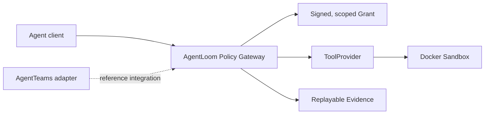

<p align="center">
  
</p>

# AgentLoom

简体中文 | [English](README.en.md)

AgentLoom 是一个 Agent Tool Policy Gateway 原型，为 Agent 工具调用提供身份绑定、
短时单次 Grant、参数与路径限制、审批、防重放和可回放 Evidence。

项目最初以 [AgentTeams](https://github.com/agentscope-ai/AgentTeams) 软件修复场景
验证这条控制链路；AgentTeams、Higress、Matrix 和 MinIO 是参考集成，不是 Gateway
核心运行时的产品边界。

> **验证基线（2026-08-25）：** AgentTeams `v1.1.2` 使用
> `minimax-cn / MiniMax-M2.5` 完成了 `Administrator -> Manager -> Investigator
> -> Verifier -> 已认证 Higress -> Policy Broker -> 不可变 Docker pytest 沙箱`
> 链路，并产生且仅产生一个受治理的 `SUCCEEDED` ToolCall。历史 clean-clone
> Lite 证据为 **339 passed / 0 failed / 3 skipped（可选 Docker 测试）**，冻结
> `v0.1.0` 门禁为 **375 passed / 3 skipped**。当前 public main 的 GitHub Actions
> 会构建不可变沙箱镜像；最新 Full 证据为 **380 passed / 0 skipped**，当前工作树
> 收集 380 项测试；Task 24 两模式基准为
> **6 PASSED / 0 NOT_RUN**。Skill 目录状态为 **2 PUBLISHED / 4 QUARANTINED**；
> 团队原创 `patch-scope-validator` v1.0.1 的三次治理调用均已严格重开。
> Human L2 审批为 `APPROVED`，上游 PR
> [#1141](https://github.com/agentscope-ai/AgentTeams/pull/1141) 仍为 `OPEN`。
> 真人录制、匿名公开播放和正式 `v0.1.0` Release 均已验证。最终八项 P0
> 提交包已完成审计，SHA-256 为
> `0c5dfeb0ba6665609a14129a76cc1c239aed882a17e930c144aa5d3b88f6c306`；
> 项目当前冻结为可复现的简历版原型，不再以竞赛页面或新的 AgentTeams 功能为开发目标。

## 项目定位

- 问题：Agent 可以调用工具，但默认缺少可验证的身份、权限和结果边界
- 核心：Policy Broker、SkillExecutionGrant、ToolProvider、Docker Sandbox、Evidence
- 参考集成：AgentTeams/HiClaw `v1.1.2`、Higress Streamable HTTP、Matrix 和 MinIO
- 关键验证：合法调用成功，越权路径、参数篡改、身份不匹配和 Grant 重放被拒绝
- 产品边界：不做代码审查产品，不做 Agent 编排器，不替代 OpenCodeReview 或 AgentTeams

## 验证证据

- 当前付费证据 Provider：`minimax-cn / MiniMax-M2.5`
- Task 24 三案例两模式矩阵完成 6/6；Task 17 证明一条完整受治理 ToolCall 链路
- 最新 public main Full 门禁：启用不可变 Docker 沙箱测试后 380 passed / 0 skipped；
  冻结 `v0.1.0` 门禁：375 passed / 3 skipped；当前本地 Lite 快照：
  377 passed / 3 skipped / 0 failed（当前工作树共收集 380 项）；Ruff、strict mypy、pip-audit 通过
- Skill 状态：`code-review-and-quality` 与团队原创 `patch-scope-validator` v1.0.1
  为 `PUBLISHED`，其余四个上游 Skill 保持 `QUARANTINED`

完整历史竞赛证据仍见[初赛提交记录](docs/competition/agentloom-preliminary-submission.md)。
Gateway 的目标边界和迁移计划见[产品规格](docs/specs/agent-tool-policy-gateway.md)。

## 架构



Gateway 不信任 Agent 自己声明的身份、路径或成功结果。每次受治理 ToolCall 必须
同时具备已认证 Principal、短时有效且单次使用的 `SkillExecutionGrant`、规范化参数
摘要和 Provider 约束。Gateway 持久化 nonce 消费记录和可回放事件摘要，并把不可信
pytest 放入全新、禁网、只读挂载工作区的 Docker 沙箱运行。

完整设计见 [AgentLoom 架构设计](docs/architecture/agentloom-architecture.md)。

## 无模型快速开始

前置条件：Python 3.12 和 Git。以下命令不会调用模型或付费 API。

```powershell
python -m venv .venv
.venv\Scripts\python -m pip install -e ".[dev]"
.venv\Scripts\python -m pytest
.venv\Scripts\ruff check .
.venv\Scripts\mypy src tests
```

无需 LLM 或云额度即可运行任一确定性修复案例：

```powershell
.venv\Scripts\python -m agentloom.mock_repair `
  --case-root .\demo\cases\severity-normalization `
  --output-root .\artifacts\demo\severity-normalization
```

将 `severity-normalization` 替换成 `pagination-boundary` 即可运行第二个案例。
本地证据控制面板的启动方式为：

```powershell
.venv\Scripts\agentloom tui
```

清洁 clone 的失败关闭门禁只有一个入口：
[`scripts/verify-clean-reproduction.ps1`](scripts/verify-clean-reproduction.ps1)。
它创建全新证据、运行确定性 Demo 和全部质量门禁，并输出脱敏 JSON 摘要及 SHA-256。
详见[清洁环境复现指南](docs/deployment/clean-environment-reproduction.md)和
[五分钟快速开始](docs/deployment/quickstart.md)。

## AgentTeams 参考集成

AgentTeams 部署、Provider 激活、Policy Broker、Higress 和严格 E2E 的历史验证说明位于
[deploy/agentteams/README.md](deploy/agentteams/README.md)。Full 模式要求预先安装
锁定版本的 AgentTeams/HiClaw `v1.1.2`；当前仓库还没有声称提供生产级的独立
Gateway 发行版。

已固化的维护者付费证据只使用 MiniMax。新的 Live 探测可按场景选择 MiniMax 或
StepFun，但必须使用唯一 run ID 并记录准确 Provider/模型。下游管理员也可以用
自己的额度，通过经过验证、使用公共 HTTPS 的
[OpenAI-compatible Provider Profile](docs/specs/openai-compatible-provider-profile.md)
接入 Provider。无密钥 Profile 只保存 Provider 元数据和环境变量名称，不保存 API
Key。Provider 只有通过验证后才会激活，付费连接探测还必须显式开启确认开关。

Provider Profile 验证只证明配置结构正确。配置、连接测试和严格 AgentTeams E2E
是三个独立门禁。“OpenAI-compatible”并不证明任意模型都支持所需的角色消息、
流式输出、工具调用、reasoning 参数、上下文长度或修复行为。厂商私有协议需要单独
实现 Adapter，不能直接视为即插即用。

## 已实现能力

- 面向 Skill、Tool 和 Verifier 的稳定 Capability、Provider、Consumer 边界，
  不同实现复用同一组契约测试
- Agent 身份、Skill 元数据、Evidence、验证、检测、Grant、任务和可回放任务事件的
  严格 Pydantic 契约
- HMAC 签名 Grant：绑定有效期、Consumer、审批、参数并防重放；Broker 重启后仍
  持久化已消费 nonce 摘要
- 失败关闭的检测流水线和确定性 L1 Skill 检查
- 具有来源锁定、严格 Schema 和发布/隔离状态的 Skill 目录：一个上游 Skill 和一个
  团队原创 Skill 已发布，另外四个上游 Skill 隔离
- FastAPI 任务 API、乐观状态迁移、追加式因果事件及可逆 SQLite/Alembic 持久化
- 位于 Higress 身份认证和白名单之后的 Streamable HTTP Policy Broker
- 带请求/结果摘要和本地 Evidence 的受治理 ToolCall 事件
- 运行于锁定镜像中的 pytest Tool Provider：禁网、只读工作区、限制输出和超时，
  并验证容器清理
- 锁定版本的 AgentTeams Manager、三个业务 Agent 身份和 Human 资源
- 无密钥 Provider Profile、无模型校验和显式启用的连接探测
- 绑定精确 Matrix event ID 的 Investigator-to-Verifier 受治理委派
- 确定性本地修复案例、隐藏测试、补丁范围约束、回放查看器和 Textual 证据面板
- Human L2 审批证据，以及仍等待维护者审查的上游 PR #1141 `humanMembers` 修复

## 本地 Broker 开发

创建本地数据库，并用至少 32 字节、仅注入进程环境的开发密钥启动验证型 stdio
Broker：

```powershell
.venv\Scripts\alembic upgrade head
$env:AGENTLOOM_POLICY_SIGNING_KEY = "replace-with-a-local-development-secret"
.venv\Scripts\python -m agentloom.policy_mcp
```

旧的宿主机 pytest runner 只允许用于可信本地开发，并同时要求
`AGENTLOOM_SANDBOX_BACKEND=local-development` 和显式确认
`AGENTLOOM_ALLOW_HOST_TEST_EXECUTION=true`。它不是容器或网络沙箱，绝不能执行
不可信测试。AgentTeams 启动器使用锁定的 Docker 后端，也不会导出该确认变量。
签名密钥、模型凭据和 Provider 原始密钥都不得写入已提交的 MCP、Worker 或 Provider
Profile 配置。

## 历史证据

> 以下内容仅为审计和复现而保留，**不是当前证据基线**。Qwen、DeepSeek 因账户
> 无余额继续禁用。MiniMax 和 StepFun 均已获得订阅调用授权，但每次新运行必须使用
> 唯一 run ID 并记录准确 Provider/模型；StepFun 证据不得混入只允许 MiniMax 的
> Task 24 版本化基准。不得把历史付费链路冒充为新运行。

- 2026-08-04，Qwen `qwen3.7-plus` 曾完成无人值守修复，并通过独立的可见测试、
  主机专属隐藏测试和静态检查。生成补丁 SHA-256 为
  `7d9d571a833eabaedf97eac73dad50f6290bfa332d3ef504882398ba2e6d0833`。
  严格运行证据仍位于
  `artifacts/agentteams/live-repair-pagination-qwen-unattended-03.json`，独立验证证据仍位于
  `artifacts/live-repair/AL-LIVE-PAGINATION-UNATTENDED-20260804-03/verified/artifacts/`。
- 更早的 StepFun 四角色回滚和 DeepSeek 消息基线证据仍作为 Human L2 审批记录的
  历史输入。脱敏摘要见
  [L2 审批与上游贡献证据](docs/competition/l2-approval-and-upstream-contribution-evidence.md)。
- 历史回放入口保留为 `scripts/competition-demo.ps1 -Mode replay` 和
  `scripts/competition-rollback-demo.ps1 -Mode replay`。回放无需模型；Live 模式是独立、
  必须明确付费并授权的操作。

## 项目状态

项目已完成简历版收尾并冻结功能范围。后续只保留两类工作：

1. 修复可复现的质量门禁或安全问题；
2. 只有出现真实试用团队时，才继续实现独立 Gateway profile 或新的 Provider。

第二主机 Full bootstrap 和四个隔离 Skill 的评测属于未完成的历史扩展项，
不作为当前项目完成度或生产能力声明。

## 开源与来源

AgentLoom 代码采用 Apache-2.0 许可证。上游运行时、Skill 内容、依赖和设计参考保留
各自许可证及署名要求。详见 [THIRD_PARTY.md](THIRD_PARTY.md)、
[provenance/sources.yaml](provenance/sources.yaml) 和 [CHANGELOG.md](CHANGELOG.md)。

## 安全

MVP 阶段只使用合成 fixture 和隔离仓库。不要把个人 SSH 目录、生产凭据或无关主机
路径挂载到 Worker 或沙箱。安全问题请私下联系仓库所有者。
