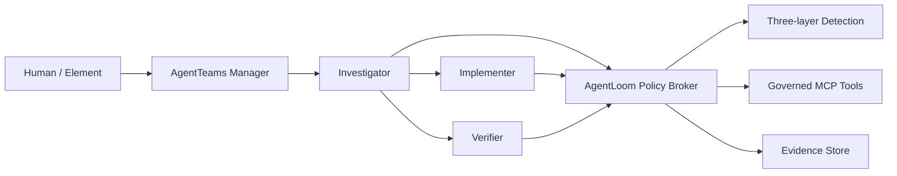

# AgentLoom

Governed, evidence-first SkillOps for multi-Agent software repair on
[AgentTeams](https://github.com/agentscope-ai/AgentTeams).

AgentLoom turns third-party Agent Skills into reviewable, authorized, testable,
and auditable capabilities. Its first competition scenario is a controlled loop
from a GitHub-style issue and failing test to a verified patch and evidence report.

> Status: early MVP. Contracts, grant authorization, static detection, task API,
> optimistic state projection, SQLite persistence, migrations, the Policy Broker
> MCP transport, bounded repair workflow, and pinned AgentTeams four-role runtime
> are implemented. The manifest-driven Mock repair-artifact E2E is complete; the
> local TUI is complete; an unattended Qwen model-generated repair has passed the
> independent hidden-test boundary with strict AgentTeams and MinIO evidence.

## Competition Scope

- Track: Agent Infra
- Direction: software-development lifecycle collaboration
- Runtime: AgentTeams/HiClaw `v1.1.2`
- Live repair model: `qwen3.7-plus` unattended repair independently verified
- Message baseline: `deepseek-v4-flash` Manager + three-Worker messaging only
- Language: Python 3.12
- Initial storage: SQLite
- Safety default: fail closed

## Architecture



Workers do not receive raw provider credentials. Tool calls require a signed,
short-lived `SkillExecutionGrant`; L2/L3 operations require explicit approval.

Full design: [AgentLoom architecture](docs/architecture/agentloom-architecture.md).

## Deployment

For a no-cloud Windows trial, clone the repository and run:

```powershell
.\scripts\bootstrap.ps1 -Profile lite
.\scripts\demo.ps1
```

See the [five-minute quickstart](docs/deployment/quickstart.md),
[full AgentTeams deployment](docs/deployment/windows-agentteams.md), and
[troubleshooting guide](docs/deployment/troubleshooting.md). Full mode requires
the official AgentTeams/HiClaw `v1.1.2` runtime to be installed first; AgentLoom
does not currently provide a standalone one-container distribution.

## Implemented

- Strict Pydantic boundary contracts for agents, skills, evidence, verification,
  detection, grants, and tasks
- HMAC-signed Skill grants with expiry, approval, parameter binding, and replay
  protection
- Fail-closed detection pipeline and deterministic L1 Skill checks
- Pinned quarantine catalog and strict input/output schemas for five upstream Skills
- FastAPI create/list/get task API
- Optimistic task state transitions with append-only reasoned events
- Internal API and stdio MCP boundaries for one-time Grant verification
- SQLite persistence and reversible Alembic migration
- Deterministic repair workflow with investigation, implementation, independent verification, approval, failure, and rollback states
- Pinned AgentTeams `v1.1.2` Manager, Team Leader, two Workers, and Human resources
- Strict Matrix E2E with role-owned markers from all four Agent identities
- Hash-verified AgentTeams global-to-team parent-task namespace bridge
- Manifest-driven offline repair-artifact E2E with two independent failing cases,
  isolated hidden tests, patch-scope enforcement, and evidence
- Fail-closed verifier for role-traced live AgentTeams submissions, including
  patch hash/path binding and independent visible, hidden, and static checks
- Unattended `qwen3.7-plus` AgentTeams repair E2E with automatic clean-task
  staging, three role-owned Matrix events, allowlisted MinIO artifacts, immutable
  input fingerprints, and host-only hidden tests
- Textual control panel for selecting cases and viewing role status, task events,
  verified artifacts, approval queue/detail, Human decisions, and local failure
  states
- Strict three-layer live evidence projection in the TUI, binding current
  AgentTeams health, role-owned Matrix events, and independent host verification
- Guarded competition entrypoint with free evidence replay by default and an
  explicit confirmation gate before a paid Qwen live repair
- Fail-closed L2 Matrix approval verifier with exact Manager request, Team Room,
  Human sender, timestamp, request hash, route, and rollback-plan binding
- Unit and integration test suite

## Local Development

Prerequisites: Python 3.12 and Git.

```powershell
python -m venv .venv
.venv\Scripts\python -m pip install -e ".[dev]"
.venv\Scripts\python -m pytest
.venv\Scripts\ruff check .
.venv\Scripts\mypy src tests
.venv\Scripts\python -m pip_audit .
```

`pip-audit` is installed by the `.[dev]` extra. To add it to an existing virtual
environment without reinstalling the project, run
`.venv\Scripts\python -m pip install "pip-audit>=2.10,<3"`.

Create a local database:

```powershell
.venv\Scripts\alembic upgrade head
```

Run the Policy Broker MCP server over stdio with a process-injected signing key of
at least 32 bytes:

```powershell
$env:AGENTLOOM_POLICY_SIGNING_KEY = "replace-with-a-local-development-secret"
.venv\Scripts\python -m agentloom.policy_mcp
```

Configure AgentTeams workers with only this server. The exposed
`verify_skill_execution_grant` tool accepts the strict `GrantVerificationRequest`
contract, consumes the Grant nonce on success, and returns `POLICY_DENIED` for an
invalid signature, expiry, parameter mismatch, or replay. Do not place the signing
key in a committed MCP configuration file; inject it through the worker process
environment.

All model credentials and deployment-specific settings must be supplied through
ignored environment files or process environment variables. Never commit them.

AgentTeams deployment, cloud-provider activation, local fallback, and strict E2E
instructions are in [deploy/agentteams/README.md](deploy/agentteams/README.md).

## Reproducible Demo Cases

Each case under `demo/cases/<case-id>` is defined by a strict `case.json`, an
independent `provenance.json`, a frozen `before/` snapshot, a deterministic
`expected/` patch source, and verifier-only `hidden-tests/`. The loader rejects
unknown fields, path traversal, shell commands, unrecognized licenses, snapshot
hash mismatches, excessive timeouts, oversized command output, and undeclared
file modifications. Commands are argument arrays mapped only to the current
Python interpreter's `pytest` or `compileall` module.

Run either case without an LLM or cloud quota:

```powershell
.venv\Scripts\python -m agentloom.mock_repair `
  --case-root .\demo\cases\severity-normalization `
  --output-root .\artifacts\demo\severity-normalization
```

Replace `severity-normalization` with `pagination-boundary` for the second
defect type. The generated artifact contracts are identical for both cases.

Launch the local demo control panel:

```powershell
.venv\Scripts\agentloom tui
```

The panel runs the deterministic local Case workflow and reads the ignored local
approval database. It shows the Manager, Investigator, Implementer, and Verifier
states, append-only task events, root cause, patch hash, verification verdict, risk
verdict, artifact directory, and parameter-bound L2 approval decisions. The
`Run failure / retry` action produces a local ten-transition demonstration in
which the first configured workflow outcome fails, `ROLLING_BACK` and
`ROLLED_BACK` are recorded, one bounded retry reaches completion, and
`failure-retry-evidence.json` records the branch.
Use
`--approval-database` to point the panel at a database populated through the local
approval API. Approval and rejection require a Human button click plus a non-empty
reason. The panel does not call a cloud model, expose deployment credentials, or
claim that its deterministic retry evidence is a live AgentTeams Trace. The retry
branch is state-machine evidence only: it does not generate a patch or run tests
and risk checks.

Replay the latest verified AgentTeams repair in the same panel without calling a
model:

```powershell
.\scripts\competition-demo.ps1 -Mode replay
```

The viewer fails closed unless `health.json`, the strict AgentTeams run evidence,
and the independent host verification bind to the same task, model, submission
hash, and three Matrix events. Local Mock controls are disabled in Live Evidence
mode so the two evidence classes cannot be confused.

The rollback path is separate from the local state-machine demonstration. A live
run collects four role-owned Matrix events, then the independent host applies a
known failed candidate in an isolated workspace, reproduces the failure, restores
the approved snapshot byte-for-byte, and reruns visible, hidden, and static checks:

```powershell
.\scripts\competition-rollback-demo.ps1 `
  -Mode live `
  -TaskId AL-LIVE-ROLLBACK-001 `
  -ConfirmPaidRun
```

Live mode can consume model quota and refuses to run without the explicit switch
and a fresh task ID. After one successful collection, replay its verified evidence
without a model call:

```powershell
.\scripts\competition-rollback-demo.ps1 -Mode replay
```

The verifier and TUI path are implemented, but no live rollback run is claimed in
this repository until the paid collection command completes successfully.

## Live Repair Verification Boundary

After a live AgentTeams run, assemble the three business Agents' role-owned
Matrix events, structured repair bundle, and exact model-generated unified diff
into a strict `agentloom.live-repair-submission/v1alpha1` JSON document. Verify
that submission against the frozen Case in a clean local workspace:

```powershell
.venv\Scripts\agentloom verify-live `
  --submission .\artifacts\agentteams\live-repair-submission.json `
  --case-root .\demo\cases\severity-normalization `
  --output-root .\artifacts\live-repair\severity-normalization
```

The verifier accepts only `qwen3.7-plus` through DashScope or
`deepseek-v4-pro` through DeepSeek. It requires distinct Investigator,
Implementer, and Verifier Matrix events, checks every artifact against the task
and patch hash, rejects paths outside the Case allowlist, applies the patch with
`git apply`, and independently reruns the original failure, visible tests,
verifier-only hidden tests, and static checks. It does not call a model or create
Matrix evidence; the live orchestration step must supply authentic event IDs.

On 2026-08-04, task `AL-LIVE-PAGINATION-UNATTENDED-20260804-03` passed this
boundary with
`qwen3.7-plus`. The Investigator reproduced the exact-multiple pagination bug,
the Implementer generated patch SHA-256
`7d9d571a833eabaedf97eac73dad50f6290bfa332d3ef504882398ba2e6d0833`, and the
Verifier independently approved the corrected artifact. AgentLoom then reproduced
the original failure and passed visible tests, an undisclosed host-only hidden
test, and static compilation. The task started from an empty Team prefix, staged
only four inputs, used role-owned exact-file `filesync push` operations, and
completed without resume, host file transfer, or recovery messages. Strict run
evidence is in
`artifacts/agentteams/live-repair-pagination-qwen-unattended-03.json`; independent
verification evidence is under
`artifacts/live-repair/AL-LIVE-PAGINATION-UNATTENDED-20260804-03/verified/artifacts/`.

## Roadmap to Demo

1. Record a separate L2 Human approval demonstration in AgentTeams/Element.
2. Evaluate and publish the five quarantined upstream Skills.
3. Record the first paid role-owned live rollback run; the guarded collector,
   independent snapshot restore verifier, CLI, and TUI projection are implemented.
4. Validate Full bootstrap on additional clean Windows machines and publish a
   deployment compatibility matrix.

## Provenance

AgentLoom code in this repository is licensed under Apache-2.0. Upstream runtime,
Skill content, dependencies, and design references retain their original licenses
and attribution. See [THIRD_PARTY.md](THIRD_PARTY.md) and
[provenance/sources.yaml](provenance/sources.yaml).

## Security

Use only synthetic fixtures and isolated repositories during the initial MVP.
Do not mount personal SSH directories, production credentials, or unrelated host
paths into workers. Report security issues privately to the repository owner.
