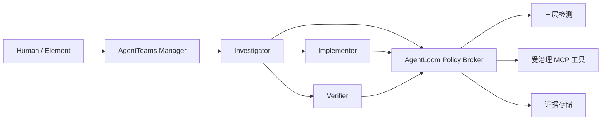

# AgentLoom

[English](README.md) | 简体中文

面向多 Agent 软件修复的治理型、证据优先 SkillOps 平台，构建于
[AgentTeams](https://github.com/agentscope-ai/AgentTeams) 之上。

AgentLoom 将第三方 Agent Skill 转化为可审查、可授权、可测试、可审计的能力。当前参赛场景是一条受控的软件修复闭环：从 GitHub 风格 Issue 和失败测试开始，经过根因调查、补丁实施、独立验证，最后生成可追溯的证据报告。

> **项目状态：早期 MVP 已完成核心闭环。** Agent 契约、Grant 授权、静态检测、任务 API、乐观状态投影、SQLite 持久化、数据库迁移、Policy Broker MCP、受控修复工作流和锁定版本的 AgentTeams 四角色运行时均已实现。基于 Manifest 的 Mock 修复产物 E2E、TUI、本地失败/重试演示、Qwen 无人值守修复、StepFun 四角色回滚以及 Human L2 审批均已通过严格证据校验。五个上游 Skill 仍处于隔离状态，尚未全部评测并发布。

## 参赛范围

- 赛道：Agent Infra
- 方向：软件研发全流程协同
- 协同运行时：AgentTeams/HiClaw `v1.1.2`
- 已验证修复模型：DashScope `qwen3.7-plus`
- 已验证回滚模型：StepFun `step-3.7-flash`
- 消息基线：DeepSeek Manager + 三个 Worker 的消息协同
- 实现语言：Python 3.12
- 初始存储：SQLite
- 安全默认值：失败关闭（fail closed）

## 架构



Worker 不接收模型供应商的原始凭据。工具调用必须携带签名的、短时有效的 `SkillExecutionGrant`；L2/L3 操作必须经过明确的人工审批。

完整设计见 [AgentLoom 架构设计](docs/architecture/agentloom-architecture.md)。

## 部署

在 Windows 本地进行无云试用：

```powershell
.\scripts\bootstrap.ps1 -Profile lite
.\scripts\demo.ps1
```

请先阅读 [五分钟快速开始](docs/deployment/quickstart.md)，再根据需要查看[完整 AgentTeams 部署](docs/deployment/windows-agentteams.md)和[故障排查](docs/deployment/troubleshooting.md)。完整模式要求预先安装官方 AgentTeams/HiClaw `v1.1.2` 运行时；AgentLoom 当前不提供单容器独立发行版。

## 已实现能力

- Agent、Skill、Evidence、验证、检测、Grant 和任务的严格 Pydantic 边界契约
- 带过期时间、审批绑定、参数绑定和防重放的 HMAC 签名 Skill Grant
- 失败关闭的检测流水线和确定性的 L1 Skill 检查
- 五个上游 Skill 的固定隔离目录、来源锁定和严格输入/输出 Schema
- FastAPI 任务创建、列表和详情 API
- 带追加式原因事件的乐观任务状态迁移
- 用于一次性 Grant 验证的内部 API 和 stdio MCP 边界
- SQLite 持久化和可逆 Alembic 迁移
- 包含调查、实施、独立验证、审批、失败和回滚状态的确定性修复工作流
- 锁定 AgentTeams `v1.1.2` 的 Manager、Team Leader、两个 Worker 和 Human 资源
- 四个 Agent 身份都产生角色归属明确的 Matrix E2E 事件
- AgentTeams 全局任务到 Team 任务的哈希校验父子任务命名空间桥接
- 基于 Manifest 的离线修复产物 E2E，包含两个独立缺陷、隐藏测试、补丁范围限制和证据
- 对 AgentTeams 角色事件、补丁哈希/路径绑定、可见测试、隐藏测试和静态检查进行失败关闭验证
- Qwen `qwen3.7-plus` 无人值守修复 E2E，包含自动清洁任务暂存、三类角色事件、MinIO 产物白名单、输入指纹和主机隐藏测试
- Textual 控制面板：查看案例、角色状态、任务事件、验证产物、审批队列、Human 决策和本地失败状态
- TUI 中严格投影三层实时证据，绑定 AgentTeams 健康状态、角色归属 Matrix 事件和独立主机验证
- 受保护的竞赛入口：默认免费证据回放，付费云模型回滚必须显式确认
- 失败关闭的 L2 Matrix 审批验证：绑定 Manager 请求、Team Room、Human sender、时间戳、请求哈希、路由和回滚计划
- StepFun 四角色回滚已验证：包含按时间排序的 Matrix 身份、批准快照恢复、隐藏测试、静态检查和绑定哈希
- Human L2 审批已通过独立 `agentloom-developer` 身份验证，详见[脱敏证据摘要](docs/competition/l2-approval-and-upstream-contribution-evidence.md)
- 已复现并修复 AgentTeams 的 `humanMembers` 更新缺陷，修复已提交至[上游 PR #1141](https://github.com/agentscope-ai/AgentTeams/pull/1141)，当前等待维护者审查
- 单元测试与集成测试套件

## 本地开发

前置条件：Python 3.12 和 Git。

```powershell
python -m venv .venv
.venv\Scripts\python -m pip install -e ".[dev]"
.venv\Scripts\python -m pytest
.venv\Scripts\ruff check .
.venv\Scripts\mypy src tests
.venv\Scripts\python -m pip_audit .
```

`pip-audit` 已包含在 `.[dev]` 依赖中。如果已有虚拟环境不想重装项目，可以单独安装：

```powershell
.venv\Scripts\python -m pip install "pip-audit>=2.10,<3"
```

创建本地数据库：

```powershell
.venv\Scripts\alembic upgrade head
```

通过注入至少 32 字节的进程环境变量启动 stdio 版 Policy Broker MCP：

```powershell
$env:AGENTLOOM_POLICY_SIGNING_KEY = "replace-with-a-local-development-secret"
.venv\Scripts\python -m agentloom.policy_mcp
```

AgentTeams Worker 只应配置这个 MCP Server。暴露的 `verify_skill_execution_grant` 工具接收严格的 `GrantVerificationRequest` 契约，成功后消费 Grant nonce；签名无效、过期、参数不匹配或重放时返回 `POLICY_DENIED`。不要把签名密钥写入提交的 MCP 配置，必须通过 Worker 进程环境注入。

所有模型凭据和部署配置都必须通过被忽略的环境文件或进程环境变量提供，绝不提交到仓库。

AgentTeams 部署、云模型启用、本地回退和严格 E2E 说明见 [deploy/agentteams/README.md](deploy/agentteams/README.md)。

## 可复现 Demo

每个 `demo/cases/<case-id>` 案例都由严格的 `case.json`、独立的 `provenance.json`、冻结的 `before/` 快照、确定性的 `expected/` 补丁源和仅供验证器使用的 `hidden-tests/` 组成。加载器会拒绝未知字段、路径穿越、Shell 命令、未识别许可证、快照哈希不匹配、超长超时、过大命令输出和未声明的文件修改。命令采用参数数组，只允许映射到当前 Python 解释器的 `pytest` 或 `compileall` 模块。

不调用 LLM、也不消耗云额度即可运行任一案例：

```powershell
.venv\Scripts\python -m agentloom.mock_repair `
  --case-root .\demo\cases\severity-normalization `
  --output-root .\artifacts\demo\severity-normalization
```

将 `severity-normalization` 替换为 `pagination-boundary` 即可运行第二种缺陷。两个案例生成相同的产物契约。

启动本地控制面板：

```powershell
.venv\Scripts\agentloom tui
```

控制面板运行确定性的本地 Case 工作流，并读取被忽略的本地审批数据库。它展示 Manager、Investigator、Implementer、Verifier 状态、追加式任务事件、根因、补丁哈希、验证 verdict、风险 verdict、产物目录和参数绑定的 L2 审批决定。`Run failure / retry` 会生成十次状态迁移的本地演示：第一次配置的工作流结果失败，记录 `ROLLING_BACK` 和 `ROLLED_BACK`，一次有界重试后完成，并写入 `failure-retry-evidence.json`。该分支只展示状态机证据，不生成补丁、不运行测试，也不执行风险检查。

不再次调用模型即可回放最近一次已验证的 AgentTeams 修复：

```powershell
.\scripts\competition-demo.ps1 -Mode replay
```

回放模式会在 `health.json`、严格 AgentTeams 运行证据和独立主机验证都绑定到相同任务、模型、提交哈希和三个 Matrix 事件时才继续。Live Evidence 模式会禁用本地 Mock 控件，避免混淆两类证据。

回滚链路与本地状态机演示分开。Live 模式会收集四个角色事件，然后由独立主机在隔离工作区应用已知失败候选、复现失败、逐字节恢复已批准快照，再次运行可见测试、隐藏测试和静态检查：

```powershell
.\scripts\competition-rollback-demo.ps1 `
  -Mode live `
  -TaskId AL-LIVE-ROLLBACK-001 `
  -ConfirmPaidRun
```

Live 模式可能消耗模型额度，且必须显式传入确认开关和新的任务 ID。成功采集后，可无模型回放：

```powershell
.\scripts\competition-rollback-demo.ps1 -Mode replay
```

截图或公开录制前，请对 JSON 摘要和 TUI 中的本机路径进行脱敏：

```powershell
.\scripts\competition-rollback-demo.ps1 -Mode replay -PublicOutput
```

只需要终端证据摘要时，可追加 `-NoTui -PublicOutput`。安全录制步骤见[竞赛录制运行手册](docs/competition/demo-recording-runbook.md)。

StepFun Live 运行需要在仓库外设置 `STEPFUN_API_KEY`：

```powershell
.\scripts\competition-rollback-demo.ps1 `
  -Mode live `
  -TaskId AL-LIVE-ROLLBACK-001 `
  -Provider stepfun `
  -Model step-3.7-flash `
  -ConfirmPaidRun
```

StepFun 使用 Step Plan 接口和 `reasoning_effort=low`。运行器会检查 Manager 和三个 Worker 是否真的启用了指定供应商与模型，再收集角色证据。

## Live 修复验证边界

AgentTeams Live 运行完成后，将三个业务 Agent 的角色归属 Matrix 事件、结构化修复包和模型生成的完整 Diff 组装为严格的 `agentloom.live-repair-submission/v1alpha1` JSON 文档，再在干净本地工作区中针对冻结 Case 进行验证：

```powershell
.venv\Scripts\agentloom verify-live `
  --submission .\artifacts\agentteams\live-repair-submission.json `
  --case-root .\demo\cases\severity-normalization `
  --output-root .\artifacts\live-repair\severity-normalization
```

验证器支持通过 DashScope 接入的 `qwen3.7-plus`、通过 DeepSeek 接入的 `deepseek-v4-pro` 和通过 StepFun 接入的 `step-3.7-flash`。它要求 Investigator、Implementer、Verifier 事件彼此独立，检查每个产物与任务及补丁哈希的绑定，拒绝超出 Case 白名单的路径，用 `git apply` 应用补丁，并独立重跑原始失败、可见测试、验证器专属隐藏测试和静态检查。验证器不调用模型、不创建 Matrix 证据；编排层必须提供真实事件 ID。

2026-08-04，任务 `AL-LIVE-PAGINATION-UNATTENDED-20260804-03` 使用 `qwen3.7-plus` 通过了该边界。Investigator 复现了整除分页缺陷，Implementer 生成补丁 SHA-256：
`7d9d571a833eabaedf97eac73dad50f6290bfa332d3ef504882398ba2e6d0833`；Verifier 独立批准修复产物。AgentLoom 随后重新复现原始失败，通过可见测试、未公开主机隐藏测试和静态编译。严格运行证据位于 `artifacts/agentteams/live-repair-pagination-qwen-unattended-03.json`，独立验证证据位于 `artifacts/live-repair/AL-LIVE-PAGINATION-UNATTENDED-20260804-03/verified/artifacts/`。

## 后续路线图

1. 根据已验证的 L2 审批和回滚证据录制公开竞赛 Demo；回放模式可避免再次消耗模型额度。
2. 评测并发布五个处于隔离状态的上游 Skill。
3. 在更多干净 Windows 机器上验证 Full bootstrap，发布部署兼容性矩阵。
4. 根据 [AI 可直接生成的 PPT 生产规格](docs/competition/ppt-production-spec.md)完成演示文稿、PDF、发布标签和脱敏提交包。

## 开源与来源

AgentLoom 代码采用 Apache-2.0 许可证。上游运行时、Skill 内容、依赖和设计参考保留各自许可证及署名要求。详见 [THIRD_PARTY.md](THIRD_PARTY.md) 和 [provenance/sources.yaml](provenance/sources.yaml)。

## 安全

初赛阶段只使用合成 fixture 和隔离仓库。不要把个人 SSH 目录、生产凭据或无关主机路径挂载到 Worker。安全问题请私下联系仓库所有者。
