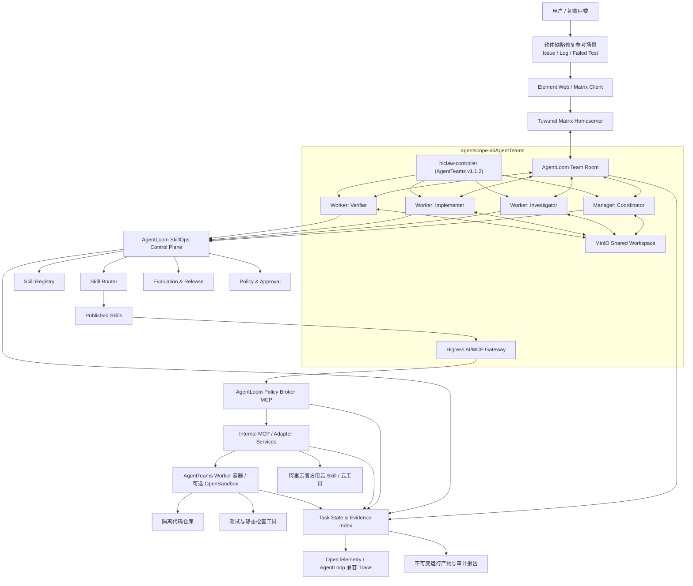
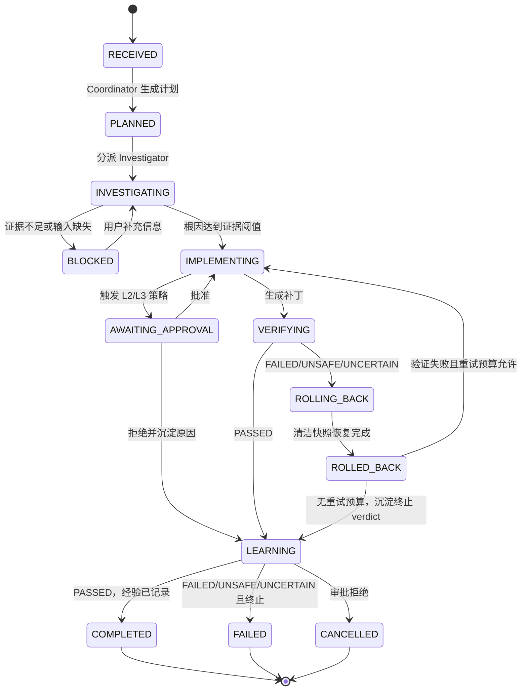
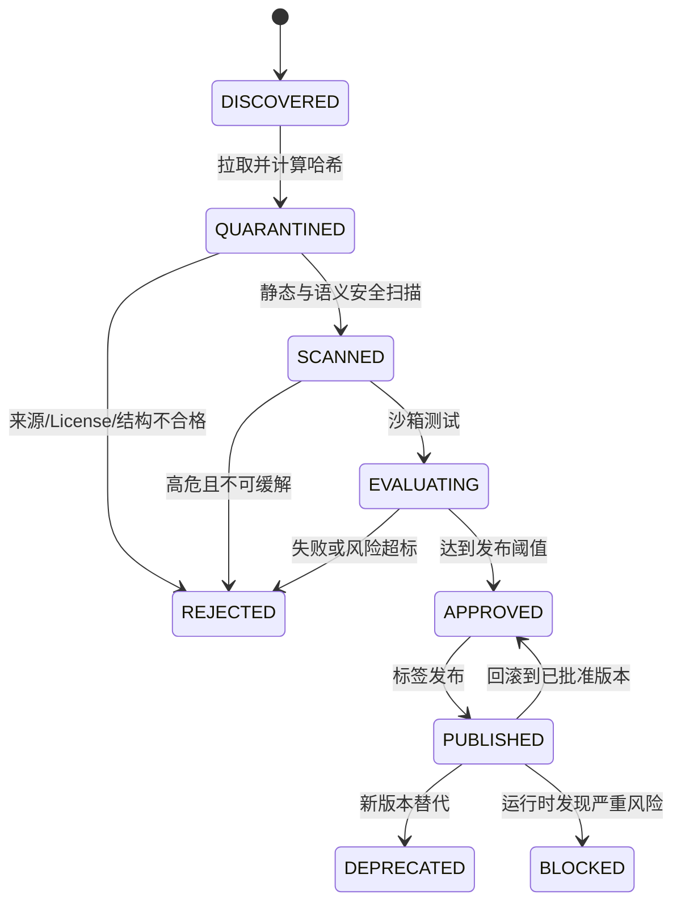
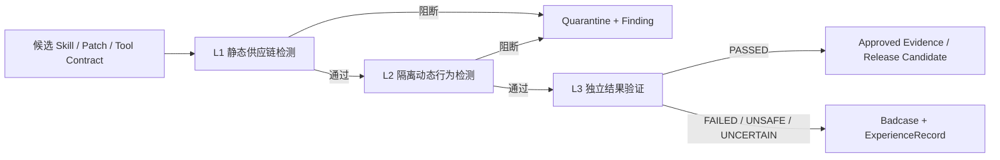

# AgentLoom 架构设计

> 可治理、可验证的多 Agent SkillOps 平台

| 项目 | 内容 |
| --- | --- |
| 团队 | 零号工位 |
| 参赛赛道 | GOAI 赛道一：新智基座｜Agent Infra |
| 参考选题 | 方向三：软件研发全流程协同 |
| 指定协同平台 | [agentscope-ai/AgentTeams](https://github.com/agentscope-ai/AgentTeams) |
| 文档状态 | Draft v0.7 |
| 文档日期 | 2026-08-14 |
| 初赛截止 | 2026-08-16 |
| 产品边界 | 面向 AgentTeams 的第三方 Skill 治理与可验证执行控制面 |
| 参考场景 | 从 GitHub Issue、错误日志和失败测试到补丁、验证与审计报告的端到端闭环 |

## 1. 文档目的

本文档是 AgentLoom 的架构基线，用于：

- 约束独立开发期间的实现范围；
- 逐项满足赛道一的强制技术与提交要求；
- 明确上游开源项目与团队原创贡献的边界；
- 为初赛 PPT、Demo、README、复赛代码包和答辩提供统一依据；
- 使每个架构能力都能由日志、Trace、测试或工程材料验证。

比赛要求以 [《赛道一：新智基座｜Agent Infra 参赛手册》](../../6e21b053-f18b-4857-83e2-835bd96d5434.pdf) 为准。本文中的页码均指该手册 PDF 页码；若组委会发布更新，以最新正式通知为准。

## 2. 项目背景、目标与摘要

### 2.1 项目背景与问题定义

开源 Agent Skill 已能沉淀调试、测试、代码审查和安全检查等方法，但企业不能把任意 GitHub 仓库中的 `SKILL.md` 直接注入生产 Agent。主要缺口不是 Skill 数量，而是缺少贯穿引入、执行和结果验收的工程治理：

- 来源、许可证、版本和内容哈希不完整，无法回答“这次运行用了哪份能力”；
- Prompt、脚本、依赖和外部引用可能包含恶意指令、越权命令或动态下载；
- Skill 输入输出、调用条件和失败语义不统一，难以被多个 Agent 稳定复用；
- Agent 可能绕过 Skill 直接调用 Shell、GitHub 或云 API，权限边界无法证明；
- 实施者容易自证成功，缺少清洁环境中的独立验证和原始证据；
- 成功、失败和人工审批结果没有回流到评测集，Skill 无法受控演进。

上述问题并不限于软件研发。运维处置、客服执行、云资源管理和安全分析中的第三方 Skill 同样需要来源、权限、评测、发布和审计治理。软件缺陷修复只作为首个参考场景：输入、补丁、测试和 Diff 可固化，成功标准可客观验证，适合在有限时间内证明控制面的通用能力。目标用户是建设 AgentTeams 应用的平台工程团队、需要治理第三方 Agent 能力的研发团队和开源维护者。

### 2.2 产品定位与目标结果

AgentLoom 是面向 AgentTeams 的第三方 Skill 治理与可验证执行控制面。它将分散在 GitHub、Agent Skill 仓库和企业内部的能力转化为可发现、可审查、可评测、可发布、可选择、可授权、可执行和可回滚的工程资产。AgentLoom 不是通用编码 Agent、代码审查 CLI 或渗透测试平台；软件缺陷修复是验证平台契约的参考应用，不是产品边界。

系统强制使用 [agentscope-ai/AgentTeams](https://github.com/agentscope-ai/AgentTeams) 作为多 Agent 协同运行平台。人通过 Element/Matrix 将任务交给 Manager；Manager 建立阶段计划并把调查任务交给 Investigator，随后由 Investigator 以结构化根因报告触发 Implementer 修复，再把冻结补丁交给 Verifier 独立验证。三个既有 Worker 分别承担 Investigator、Implementer 和 Verifier 职责，通过 Matrix Team Room、共享任务状态和 MinIO 产物协作。`agentloom-investigator` 在 AgentTeams Team 资源中占用框架要求的 `spec.leader` 槽位，但不新增 TeamLeader Agent Identity。AgentTeams Manager 是编排基础设施，不计为第四个业务 Agent。Agent 不直接裸调外部工具，而是通过 Skill 和 Higress 托管的 MCP/适配器形成稳定、可授权、可审计的调用链。所有关键结论必须引用运行证据；高风险动作必须经过 Matrix/Element 中可见的人工审批。

初赛只实现一条可信闭环：

```text
GitHub Issue + 错误日志 + 失败测试 + 示例代码仓库
  -> 多 Agent 分工
  -> Skill 选择与执行
  -> 沙箱内生成补丁
  -> 独立测试与安全验证
  -> 补丁、报告、Trace 和 Skill 评测结果
  -> Badcase/经验记录回流到评测集，经人工批准后形成 Skill 新版本
```

目标结果均作为验收目标，不在真实测量前写成既成成绩：

- 一个固定 Python 缺陷任务可在清洁环境中重复完成；
- 100% 最终关键结论可回链到 Evidence ID；
- 未持有有效 SkillExecutionGrant 的工具调用拒绝率为 100%；
- Implementer 与 Verifier 使用独立会话、权限和可写工作区；
- 正常、失败、审批拒绝和回滚路径均能生成可审计产物；
- 上游 Skill、团队原创代码、模型、API 和数据来源均可追溯。

### 2.3 团队原创系统贡献

AgentLoom 的原创价值不在重写调试、测试驱动开发或代码审查方法，而在把来源不同、质量不一的 Skill 纳入 AgentTeams 可强制执行的治理闭环。初赛团队贡献固定为：

1. 面向多来源 Skill 的统一 Manifest、来源哈希和隔离生命周期；
2. Skill 风险、权限、评测、发布、升级和回滚一体化门禁；
3. 绑定 Task、Agent、Skill、Tool、参数摘要、路由和时效的 `SkillExecutionGrant`；
4. Policy Broker 的签名校验、防重放、路径白名单和 L2/L3 人工审批边界；
5. AgentTeams 与 SkillOps 控制面的协同契约，保持三个业务 Agent 的职责与权限互斥；
6. 静态、动态、独立验证三层检测以及不可变 Evidence 链；
7. 可复现 Demo Case、失败/审批/回滚分支和 AgentLoom-Bench 评测结构；
8. 运行经验经人工复盘后形成新 SkillVersion 候选的受控演进流程。

每项贡献都必须对应团队代码、契约测试、Git 提交和运行证据。上游工作流内容、第三方工具能力和 AgentTeams 原生组件不计入团队原创代码量。

### 2.4 产品边界与参考场景关系

```text
AgentTeams 协同运行时
  -> AgentLoom SkillOps 控制面
     -> 来源 / Manifest / 评测 / 发布 / 路由
     -> Grant / Policy / Approval / Evidence / Rollback
        -> 软件缺陷修复参考场景
           -> Issue -> 根因 -> 补丁 -> 独立验证 -> 经验沉淀
```

未来迁移到运维、客服或云资源治理时，替换的是任务 Schema、角色提示和领域 Skill；Skill 生命周期、Policy Broker、审批、Evidence 和版本回滚保持不变。能否在第二个场景复用这些控制面契约，是 AgentLoom 平台定位是否成立的长期验证标准。

## 3. 比赛要求对齐

### 3.1 跨阶段要求与阶段边界

| 比赛要求 | 手册依据 | AgentLoom 设计 | 验证材料 |
| --- | --- | --- | --- |
| 真实企业场景 | 第 1、5、17 页 | 软件研发缺陷修复与质量门禁 | Issue、失败测试、补丁和业务价值说明 |
| 至少 3 个不同职能 Agent | 第 1、10、16、21 页 | Investigator、Implementer、Verifier 三个业务 Agent，职责与权限互斥；Manager 仅承担 AgentTeams 编排 | Agent Identity 清单、AgentTeams Trace |
| 以 AgentTeams 为协同设计基点 | 第 10、14、17、19 页 | 实际部署 `agentscope-ai/AgentTeams`；使用 Manager、Worker、Team、Human、Matrix、MinIO 和 Higress 完成协作 | AgentTeams 版本锁、资源清单、Element 房间记录、运行日志和可执行代码 |
| Skill 为必选项 | 第 10、17、19、21-22 页 | Skill Registry、生命周期、调用契约、评测和回滚 | Skill 清单、Manifest、评测报告 |
| 阿里云官方用云 Skill | 第 11、14-15、17、19 页 | 正文 9.1 和工具链表将其列为可选/推荐；只有找到与 Demo 直接相关且可真实验证的能力时选择 1 个，不为覆盖名词而接入 | 采用时提供必要性、调用 Trace、版本与来源；不采用时说明原因 |
| 工具或系统稳定接入 | 第 2、8、11-12 页 | Skill -> MCP/Adapter -> Tool 的三层契约 | Tool Contract、Mock/真实接口一致性测试 |
| 上下文传递与状态追踪 | 第 1、10、21、26-27 页 | Task State、Agent Message、Evidence Index | 状态快照、消息记录和可回放 Trace |
| 结果验证与执行证据 | 第 8-10、17 页 | 独立 Verifier、测试闸门、证据哈希 | 测试日志、Diff、VerificationResult |
| 审批、回滚和审计 | 第 2、8-13、16-18 页 | L0-L3 风险分级、人工审批、补丁回滚、追加式审计 | ApprovalRecord、RollbackRecord、审计报告 |
| 复赛/决赛可运行、可复现 Demo | 第 8-10、17-18 页 | Docker 一键启动，固定示例仓库与固定任务 | README、部署脚本、Demo 或等价可验证工程材料 |
| 开源与第三方依赖披露 | 第 8-10、15-19 页 | provenance、THIRD_PARTY、License、版本锁定 | 来源清单、许可证、团队贡献说明 |
| 不得套壳或伪造结果 | 第 18 页 | 明确上游边界；原始 Trace 与不可变证据关联 | 原始运行产物、提交历史、贡献说明 |

阶段边界必须分开表述：初赛必交物只有 500 字以内作品简介和方案 PPT/PDF，可执行 AgentTeams 代码包为可选加分材料；复赛起才强制提交可执行代码包和可运行 Demo/Demo 视频。跨阶段技术要求在初赛需要形成完整设计，工程实现按初赛加分、复赛必交管理，不能把复赛门槛误写成初赛硬要求。

手册存在一处文字冲突：9.1 写明“可使用阿里云官方用云 Skills，也可将关键能力沉淀为可复用 Skill”，第 14-15 页工具链表把官方用云 Skills 标为“推荐”，FAQ Q6 却写“并使用”。本架构以详细要求 9.1 和工具链分级表为实施依据，将 Skill 与 AgentTeams 视为必选，将官方用云 Skills 视为推荐；若组委会发布新的书面解释，以最新通知覆盖本决策。

### 3.2 评分策略

| 评审维度 | 权重 | 设计重点 | 初赛目标证据 |
| --- | ---: | --- | --- |
| 场景价值与行业可复制性 | 25% | 研发缺陷修复时间、验证质量和知识复用 | 真实风格 Issue、前后测试结果、可迁移说明 |
| 多 Agent 协同与自主闭环 | 25% | 清晰分工、结构化交接、异常处理、审批边界 | AgentTeams 状态图、消息与任务 Trace |
| Skill 工程体系与生态复用 | 25% | 导入、Schema、风险扫描、评测、版本和回滚 | Skill Manifest、EvalRun、版本对比 |
| 工程落地、运行验证与安全可审计 | 20% | 一键部署、沙箱、测试闸门、OTel Trace | Demo、日志、Metrics、审计报告 |
| 开放/开源贡献 | 5% | 模板、契约、样例任务和文档 | 开源计划、许可证与第三方清单 |

### 3.3 红线约束

- 不把第三方项目或 Skill 表述为团队原创。
- 不提交无法复现的录屏结果或人工伪造 Trace。
- 不在真实生产仓库、生产分支或生产环境执行自动修改。
- 不在未授权目标上运行安全扫描或渗透工具。
- 不让 Agent 读取宿主机真实密钥、用户目录或无关仓库。
- 不在没有审批记录的情况下执行外部写操作，例如 Push、创建 PR、部署或变更云资源。
- 不通过增加 GitHub 项目数量制造技术深度；每个依赖必须说明必要性、替代性、权限与迁移成本。

### 3.4 工具链选型与替代矩阵

比赛工具链说明明确规定：只有 AgentTeams 必选；阿里云官方用云 Skills、Nacos、Higress、PolarDB for PostgreSQL、UnifiedModel、RocketMQ、LoongSuite、AgentScope Studio 和 AgentLoop 均为推荐项。推荐项目和云产品不按使用数量评分，因此 AgentLoom 不以“全部接入”为目标。

| 工具/产品 | 比赛级别 | 初赛决策 | 必要性与设计理念 | 接口契约/兼容边界 | 替代方案、原因与迁移成本 |
| --- | --- | --- | --- | --- | --- |
| `agentscope-ai/AgentTeams` | **必选** | **采用并实际部署** | 唯一主协同平台，承担 Manager/Worker/Team/Human、Matrix 协作、共享文件和人工介入 | 初赛固定 `v1.1.2` 的 `hiclaw.io/v1beta1` CRD、Controller API、`hiclaw` CLI、Matrix、MinIO 和 `spec.mcpServers`；AgentTeams 为该项目现名 | 不允许替代；升级版本必须单独验证资源名称、CLI、镜像与 E2E |
| 阿里云官方用云 Skills | 推荐 | 条件采用 1 个 | 只有能直接支持代码修复、产物、执行或云资源场景并产生真实证据时才接入 | 按官方 Skill 的输入输出、鉴权和版本契约包装；记录调用版本、权限与 EvidenceRef | 可由自定义 Skill/MCP 完成；若无匹配官方能力则不强行接入。后续迁移成本取决于 Schema，目标为低至中 |
| Nacos | 推荐 | 初赛非主链；部署顺利时展示 | AgentTeams `v1.1.2` 支持 `nacos://` Agent package，可用于远程分发 AgentSpec/Skill 包；不把 Nacos 当成 AgentLoom 业务状态库 | 只依赖稳定版公开的 `spec.package` 和 Nacos URI；AgentLoom Manifest 保持存储无关 | 初赛默认本地 Registry + MinIO；复赛切换包 URI 与认证适配，成本中 |
| Higress | 推荐 | **采用** | AgentTeams 本地与 Helm 方案原生集成，用于 LLM/MCP 路由、consumer token、鉴权和审计，避免 Worker 持有真实密钥 | OpenAI-compatible LLM API；MCP 使用 AgentTeams `spec.mcpServers` 支持的 HTTP/SSE；AgentLoom Tool Contract 不依赖网关私有响应 | 可替换 ToolHive 或直连 MCP，但会失去 AgentTeams 原生凭据和路由集成；迁移成本中至高 |
| PolarDB for PostgreSQL | 推荐 | 初赛不采用 | 单人单机 Demo 使用 SQLite 足够，提前引入云数据库不会增加闭环证据 | 通过 Repository 接口隔离 SQL；ID、时间、状态枚举和 append-only 语义与 PostgreSQL 兼容 | 复赛可迁移 PostgreSQL/PolarDB；需要 schema migration 和数据搬迁，成本中 |
| UnifiedModel | 推荐 | 初赛不采用 | 初赛只有一个自建 Python 样例仓库和 AgentLoom canonical schema，引入统一实体建模收益有限 | Task、AgentStep、SkillVersion、Evidence 等实体保留稳定 ID 和关系，可映射到 UnifiedModel | 复赛跨接 GitHub、CI/CD、知识库时增加实体映射；核心存储无需重写，迁移成本低至中 |
| RocketMQ | 推荐 | 初赛不采用 | 单机任务量可由 AgentTeams Matrix 和本地任务表处理，引入消息队列会增加部署与一致性复杂度 | TaskEvent 使用稳定 envelope，并预留 outbox；消费者必须幂等 | 扩展到异步多 Worker 时接入 RocketMQ；因已有 EventEnvelope/outbox，迁移成本低至中 |
| LoongSuite | 推荐 | 初赛不采用 | 本地结构化日志与 OTel-compatible Trace 足够形成初赛证据 | AgentLoom 使用稳定 Span Schema、OTLP 导出边界和 Evidence ID | 复赛将 OTLP 接入 LoongSuite；迁移成本低 |
| AgentScope Studio | 推荐 | 初赛不采用 | Element 展示协作，静态运行报告展示证据；额外 Studio 会形成重复展示面 | 保留标准 Trace/运行产物导出，不依赖专有会话格式 | 复赛需要强化调试体验时接入；增加 Trace 映射，迁移成本低至中 |
| AgentLoop | 推荐 | 初赛不作为主链依赖 | `v1.1.2` 基线不假设内置 AgentLoop 集成，避免把后续版本能力误写为稳定版能力 | canonical event/evidence 模型可导出 AgentLoop/OTel 所需字段，业务状态不只存于观测后端 | 复赛在 AgentLoop、LoongSuite、AgentScope Studio 中择一实接；迁移成本低 |

每个实际启用的工具必须在最终材料中给出：版本、用途、调用入口、输入输出 Schema、鉴权、权限、失败语义、替代性、运行证据和迁移成本。未启用的推荐工具只说明未选原因和预留边界，不在 PPT 中伪装成已集成。

## 4. 目标与非目标

### 4.1 初赛目标

初赛先满足材料门槛，再用可运行原型提供加分证据。两类目标不得混写。

**P0：手册必交目标**

1. 提交 500 字以内作品简介，覆盖场景、方案、创新、开放价值和当前进展。
2. 提交方案 PPT/PDF，完整说明 AgentTeams 映射、至少 3 个不同职能 Agent、任务闭环、核心 Skill、上下文机制、验证、异常分支、安全与开放计划。
3. 提供 Agent Identity 清单和核心 Skill 清单，字段分别覆盖手册附录 A、B。
4. 明确 MCP、RAG、可观测、官方用云 Skill 和其他推荐工具的采用决定、必要性、替代性与迁移成本。

**P1：团队加分原型目标**

1. 实际部署 `agentscope-ai/AgentTeams`，由 Manager 编排 Investigator、Implementer、Verifier 三个独立 Worker，跑通三个不同职能业务 Agent 的完整协作链路。
2. 支持从至少 1 个上游来源和 1 个团队原创来源导入 5 个核心 Skill；主任务至少真实调用其中 3 个。
3. 为每个 Skill 保存来源、许可证、版本、内容哈希、权限和风险信息。
4. 在隔离工作区完成 1 个固定缺陷任务，展示正常链路、1 个失败分支和 1 个人工审批分支。
5. 输出补丁、测试结果、风险结论、成本指标和 Trace；所有关键结论回链 Evidence ID。
6. 对外部写操作进行人工审批；初赛默认不执行真实 Push 或部署。

两模式对比、3-5 个评测任务、完整 TUI 和真实 GitHub PR 均为后续加分项，不阻塞初赛 P0 提交。

### 4.2 非目标

- 不建设通用聊天机器人或通用 Agent 商店。
- 不建设通用代码审查 CLI，不以行级评论数量或审查模型精度作为核心产品指标。
- 初赛不集成、封装或移植 `alibaba/open-code-review`、`usestrix/strix`、`stablyai/orca`；三者只进入先行工作与竞品对照。
- 不支持任意语言和任意仓库；初赛固定 Python 示例仓库。
- 不实现多租户、计费、商业账户体系或复杂 RBAC 管理后台。
- 不实现 Kubernetes 级分布式调度。
- 不抓取或镜像整个 GitHub Skill 生态。
- 不开展基础模型 Pre-training；不建设训练数据管线或训练基础设施。
- 初赛不开展 Post-training，包括监督微调、偏好优化或领域适配；先用 Skill、Prompt、结构化契约和评测解决任务稳定性。
- 不允许 Agent 自己声明任务成功，成功必须由 Verifier 和测试证据决定。
- 不以 LangGraph、AutoGen、CrewAI、自研状态机或抽象 Adapter 替代 `agentscope-ai/AgentTeams` 主编排。
- 初赛不使用 RAG；明确实现手册替代项中的共享状态管理和轨迹可观测两项，并以代码检索、结构化上下文包和 Evidence Index 支撑上下文传递。复赛引入知识库时只增加检索接口，不重写协作链。

## 5. 核心用户与场景

### 5.1 目标用户

- 需要处理 Issue、缺陷和回归的研发团队；
- 需要治理编码 Agent、Skill 和工具权限的平台工程团队；
- 需要验证第三方 Skill 是否安全、有效和可复用的开源维护者。

### 5.2 Demo 场景

用户向 AgentLoom 提交：

- 一个固定示例仓库；
- 一条 GitHub 风格 Issue；
- 错误日志；
- 一个或多个初始失败测试；
- 任务约束，例如禁止新增依赖、禁止网络访问和允许修改的路径。

系统交付：

- 根因分析及证据引用；
- 统一 Diff 格式的代码补丁；
- 修复前后测试结果；
- 代码质量与安全审查结论；
- 使用过的 Agent、Skill、工具及其版本；
- Token、成本、时延和工具调用指标；
- 审批、失败重试、回滚和完整 Trace。

### 5.2.1 为什么这个任务需要 AgentTeams

这里的难点不是把一行 `+1` 改成条件表达式，而是把一个生产风格的软件修复请求在多重约束下安全完成。一次任务同时包含：

1. **问题复现**：从 Issue、日志和失败测试确认原始故障确实存在，不能把猜测当根因。
2. **约束修复**：只能修改白名单路径，禁止联网和新增依赖，补丁必须可回滚并带哈希。
3. **独立验收**：修复者不能接触隐藏测试，也不能给自己的补丁签发最终结论；Verifier 要在清洁快照中重放。
4. **风险处置**：涉及外部写入、依赖变化或审批的动作要升级 L2；验证失败必须回滚并保留失败证据。

因此，算法缺陷可以很小，但任务的工程约束、权限边界、验收责任和失败处置不能由一个自由对话自然保证。单个大模型可以生成候选补丁，却不能天然提供独立身份、互斥权限、Team Room 委派、人工审批和可复核 Evidence。

实际协作关系严格对应 AgentTeams 的 Team/Worker 边界：

```text
Human 提交 Issue / 约束
        |
AgentTeams Manager 接收任务、建立阶段计划、选择 Team
        |
Investigator：复现故障、定位根因、输出 RootCauseReport
        |
Implementer：消费根因报告并生成受限 PatchArtifact
        |
Verifier：消费冻结补丁并独立重放、测试与安全审查
        |
Manager 汇总结构化产物 -> Policy Gate -> Human 审批（L2）
        |
        +--> PASSED：完成并生成 Evidence
        +--> FAILED/UNSAFE：回滚、补证或终止
```

其中两个可以独立执行的子检查可并行：Verifier 的基线复现与 Investigator 的证据整理、补丁冻结后的测试验证与范围/风险复核。补丁生成仍依赖根因报告，不能为了“看起来并行”而伪造没有依赖关系的流程。`agentloom-investigator` 在资源拓扑中兼任 leader，只负责调查和技术交接，不因此增加业务角色；Manager 是 AgentTeams 编排资源，不计入三个业务 Agent。

### 5.3 可复现 Demo Case 契约

初赛自建案例统一存放在 `demo/cases/<case-id>/`，不允许在 Runner 中写死源文件、测试节点、Issue 或修复描述：

```text
demo/cases/<case-id>/
├── case.json          # 严格任务、命令、路径、超时和运行时契约
├── provenance.json    # 仓库、固定 commit、Issue URL、许可证、快照哈希
├── issue.md
├── before/            # Implementer 获得的冻结输入
├── expected/          # 仅 Mock Runner 使用的确定性补丁源
└── hidden-tests/      # 仅复制到独立 Verifier workspace
```

`case.json` 禁止未知字段和 shell 字符串；命令必须为参数数组，且只映射到当前 Python 解释器的 `pytest` 或 `compileall`。路径穿越、绝对可执行路径、未识别许可证、超过 120 秒的超时、快照哈希不一致、输出超限、隐藏测试泄露到 Implementer workspace、pytest 收集/内部错误、目标失败未复现、隐藏测试失败和越权文件修改均失败关闭。Runner 不抓取 manifest 中的 URL；真实 GitHub Case 的获取、许可证复核和隔离将在导入阶段完成。

当前 `severity-normalization`、`pagination-boundary` 与 `retry-delay-cap` 三个不同缺陷类型使用同一 Runner 和同一产物契约，并通过 AgentTeams MinIO namespace bridge 往返验证。`expected/` 只能作为明确标注的 Mock 基线，不能用于宣称模型自主生成补丁。

## 6. 架构原则与实现技术栈

### 6.1 架构原则

1. **指定 AgentTeams 实现优先**：实际运行 `agentscope-ai/AgentTeams`，角色编排、任务拆解、共享状态和状态追踪落到其 Manager、Worker、Team、Matrix 和 MinIO 能力，而非只做概念映射。
2. **Contract first**：Agent、Skill、MCP/Adapter、证据和验证结果先定义契约，再实现逻辑。
3. **Agent 不裸调工具**：Agent 只能调用已发布 Skill；Skill 再通过受控 Tool Contract 调用 MCP 或适配器。
4. **第三方默认不可信**：Skill、仓库内容、工具描述和外部 API 响应均在边界校验并接受安全扫描。
5. **执行与验证分离**：Implementer 无权给出最终成功结论，Verifier 无权修改代码。
6. **证据优先**：无法被原始工具输出、测试或文件哈希支持的结论不能进入最终报告。
7. **最小权限**：每个 Agent、Skill 和工具只获得完成当前步骤所需的权限。
8. **追加而非覆盖**：运行记录、评测和版本历史采用 append-only 语义，保留失败和历史决策。
9. **可恢复与幂等**：任务可以从检查点恢复；重复工具调用不得产生重复外部副作用。
10. **Mock 与真实接口同契约**：初赛 Mock Tool 和复赛真实系统使用同一 Schema。
11. **不堆叠工具**：工具只有在减少真实风险、提供闭环证据或解决明确工程问题时才进入架构。
12. **能力通过 seam 组合**：每项可替换能力分为稳定接口、具体 Provider 和 Consumer；Agent 不直接绑定 MCP、模型或执行后端。
13. **模型可见即已记录**：进入模型请求的上下文、工具调用和关键决策必须落入可回放事件或 EvidenceRef，普通日志不能替代事实记录。
14. **运行时强制边界**：权限、沙箱和 Agent 作用域必须由执行时的契约和 Policy Broker 强制，不能只依赖 Prompt 或文档约定。

### 6.2 能力 seam、事件不变量与实施阶段

AgentLoom 借鉴 DeepSeek Harness 的能力 seam 思路，但不引入 Cordis，也不替代比赛指定的 AgentTeams。一个 seam 必须同时定义三种角色：

```text
Capability Definition
  -> Provider（本地、AgentTeams 或远程实现）
  -> Consumer（Skill、Tool、Verifier 或控制面服务）
```

当前第一阶段的接口边界如下：

| 能力 | Definition | 当前 Provider | Consumer | 兼容要求 |
| --- | --- | --- | --- | --- |
| Skill | `SkillResolutionRequest -> SkillManifest` | `CatalogSkillProvider` | Skill Router / Policy Broker | 只返回已校验、可追溯的版本 |
| Tool | `ToolExecutionRequest -> ToolExecutionResult` | `CallableToolProvider`；AgentTeams 适配器预留 | Skill / MCP Router | 结果必须是结构化状态并带 EvidenceRef |
| Verifier | `VerificationRequest -> VerificationResult` | 本地 Callable Provider；AgentTeams 适配器预留 | Workflow / Report | 只能验证冻结补丁，不能修改工作区 |

所有 Task 状态事件都使用 `agentloom.task-event/v1alpha1`。事件至少携带 `eventType`、`actor`、`causationId`、`correlationId` 和 `payloadDigest`。`payloadDigest` 覆盖事件的非易变业务字段；事件回放必须验证摘要，发现不一致时拒绝生成可信报告。

第一阶段只补契约，不改 AgentTeams 主编排：

1. 统一 Capability、Provider、Consumer 术语和边界。
2. 为 Skill、Tool、Verifier 定义 Python `Protocol` 和 Pydantic 输入输出模型。
3. 为 TaskEvent 增加因果、关联、操作者和 Payload 摘要，并通过 Alembic 回填既有记录。
4. 先为 TaskEvent 增加“可回放即必须通过摘要校验”的测试；AgentTeams 模型/工具转录接入后，再把同一不变量扩展到模型可见内容。
5. 为本地 Provider 与未来 AgentTeams Provider 复用同一组契约测试；远程适配器未锁定真实接口前不得伪造为已完成。

当前落地入口为 `load_skill_provider()` 和 `SkillGrantAuthorizer.issue_from_provider()`：前者只加载并解析本地目录，后者先解析 Skill 再复用既有发布状态、来源哈希、Agent、工具、路径、风险、审批和时效检查；解析不成功统一以 `PolicyDenied` fail-closed。

部署态 Grant 发行使用独立的 `GrantIssuanceRequest`，调用方只能提交 Task/Step、Skill 名称与版本、Tool/Action、参数摘要和请求路径。`agentName`、Grant ID、nonce、签发/过期时间、Skill 内容哈希和风险级别均为服务端字段，不进入请求契约。Issuer 从已认证的 Higress consumer 映射 Agent Identity，从权威 Task 与 Skill Provider 读取状态和 Manifest，仅在 Task 为 `VERIFYING`、Skill 已发布且评测、Agent/权限/工具/路径均匹配时生成五分钟 Grant，再复用 `issue_from_provider()` 完成签名门禁。

工具调用入口为 Policy Broker MCP 的 `execute_governed_tool`：`ToolExecutionEnvelope` 将 `SkillExecutionGrant`、规范化工具参数与 `ToolExecutionRequest` 绑定，Broker 验证参数摘要并消费 nonce 后只把请求交给显式 `ToolProvider`。配置 `AGENTLOOM_DATABASE_URL` 的部署使用数据库唯一主键原子持久化 nonce 的 SHA-256 摘要，使同一数据库上的 Broker 重启或多实例继续拒绝重放；不保存原始 nonce、完整 Grant、签名或密钥。未配置数据库的本地验证模式保留进程内 Store，不能宣称跨重启防重放。生产 `SandboxedTestRunnerProvider` 要求参数中的 `workspaceDigest` 与 Grant 参数摘要一起签名，并通过 `SandboxProvider` 在授权前、执行前和执行后校验同一快照。当前 `DockerSandboxProvider` 使用固定镜像和 Docker 参数创建一次性、无网络、只读、非 root、无 capability 的受限容器；镜像、挂载、环境、容器名和资源限制只来自服务端配置。超时、输出溢出、快照漂移、Docker 或清理确认失败均阻断且不回退宿主执行。`LocalTestRunnerProvider` 只保留给显式 `local-development` 后端，并要求独立的宿主执行确认变量。Provider 返回的结构化结果通过 recorder 追加为 `agentloom.tool-call/v1alpha1` 的 `ToolCall` 事件；事件持久化后回放必须重新通过 Payload 摘要校验。

第二阶段才引入配置组合：

```text
profile
  -> AgentTeams 基础配置
  -> AgentLoom Policy 配置
  -> Skill Bundle
  -> 环境或任务级 Patch
```

Profile、Bundle 和 Patch 只负责选择和叠加已通过契约测试的 Provider，不改变 TaskEvent 语义，不绕过 Policy Broker，也不授予 Agent 额外权限。只有当第二个真实 Provider 出现并通过同一套契约测试后，才提取通用 Registry；在此之前不为单一实现引入空泛的插件框架。

部署层的模型选择使用 `agentloom.provider-profile/v1alpha1`。Profile 只描述
管理员批准的 OpenAI-compatible Chat endpoint、模型 ID、生成参数和密钥环境
变量名；密钥本身不进入 Profile、命令行、资源文件或输出。`custom-` Provider
命名空间防止覆盖内建 Provider，HTTPS/public-host、字段、数值和容器边界在
任何密钥或 Docker 访问前 fail-closed。实现类固定为 CoPaw
`OpenAIChatModel`，因此该契约不承诺兼容任意私有协议，也不承诺所有模型都
支持流式输出、工具调用或推理参数。配置默认不做模型调用，连接探测必须显式
选择；配置成功不能替代 AgentTeams 角色消息和修复 E2E。

### 6.3 初赛固定实现栈

| 层 | 技术 | 选择理由 | 替代/迁移边界 |
| --- | --- | --- | --- |
| 语言与运行时 | Python 3.12 | Agent、MCP、评测和 AI 工具生态完整；独立开发统一语言 | 核心契约使用 JSON Schema，允许后续服务由其他语言实现 |
| 依赖与项目管理 | `uv` + `pyproject.toml` | 锁定依赖快、清洁环境复现简单 | 可导出标准 requirements；不把 uv 私有格式暴露为服务契约 |
| API | FastAPI | 原生 OpenAPI、异步接口、依赖注入和边界验证成熟 | REST/OpenAPI 为公开契约，可替换 ASGI 实现 |
| Schema | Pydantic v2 + JSON Schema | Agent、Skill、Tool、Evidence 共用类型，可生成验证 Schema | 持久化和外部协议只依赖导出的 JSON Schema |
| ORM 与迁移 | SQLAlchemy 2 + Alembic | SQLite/PostgreSQL 双支持，迁移历史可审计 | Repository 接口隔离方言；复赛迁往 PolarDB/PostgreSQL |
| 初赛数据库 | SQLite | 单人单机、零额外运维、足够保存控制面元数据 | append-only 语义和迁移脚本保持 PostgreSQL 兼容 |
| Artifact Store | MinIO + 文件 URI | AgentTeams 原生共享产物；适合补丁、日志和报告 | ArtifactStore 接口允许迁移 OSS/S3 |
| 多 Agent | AgentTeams `v1.1.2` | 比赛必选；提供 Manager/Worker/Team/Human、Matrix、MinIO、Higress | 固定 HiClaw 时代资源契约；升级需 E2E 与资源迁移 |
| Agent Runtime | Manager: OpenClaw 或 QwenPaw；Worker: Hermes 优先 | Manager 稳定协调，Hermes 适合编码执行 | Spike 后锁定；Worker Runtime 不进入业务 Schema |
| MCP | 官方 MCP Python SDK；HTTP 主传输、SSE 兼容 | 与 AgentTeams `spec.mcpServers` 匹配，减少自定义协议 | Tool Contract 独立于传输，允许替换实现 |
| 网关与授权 | Higress + AgentLoom Policy Broker | Higress 管理真实凭据和路由；Broker 强制 Skill 级授权 | Broker 保持标准 MCP 边界；网关可替换但需保留鉴权语义 |
| HTTP 客户端 | httpx | 支持异步、超时、连接池和测试 Mock | 封装于 Adapter，不进入领域模型 |
| 可观测 | OpenTelemetry Python SDK + JSON 日志 | 标准 Trace、可导出、初赛无需部署重后端 | OTLP 可迁往 AgentLoop、LoongSuite 或 Studio |
| 测试 | pytest + pytest-asyncio | 覆盖 Schema、策略、契约、集成和 E2E | 测试数据与运行协议独立于框架 |
| CLI/TUI | Typer + Textual + Rich | 同一 Python 包提供自动化 CLI 和可审计本地运维面板 | TUI 只调公开 API；移除不影响 Agent 主链 |
| 报告 | Jinja2 静态 HTML/Markdown | 无前端构建链，离线可审查、易随提交包分发 | 后续 WebUI 复用相同 Report API |
| 部署 | AgentTeams 官方本地安装 + AgentLoom Docker Compose | 复用指定平台，AgentLoom 服务独立升级 | 通过网络和 API 契约连接，不修改 AgentTeams 镜像 |

### 6.3 RAG、Pre-training、Post-training 与 MCP 必要性

技术是否进入初赛主链，只看四项：是否解决当前闭环中的真实问题、是否提供可验证证据、是否有更简单替代、是否能由独立开发者在截止前稳定复现。

| 能力 | 初赛决策 | 必要性判断 | 当前替代/实现 | 后续触发条件 |
| --- | --- | --- | --- | --- |
| RAG | 不采用 | 固定 Python 仓库、5 个核心 Skill、Issue、日志和测试均可用精确代码检索与结构化引用处理；引入向量库不会提高当前结果可验证性 | AgentTeams 共享状态管理 + AgentLoom 轨迹可观测，满足手册“不使用 RAG 时其余 3 项至少实现 2 项”的要求；上下文使用 Matrix 结构化消息、MinIO 产物和 Evidence Index | Skill/案例规模显著扩大、跨仓库历史经验检索成为瓶颈，并能用检索命中率和任务成功率证明收益 |
| Pre-training | 不采用 | 赛题不要求自研基础模型；数据、算力、许可、训练稳定性和复现成本与 Agent Infra 主问题无关 | 使用可配置的现有模型，差异化放在 AgentTeams 协同、SkillOps、授权和证据治理 | 无初赛/复赛计划；只有形成独立模型产品目标和合法大规模语料后另立项目评估 |
| Post-training | 初赛不采用 | 当前没有足够标注数据证明微调优于 Skill、Prompt 和工具契约；提前微调会增加模型绑定与复现风险 | 固定 Prompt、结构化 Schema、Skill 版本、失败回流和 AgentLoom-Bench 评测 | 至少积累代表性任务和稳定重复失败模式，建立训练/验证隔离数据集，并证明微调收益超过成本后再立项 |
| MCP | 采用 | AgentLoom 需要把 AgentTeams Worker 的工具调用统一收口到可鉴权、可审计、可替换的边界；Policy Broker 已有实现基础 | Worker 只配置 Policy Broker MCP；内部本地 Adapter 可暂不全部改造成 MCP，但必须遵守同一 Tool Contract | 外部消费者、跨语言服务或远程部署出现时，将内部 Adapter 按契约逐个包装为标准 MCP Server |

结论：初赛采用 MCP，不采用 RAG、Pre-training 和 Post-training。后两者不进入 AgentLoom 运行时架构；RAG 保留受指标触发的复赛扩展点，不能因术语热度提前加入。

## 7. 总体架构

总体架构以 AgentTeams 为协同运行时、AgentLoom SkillOps 为治理中心、软件缺陷修复为可替换参考场景。参考场景只能通过 AgentTeams 和受治理 Skill 进入控制面，不能直接拥有工具、凭据、审批或最终验收权限。



### 7.1 分层职责

| 层 | 主要职责 | 禁止承担的职责 |
| --- | --- | --- |
| Element/Matrix 入口层 | 创建任务、查看协作过程、人工介入和审批 | 不直接执行工具 |
| `agentscope-ai/AgentTeams` 协同层 | Manager/Worker 生命周期、Team Room、任务委派、共享文件、重试和人工可见性 | 不被 AgentLoom 自研编排器替代，不绕过 Policy |
| 多 Agent 层 | 分析、实施、验证和结构化交接 | 不直接裸调 Shell、Git 或云 API |
| SkillOps 控制面 | Skill 导入、扫描、评测、发布、路由、版本和回滚 | 不执行未经批准的 Skill |
| Skill 能力层 | 封装稳定任务能力和失败语义 | 不隐式提升权限 |
| MCP/适配器层 | 鉴权、Schema 校验、幂等、超时和审计 | 不把真实凭据暴露给 Agent |
| 沙箱执行层 | 文件修改、测试、静态检查和产物隔离 | 不访问宿主机无关目录和默认公网 |
| 证据治理层 | Trace、日志、Metrics、证据哈希和报告 | 不修改历史证据 |

## 8. `agentscope-ai/AgentTeams` 协同设计

### 8.1 指定实现与版本基线

- 唯一指定仓库：[agentscope-ai/AgentTeams](https://github.com/agentscope-ai/AgentTeams)，Apache-2.0。
- 初赛默认锁定安装器当前稳定版 `v1.1.2`（Git tag `a99457830fafb99c991bdb666aa8a1eef2f83b12`），同时记录 Chart/Image 版本和镜像摘要；不得使用浮动 `latest` 作为提交复现依据。
- `v1.2.0-beta.1` 及后续预发布版只有在稳定版缺少不可替代能力时才允许采用，并必须重新完成全部 E2E 验证。
- 初赛使用官方本地单机安装模式：embedded controller + 独立 Manager/Worker 容器。
- AgentTeams Manager 运行时选择 OpenClaw 或 QwenPaw；初赛技术 Spike 后固定一种，不在 Demo 中动态切换。
- Implementer 和 Verifier 优先采用相互独立的 Hermes Worker 容器，确保代码执行与独立复核隔离；若稳定版运行条件不满足，则使用官方支持的 QwenPaw/OpenClaw Worker，并保持独立工作区。
- 使用稳定版实际提供的 `hiclaw.io/v1beta1` `Manager`、`Worker`、`Team` 和 `Human` 声明式资源或本地等价 Controller API 创建 AgentLoom 团队；材料中同时注明 HiClaw 是 AgentTeams 原名。
- 人与 Agent、Agent 与 Agent 的主要协作通道为 Matrix；共享大文件、仓库快照和任务产物通过 MinIO，不将大日志反复粘贴进房间上下文。初赛固定 AgentTeams `v1.1.2` 的实际传输契约：跨房间委派由 `copaw channels send` 完成，Worker 产物由配置好的 `mc cp` 逐个上传；不存在的 `filesync` 命令不得写入 Prompt 或运行证据。
- LLM 与 MCP 流量统一经 Higress；Worker 只持有 consumer token，不持有真实 LLM API Key 或 GitHub PAT。
- 初赛由 AgentLoom 生成结构化日志和 OTel-compatible Skill/Evidence Span，不假设稳定版内置 AgentLoop；复赛再选择 AgentLoop 或其他 OTLP 后端实接。

AgentLoom 在 AgentTeams 上新增 SkillOps 控制面、MCP 服务、策略和证据闸门，不修改 AgentTeams 对 Manager/Worker 生命周期、Matrix 房间、共享存储和凭据网关的所有权。

### 8.2 AgentTeams 资源映射

| AgentLoom 概念 | AgentTeams 实体 | 具体实现 |
| --- | --- | --- |
| Coordinator | `Manager` | `agentloom-manager`，负责任务入口、团队创建、DAG 拆解、委派、审批和终止 |
| Investigator | `Worker` | `agentloom-investigator`，只读代码与证据，禁止写仓库 |
| Implementer | `Worker` | `agentloom-implementer`，在隔离工作区应用补丁与运行局部测试 |
| Verifier | `Worker` | `agentloom-verifier`，从清洁快照独立重放补丁与验收，禁止修改补丁 |
| 协作小组 | `Team` | `agentloom-repair-team`，包含 3 个 Worker 和可见的人类协调员 |
| 人工审批者 | `Human` | 初赛开发者账号，加入 Team Room 并拥有审批权限 |
| 协作事件 | Matrix Event + AgentLoom TaskState | 任务委派、状态更新、证据引用、审批和终止；不依赖 `v1.2` beta 的 TeamHarness/WorkerFlow |
| 共享产物 | MinIO team/shared prefix + `mc cp` | 仓库快照、补丁、日志、测试结果和报告；只允许逐个 allowlist 对象传输 |
| 工具入口 | `spec.mcpServers` + Higress | Worker 只获得 `agentloom-policy-broker`；Broker 验证 SkillExecutionGrant 后转发到 Git Mock、Test Runner 或云能力 |
| Skill 分发 | `spec.skills` / `spec.package` / Nacos remote skills | 内置协作 Skill、上游工程 Skill 和团队原创 Skill |

### 8.3 Agent Identity 清单

该清单覆盖手册附录 A 的 Name、Role、Capabilities、Inputs、Outputs、Dependencies、Decision Boundary 和 Trace 字段。参赛 Agent Identity 只包含以下三个 Worker。`agentloom-manager` 是 AgentTeams 编排资源，负责计划、委派、状态聚合和人工审批入口，不作为第四个业务 Agent 申报；其行为仍通过 Manager 日志、Matrix 事件和 TaskPlan 接受审计。

| Name | Role | Capabilities | Inputs | Outputs | Dependencies | Decision Boundary | Trace |
| --- | --- | --- | --- | --- | --- | --- | --- |
| `agentloom-investigator` | AgentTeams Worker；根因定位与证据收集 | 阅读代码、日志和测试；搜索调用链；形成根因候选；不能写工作区 | MinIO 仓库快照、Issue、日志、失败测试 | RootCauseReport、EvidenceRef、修复约束 | Debugging Skill、Policy Broker、MinIO、Team Room | 仅 L0 只读；不得修改文件、执行外部写操作或声明最终成功 | Worker Session、Matrix 状态事件、查询范围、证据 ID 和置信度 |
| `agentloom-implementer` | AgentTeams Worker；补丁设计与实施 | 选择已发布 Skill；在隔离工作区修改代码；运行局部测试；不能批准自己的结果 | RootCauseReport、TaskConstraints、SkillCandidateSet | PatchArtifact、ImplementationNotes、局部测试证据 | TDD Skill、Policy Broker、MinIO、Team Room | 仅允许修改白名单路径；新增依赖、网络访问和外部写入需审批 | Worker Session、Skill 版本、文件 Diff、命令、退出码和产物哈希 |
| `agentloom-verifier` | AgentTeams Worker；独立验证与风险审查 | 从清洁快照重放补丁、执行可用的静态检查、审查 Diff、给出 verdict；不能修改补丁 | MinIO PatchArtifact、验收标准、原始证据 | VerificationResult、RiskReport、Badcase | Testing/Review/Security Skill、独立 Sandbox、Team Room | 本地测试运行时不可用时必须返回 `UNCERTAIN`，不得声称测试通过；最终测试 PASS 由 host verifier 和受治理 Docker ToolCall 产生 | 独立 Worker Session、可用检查、证据引用、role verdict 和 host verdict |

### 8.4 协作状态机



### 8.5 任务拆解与上下文传递

- AgentTeams Manager 将任务拆成带依赖关系的步骤，通过 Team Room 的 Matrix Event 委派，并把权威状态写入 AgentLoom TaskStore；不依赖预发布版专属任务流能力，也不只靠自由对话隐式传递状态。
- Worker 间通过 Matrix 传递结构化状态和 EvidenceRef；大体积原始日志、仓库和补丁保存在 MinIO team/shared prefix，按需同步。
- 每条 AgentLoom 业务消息封装进 Matrix Event，包含 `taskId`、`stepId`、`sender`、`recipient`、`schemaVersion`、`payload` 和 `evidenceRefs`。
- 共享状态只保存事实、约束、当前计划和证据索引，不保存未验证推测为事实。
- 冲突结论由 Manager 要求 Worker 补充证据，不能通过多数投票直接决定。
- 每个步骤必须定义 `doneWhen`、超时、最大重试次数和失败分支。

### 8.6 Agent Integration Engine 核心模块

AgentLoom 的 Agent Engine 是 AgentTeams 集成层，不是第二套编排器。Agent 创建、Team 关系、房间、消息投递和 Worker 生命周期归 AgentTeams；AgentLoom 负责把业务约束映射成可验证契约，并投影权威任务状态。

| 模块 | 职责 | 输入 | 输出 | 不负责 |
| --- | --- | --- | --- | --- |
| Team Provisioner | 生成并提交 `Manager/Worker/Team/Human` 资源，核对 Ready 状态 | AgentIdentity、模型配置、资源限额 | AgentTeams 资源引用、Room ID、Worker 状态 | 不直接启动自研 Agent 进程 |
| Task Intake | 验证任务、仓库范围、验收标准和风险预算 | CreateTaskInput | Task、TaskConstraints、初始 Evidence | 不接受无授权仓库或模糊成功标准 |
| Context Assembler | 按角色最小化上下文，引用大产物而非复制全文 | Task、Evidence Index、前序输出 | VersionedContextPackage | 不把未验证推测写成事实 |
| Dispatch Adapter | 把 Assignment 封装为 Matrix Event 并投递 Team Room | AgentAssignment、ContextPackageRef | Matrix eventId、delivery status | 不自行选择 Worker Runtime |
| State Projector | 消费 Matrix/Controller 事件，幂等投影 TaskState | Matrix Event、Controller status | TaskEvent、Task/AgentStep 当前状态 | 不以聊天文本作为唯一权威状态 |
| Runtime Policy | 计算风险、审批和 Skill/Tool 权限 | Task、Agent、Skill、ToolCall | PolicyDecision、SkillExecutionGrant | 不执行工具 |
| Checkpoint & Recovery | 保存检查点，处理超时、重试、重复事件和中断续跑 | TaskEvent、AgentStep、retry budget | ResumeCommand、终止原因 | 不无限重试 |
| Outcome Collector | 聚合补丁、验证、成本、Trace 和经验记录 | EvidenceRef、VerificationResult | FinalReport、ExperienceRecord | 不覆盖原始证据 |

#### 8.6.1 核心接口

```python
class AgentTeamGateway(Protocol):
    async def apply_team(self, spec: TeamSpec) -> TeamRef: ...
    async def get_resource_status(self, ref: ResourceRef) -> ResourceStatus: ...
    async def send_assignment(self, assignment: AgentAssignment) -> DeliveryReceipt: ...
    async def stream_events(self, task_id: TaskId, after: EventCursor | None) -> AsyncIterator[AgentEvent]: ...

class TaskEngine(Protocol):
    async def create(self, request: CreateTaskInput) -> Task: ...
    async def project(self, event: AgentEvent) -> TaskState: ...
    async def resume(self, task_id: TaskId, checkpoint_id: CheckpointId) -> ResumeResult: ...
    async def terminate(self, task_id: TaskId, reason: TerminationReason) -> TaskState: ...
```

接口输入输出均由 Pydantic 模型生成 JSON Schema。所有创建操作携带 `idempotencyKey`；事件使用 `eventId` 去重并按 `taskId + sequence` 检测乱序。未知事件进入 dead-letter 表并告警，不静默丢弃。

#### 8.6.2 生命周期、超时与恢复

1. Provisioner 应用资源并等待 `READY`；超时后记录 Controller 日志，不继续创建任务。
2. Task Intake 创建 Task 和初始 Evidence，Manager 产生版本化计划。
3. Dispatch Adapter 发送 Assignment；只有收到 Matrix eventId 才标记 `DELIVERED`。
4. Worker 定期写 AgentStep 和 Artifact；State Projector 幂等推进状态机。
5. 步骤超时先查询 Worker/Room/Artifact 三方状态，再决定重发、恢复或终止，避免重复执行。
6. 重试沿用同一 stepId、递增 attempt；只读操作最多 2 次，写操作仅在幂等或已回滚后重试。
7. 会话丢失时从最新 Checkpoint、ContextPackage 和 Evidence Index 恢复，不依赖模型记忆。

#### 8.6.3 模型、资源与并发边界

- 模型通过 Higress OpenAI-compatible route 注入；AgentLoom 记录 provider alias、model ID、参数和价格快照，不在业务逻辑判断厂商。
- 每个 Worker 声明 CPU、内存、命令超时、Token 和费用预算；预算耗尽产生 `BUDGET_EXCEEDED`，不得降级为成功。
- 初赛每个 Task 同时只有一个 Implementer 可写；Verifier 只消费冻结 PatchArtifact。
- TaskState 更新使用 `planVersion`/乐观锁；版本冲突返回 `VERSION_CONFLICT` 并重新读取，不采用最后写入覆盖。
- AgentTeams 不可用时任务进入 `BLOCKED_PLATFORM`；不切换其他编排框架伪装完成。

## 9. SkillOps 控制面

### 9.1 Skill 生命周期



### 9.2 Skill Manifest

比赛附录 B 字段全部为必填；AgentLoom 在其基础上增加供应链、版本和评测字段。

```yaml
schemaVersion: agentloom.skill/v1alpha1
name: debugging-and-error-recovery
version: 1.0.0+upstream.<commit>
type: external-skill
description: 系统化定位软件缺陷并形成证据链

source:
  repository: https://github.com/addyosmani/agent-skills
  path: skills/debugging-and-error-recovery
  commit: "<immutable-commit-sha>"
  license: MIT
  contentHash: sha256:<hash>

usage:
  scenarios: [bug-triage, root-cause-analysis]
  invocationConditions: [issue-and-repository-present]
  compatibleAgents: [investigator]

contract:
  inputSchema: schemas/debugging-input.json
  outputSchema: schemas/root-cause-report.json
  failureModes: [INSUFFICIENT_EVIDENCE, TOOL_FAILURE, TIMEOUT]

dependencies:
  skills: []
  tools: [repository-search, test-reader]
  mcpServers: []

security:
  riskLevel: L0
  permissions: [repo.read, tests.read]
  networkPolicy: deny
  requiresApproval: false

evaluation:
  suite: agentloom-bench/v1
  minimumPassRate: 0.60
  lastEvalRunId: "<eval-run-id>"

reuse:
  reusableAcrossAgents: false
  reusableAcrossScenarios: true
  notes: 可用于缺陷定位、事故分析和代码审查前置调查
```

### 9.3 初赛核心 Skill 清单

下表逐项覆盖手册附录 B。所有“必须”项均需提交对应 Manifest、版本和至少一次真实调用证据。

| Skill 名称 | 类型与使用场景 | 输入参数 -> 输出结果 | 调用条件 | 依赖工具/系统 | 失败处理 | 权限与安全 | 复用价值及协同关系 | 初赛状态 |
| --- | --- | --- | --- | --- | --- | --- | --- | --- |
| Debugging Skill | 上游 Skill；缺陷定位 | Issue、仓库快照、失败日志 -> RootCauseReport、EvidenceRef | 输入完整且失败可复现 | Repository Adapter、Test Reader | 证据不足返回 `INSUFFICIENT_EVIDENCE`；工具失败重试一次后阻塞 | L0，只读仓库和测试，禁网、禁写 | Investigator 使用；也可复用于事故分析和审查前调查 | 必须 |
| Test-Driven Development Skill | 上游 Skill；最小补丁实现 | RootCauseReport、验收标准、白名单路径 -> PatchArtifact、局部测试证据 | 根因达到证据阈值且 Skill 已发布 | Policy Broker、Patch Adapter、Test Runner | 测试失败回滚工作区并返回结构化失败；超过预算交回 Manager | L1，仅隔离工作区；新增依赖、联网或外部写入升级为 L2 审批 | Implementer 使用；可复用于一般 Python 缺陷修复 | 必须 |
| Code Review Skill | 上游 Skill；独立 Diff 复核 | PatchArtifact、验收标准、EvidenceRef -> ReviewFindings、verdict | 补丁已冻结并进入独立 Verifier 工作区 | Repository Adapter、Static Check Adapter | 输入证据缺失返回 `UNCERTAIN`；不得自行修改补丁 | L0，只读清洁快照；与 Implementer 权限和会话隔离 | Verifier 使用；可复用于人工 PR 前置检查 | 必须 |
| Security Hardening Skill | 上游 Skill；补丁和调用链安全审查 | Diff、依赖变化、ToolCall、权限清单 -> RiskReport、策略命中 | 代码或依赖发生变化，或触发 L2/L3 风险 | Static Check Adapter、Policy Engine | 扫描异常时不放行，返回 `UNSAFE` 或 `UNCERTAIN` | 只读；规则和阈值不可由被审查 Agent 修改 | Verifier 使用；可复用于 Skill 导入和发布门禁 | 必须 |
| Patch Scope Validator | 团队原创 Skill；受治理补丁范围验证 | Unified diff、允许路径 -> 结构化 verdict、实际路径、违规项、补丁哈希 | 补丁冻结且任务已定义允许路径 | `patch-scope-validator:patch.validate:scope` ToolProvider | 解析或模式错误 fail closed；不把未执行检查记为成功 | L0，只读调用参数；不读文件系统、不联网、不写入 | Verifier/Implementer 使用；可复用于修复、PR 审查与合规检查 | 已发布并完成三次真实调用 |
| 阿里云官方用云 Skill | 官方 Skill；仅限与 Demo 直接相关的云能力 | 以当期官方 Schema 为准 -> 官方结果及 EvidenceRef | 门户存在匹配能力、可真实调用且收益大于接入成本 | 官方 Skill、最小权限云身份 | 配额、超时或权限错误进入降级分支，不伪装成功 | 最小云权限、调用版本和费用可审计，写操作需 L2/L3 审批 | 条件采用；未选时记录原因，不作为初赛通过条件 | 条件采用 |

上游 Skill 只作为内容来源。Skill 导入、标准化、评测、策略、发布、路由、运行记录和回滚属于 AgentLoom 原创系统层。

### 9.4 `addyosmani/agent-skills` 首批导入方案

`addyosmani/agent-skills` 作为 AgentLoom 的主要上游工作流内容源，但不承担 Agent 编排、授权、执行隔离或结果放行。首批只选择与缺陷修复闭环直接相关的五个 Skill，禁止一次性安装全部内容。

| 上游 Skill 路径 | AgentTeams 角色绑定 | 标准化输出 | 在闭环中的职责 | 初赛状态 |
| --- | --- | --- | --- | --- |
| `skills/debugging-and-error-recovery` | Investigator | `RootCauseReport` | 复现失败、收集证据、定位根因；不得修改仓库 | 来源已锁定并隔离；待 Eval/发布 |
| `skills/test-driven-development` | Implementer | `PatchArtifact` | 先固化失败测试，再生成最小补丁和局部测试证据 | 来源已锁定并隔离；待 Eval/发布 |
| `skills/code-review-and-quality` | Verifier | `ReviewFindings` | 在清洁快照中独立审查 Diff、回归风险和验收标准 | 来源已锁定并隔离；待 Eval/发布 |
| `skills/security-and-hardening` | Verifier | `RiskReport` | 检查补丁、依赖、权限和工具调用链的安全风险 | 来源已锁定并隔离；待 Eval/发布 |
| `skills/using-agent-skills` | Manager | `SkillCandidateSet` | 根据任务、角色、权限和风险选择少量候选 Skill | 来源已锁定并隔离；待 Eval/发布 |

每个导入版本必须经过同一标准化流水线：

```text
Git source + immutable commit
  -> quarantine + MIT license verification + content hash
  -> parse upstream SKILL.md without rewriting it
  -> generate SkillManifest and input/output JSON Schema
  -> bind AgentTeams role, tool allowlist and path allowlist
  -> assign L0-L3 risk and Policy Broker rules
  -> run upstream Eval and AgentLoom repair benchmark
  -> approve and publish, or reject and keep quarantined
```

运行时不因 Manager 选中某个 Skill 就自动获得工具权限。Router 只产生 `SkillCandidateSet`；Manager 确认候选后，Policy Broker 基于具体任务、Agent、SkillVersion、工具、路径、风险级别、审批引用和有效期签发 `SkillExecutionGrant`。Worker 每次工具调用都必须携带该 Grant，越权、过期、重放或哈希不匹配时 fail-closed。

首批导入的统一验收门禁如下：

1. 来源仓库、不可变 commit、MIT License 和内容哈希可核验；
2. `SkillManifest`、输入 Schema、输出 Schema、失败码和 AgentTeams 角色绑定齐全；
3. 工具与路径权限使用白名单，风险级别与审批条件明确；
4. 上游 Eval 和 AgentLoom 缺陷修复基准均有不可变 Evidence，未达到阈值不得发布；
5. 至少完成一次真实角色调用，并能从 TaskRun 追溯到 SkillVersion、Grant、ToolCall 和输出产物；
6. 升级重新走隔离、扫描和评测；线上异常可阻断版本并回滚到上一已批准版本。

原创边界固定为：`agent-skills` 提供成熟的工作流方法和内容；AgentLoom 提供受治理、经授权、可审计、可验证和可回滚的执行系统。上游原文、名称和来源不得改写为团队原创；AgentTeams 仍是唯一多 Agent 编排运行时。

### 9.5 Skill 路由

Skill Router 不把所有 Skill 注入模型上下文，采用四阶段选择：

1. **确定性预筛选**：按任务类型、语言、Agent、权限、依赖和兼容版本过滤。
2. **安全策略过滤**：移除未发布、风险超限、来源失效或需要未获授权权限的 Skill。
3. **质量排序**：结合成功率、近期回归、成本、时延和场景匹配度排序。
4. **Agent 最终选择**：从最多 3-5 个候选中选择，并记录选择理由。

推荐排序模型：

```text
score = 0.40 * taskSuccessRate
      + 0.20 * verificationPassRate
      + 0.15 * scenarioMatch
      + 0.10 * safetyScore
      + 0.10 * costScore
      + 0.05 * latencyScore
```

初赛可以使用固定权重；复赛再通过评测数据校准。不得把 Star 数量直接作为质量分。

### 9.6 Skill 系统内部模块与边界

| 模块 | 主要操作 | 持久化 | 关键不变量 |
| --- | --- | --- | --- |
| Source Connector | `discover/fetch/refresh` Git、本地和 Nacos package | Source、ImportRun | 来源必须锁定 commit/版本，禁止浮动分支进入发布 |
| Normalizer | 解析上游 Skill 并生成 AgentLoom Manifest | SkillVersion | 原文只读保存；标准化结果不能覆盖上游内容 |
| Scanner | 静态、语义和依赖风险检测 | ScanRun、Finding | 扫描失败等同未通过，不允许 fail-open |
| Evaluation Runner | 在固定任务和沙箱中评测候选版本 | EvalRun、Evidence | 评测环境、模型、数据集和指标必须版本化 |
| Registry | 查询 Skill、版本、来源和状态 | Skill、SkillVersion | SkillVersion 不可变；名称和版本唯一 |
| Release Manager | 发布、灰度、撤销和回滚标签 | ReleaseTag、Approval | 标签变化追加记录；高风险版本需 Human 审批 |
| Skill Router | 权限过滤、兼容过滤和质量排序 | RouteDecision | 只返回 Published/Approved 版本并保存选择理由 |
| Distributor | 转换为 AgentTeams `spec.skills/spec.package` 可消费形式 | DistributionRecord | 分发哈希必须等于已批准 SkillVersion 哈希 |

公开接口遵循单版本原则：`SkillManifest v1alpha1` 在初赛只允许增加可选字段，不删除或改变已有字段类型。上游格式变化由 Source Connector 适配，不能泄漏到 Agent、Router 或评测调用方。

## 10. 工具、MCP 与适配器

### 10.1 调用链

```text
Agent
  -> Published Skill
  -> Policy Check，签发 SkillExecutionGrant
  -> AgentLoom Policy Broker MCP
  -> Internal MCP/Adapter
  -> Tool
  -> Raw Result
  -> Schema Validation
  -> Evidence Store
  -> Structured Result 返回 Agent
```

AgentTeams `v1.1.2` 的三个业务 Agent（`spec.leader` 与两个 `spec.workers[]`）只配置 `agentloom-policy-broker`，不直接暴露内部工具 MCP；Manager 不配置 MCP。固定资源契约使用 `MCPServer{name,url,transport}`，本地 embedded Docker 的 Worker 地址为 Higress `http://aigw-local.hiclaw.io:8080/mcp-servers/mcp-agentloom-policy-broker`，`transport=http` 对应 Broker 的 Streamable HTTP 传输。Higress 以 `DIRECT_ROUTE` 将公开路径转发到 `http://host.docker.internal:8765/mcp`；`host.docker.internal` 只存在于网关上游配置，远程或 Helm 部署必须替换为环境内可路由的 Broker 服务地址。

Broker 对每次受治理工具调用强制验证短时、不可复用的 `SkillExecutionGrant`，其字段至少包括 `taskId`、`stepId`、`agentName`、`skillName`、`skillVersion`、允许的 `tool/action`、参数摘要、`authorizedPaths`、风险级别、审批引用、过期时间和 nonce。消费 Grant 时必须把当前 Higress consumer 再映射到 Grant Agent，并由 ToolProvider 从已校验参数解析真实目标路径，与签名路径逐项比对后才可消费 nonce。缺少 Grant、身份或权限不匹配、路径越界、过期或重放均返回 `POLICY_DENIED`，从机制上保证 Agent 不能把 Grant 当作跨身份 bearer token，也不能通过伪报 `requestedPaths` 绕过路径权限。签名密钥只注入 Broker 进程，不进入 Manager、Worker 资源或子进程环境。

当前实现证据分为五层：本地主机真实 MCP 客户端已通过 Streamable HTTP 完成 `initialize/list_tools`；AgentTeams 资源已通过固定 Schema 契约测试；Higress 对无凭据请求返回 `401`，对持有有效 consumer token 但不在 allowlist 的 `worker-alert-intake` 返回 `403`；固定版 AgentTeams Verifier Worker 从下发的 `mcporter.json` 读取网关 endpoint，通过 Higress 发现发行、验证和执行三个 Broker 工具；2026-08-14 的部署态闭环由 Broker 从可信 consumer 映射派生 `agentloom-verifier`，为 `VERIFYING` Task 签发五分钟 Grant，并由 Verifier 执行一次受治理 pytest。

实机负向证据同时覆盖：直连缺身份、缺 assertion、无效 assertion 和重复 consumer 均返回 `401`；allowlist 外 Worker 返回 `403`；allowlist 内 Implementer 请求发行以及消费 Verifier Grant 均返回 `POLICY_DENIED`；声明路径与真实 pytest 目标不一致、参数篡改和 Grant replay 均被拒绝。成功路径只追加一条 `SUCCEEDED` ToolCall，actor 为 `agentloom-verifier`，没有第二次执行。该闭环不调用模型；脱敏证据为 `artifacts/policy-broker/task12/live-verifier-probe.json`，原始测试输出由其 `EvidenceRef` 与摘要绑定。

### 10.2 Tool Contract

每个工具集成必须声明：

- 唯一名称、版本和所有者；
- MCP 或等价协议；
- 鉴权方式和密钥代理方式；
- 输入与输出 JSON Schema；
- 权限范围、网络策略和允许的目标；
- 超时、重试、幂等键和并发限制；
- 错误码与降级策略；
- 审计字段和 Evidence 生成规则；
- Mock 与真实实现的切换方式；
- 若非 MCP，迁移到 MCP 的适配成本。

### 10.3 初赛工具

| Tool | 协议 | 权限 | 作用 | 失败处理 |
| --- | --- | --- | --- | --- |
| Repository Adapter | 本地 Adapter，保留 MCP 迁移契约 | `repo.read` | 读取文件、搜索、查看 Git 历史 | 返回结构化 NOT_FOUND/OUT_OF_SCOPE |
| Patch Adapter | 本地 Adapter | `repo.write:sandbox` | 在隔离分支应用补丁 | 原子失败，不留下半成品 |
| Test Runner | Policy Broker `SandboxedTestRunnerProvider` + 一次性 Docker `SandboxProvider`；未来可替换为 OpenSandbox Provider | `process.exec:test` | 在签名快照上执行 pytest 白名单命令 | 无网络/只读/非 root/资源受限；超时、输出、快照或清理异常失败关闭；stdout/stderr 与镜像/快照身份写 Evidence |
| Static Check Adapter | 本地 Adapter | `process.exec:lint` | lint、类型或安全检查 | 返回退出码和规则命中 |
| GitHub Mock Adapter | Mock MCP/Adapter | `github.pr.mock` | 生成 PR 预览，不真实写 GitHub | 保存请求体作为证据 |
| 阿里云官方 Skill Adapter | 官方调用方式 | 最小云权限 | 条件接入；仅在存在与 Demo 匹配能力时启用 | 超时、配额和权限错误进入降级分支 |

### 10.4 MCP Router 路由模型

Policy Broker 同时承担鉴权闸门和契约路由，不承担业务推理。路由键为 `toolName + action + contractVersion + environment`；Agent、Prompt 或 Skill 不能提交任意目标 URL。

```yaml
routeId: test-runner-v1-local
match:
  toolName: test-runner
  action: process.exec:test
  contractVersion: v1
  environment: local
target:
  transport: http
  endpointRef: internal://test-runner
policy:
  allowedAgents: [agentloom-implementer, agentloom-verifier]
  allowedSkillPatterns: [test-driven-development@1.*, code-review-and-quality@1.*]
  maxRiskLevel: L1
  timeoutMs: 120000
  maxAttempts: 1
  idempotencyRequired: true
  circuitBreaker: {failureThreshold: 3, openSeconds: 30}
fallback: null
```

目标态路由处理顺序固定：

1. 验证 AgentTeams consumer token 和 Agent Identity。
2. 验证 SkillExecutionGrant 签名、任务、Agent、Skill 版本、action、参数摘要、审批引用、过期时间和 nonce。
3. 查询不可变路由快照；匹配不到返回 `ROUTE_NOT_FOUND`，不允许 Agent 指定 URL 回退。
4. 对请求执行 JSON Schema、大小、路径、域名和命令白名单校验。
5. 注入服务凭据、TraceContext、idempotencyKey 和 Evidence metadata。
6. 调用目标，验证第三方响应 Schema，脱敏后返回 Agent；原始结果写 Evidence Store。
7. 追加 `ToolCall` 和路由版本；成功、失败、超时和拒绝均产生 Span。当前本地 Provider 已把结构化成功/失败结果写入可回放事件；授权拒绝事件在 Evidence Store 接入后补齐，不能伪造 EvidenceRef。

当前 MVP 已实现第 1 步的 Higress consumer-token/Agent Identity 校验、第 2 步的签名、摘要、有效期和 nonce 校验，以及本地 `ToolProvider` 的边界校验、Evidence 与可回放 `ToolCall`。未带凭据、非 allowlist consumer 和无效 Grant 均已 fail-closed；Task 12 增加可信 Grant 签发入口和一次成功受治理调用，不能以发现与拒绝路径代替。完整不可变路由快照仍是后续路由治理项，不影响上述身份与授权拒绝证据的成立。

Higress `key-auth` 成功后写入 `X-Mse-Consumer`，但 Worker 可直接访问 `host.docker.internal`，因此该头单独存在时不是可信边界。Broker 的 HTTP 外层必须同时满足：`X-Mse-Consumer` 恰好一个值、consumer 在固定映射中、`X-AgentLoom-Gateway-Assertion` 恰好一个值且与进程级随机 secret 常量时间相等。Higress 在生成的 Broker route 上以 `headerControl.request.set` 覆盖 assertion；缺失、重复、无效 assertion 或直连宿主请求均在进入 MCP session 前返回认证错误。assertion 与签名 key 只通过进程环境/标准输入传递，不进入命令行、Agent 资源、日志或 Evidence。

### 10.5 超时、重试、熔断与降级

- 只读幂等操作可指数退避重试最多 2 次；测试执行、补丁和外部写操作默认不自动重试。
- 写操作只有目标支持相同 idempotencyKey 且前一次结果可查询时才可重试。
- 熔断按 `routeId` 隔离；开启后返回 `TOOL_UNAVAILABLE`，任务进入 Blocked/降级分支。
- Fallback 必须具有相同 Tool Contract。切换模型、权限目标或真实外部系统不视为等价 Fallback。
- L2/L3 路由切换后，原审批与目标不一致则失效，必须重新审批。
- Mock 到真实 Adapter 由部署配置切换；报告必须标明实际实现，禁止把 Mock 结果表述为真实调用。
- 路由配置只允许管理员发布，使用版本号、内容哈希和回滚标签；运行中的任务固定使用启动时快照。

## 11. 运行与验证架构

### 11.1 初赛运行流水线

```text
1. Intake
   校验 Issue、仓库、测试和任务约束

2. Plan
   AgentTeams 生成角色计划与 doneWhen

3. Investigate
   只读定位根因，输出 EvidenceRef

4. Select Skills
   预筛选、策略检查、质量排序和选择

5. Implement
   在隔离工作区修改代码并运行局部测试

6. Verify
   新沙箱或清洁工作区重放补丁，独立执行全部验收测试

7. Gate
   根据测试、安全、权限和证据完整性产生 verdict

8. Learn
   将通过、失败和不确定结果写入 ExperienceRecord；Badcase 回流评测集
   只生成 Skill 改进候选，不允许 Agent 自动发布或修改当前版本

9. Report
   输出补丁、指标、Trace、风险和可复现命令
```

### 11.2 独立验证结果

```yaml
schemaVersion: agentloom.verification/v1alpha1
taskId: task_01
patchHash: sha256:<hash>
verdict: PASSED # PASSED | FAILED | UNSAFE | UNCERTAIN
checks:
  originalFailureReproduced: true
  targetTestsPassed: true
  regressionTestsPassed: true
  staticChecksPassed: true
  unauthorizedChanges: false
  newDependencyAdded: false
evidenceRefs:
  - ev_test_before
  - ev_patch
  - ev_test_after
reason: 修复目标测试通过，未发现越权文件修改或新增依赖
verifierAgent: verifier
verifierModel: "<model-id>"
```

只有 `PASSED` 可进入 `COMPLETED`。`UNCERTAIN` 必须请求人工确认或补充证据，不能自动当作成功。

### 11.3 评测设计

借鉴 Promptfoo 的声明式矩阵、SWE-bench 的可复现任务和 DeepSec 的独立 revalidate 思路。

| 维度 | 指标 |
| --- | --- |
| 任务结果 | 修复成功率、目标测试通过率、回归测试通过率 |
| Agent 协同 | 完成率、交接失败数、重试数、上下文缺失数 |
| Skill 质量 | 选中率、调用成功率、验证通过率、跨任务复用率 |
| 工程效率 | 总时延、LLM 时延、工具时延、Token、估算成本 |
| 安全 | 越权调用数、审批触发数、危险内容命中数、密钥暴露数 |
| 可复现 | 同任务重复运行一致率、环境重建成功率 |

初赛最小验收集包含：

- 1 个固定缺陷任务完整跑通 AgentTeams 无治理 Skill 与 AgentTeams + AgentLoom Skill 两种模式；
- 1 个确定性失败分支和 1 个需要审批的分支，可由同一任务的受控变体触发；
- 3-5 个固定缺陷任务及单 Agent 基线属于加分评测，不阻塞主链交付；
- 所有指标标注为真实测量值，不以目标值冒充结果。

### 11.4 经验沉淀与受控演进

每次任务无论成功或失败都生成不可变 `ExperienceRecord`，记录任务类型、根因标签、所用 Skill 版本、关键证据、Verifier verdict、失败模式、人工复盘结论和可复用规则候选。该记录进入 AgentLoom-Bench Dataset/Badcase 集，不直接改写 Prompt、Skill 或路由权重。

演进流程为 `ExperienceRecord -> 人工复盘 -> 新 SkillVersion 候选 -> 隔离评测 -> Human 发布审批 -> 灰度标签`。只有新版本通过回归、安全和复现闸门后才可发布；失败版本保留记录并可回滚到上一不可变版本。这样覆盖手册要求的“经验沉淀”，同时避免 Agent 自我修改造成不可审计漂移。

## 12. 安全、审批与回滚

### 12.1 供应链安全

第三方 Skill 导入后先隔离，不可直接执行：

1. 锁定仓库、路径和 commit SHA；
2. 计算文件清单和 SHA-256；
3. 识别许可证并保留原版权声明；
4. 检查 Prompt Injection、恶意命令、动态下载、密钥读取和不可信引用；
5. 解析脚本、依赖和网络需求；
6. 在无真实密钥的沙箱中 dry-run；
7. 通过 benchmark 和 Verifier 后才允许发布。

风险分类参考 `mcp-scan`，但 AgentLoom 维护自己的规则、结果 Schema 和发布门禁。

### 12.2 三层检测体系

三层检测分别回答三个问题：内容是否可进入、行为是否越界、结果是否可信。三层串联且均 fail-closed；后层不能覆盖前层阻断。



| 层 | 检测对象 | 检测项 | 输出 | 阻断条件 | 证据 |
| --- | --- | --- | --- | --- | --- |
| L1 静态供应链检测 | Skill 文件、Prompt、脚本、依赖、Manifest、Patch、Tool Contract | 来源/许可证/哈希、Prompt Injection、危险命令、动态下载、密钥读取、混淆内容、依赖新增、Schema 和权限声明 | ScanRun、Finding、内容哈希、风险等级 | 来源或许可证不明、Schema 无效、严重规则命中、扫描器异常 | 文件清单、规则版本、命中位置、原始哈希 |
| L2 隔离动态行为检测 | 候选 Skill、补丁、工具调用 | 文件读写、进程、网络、资源、MCP action、超时、幂等、实际权限与声明差异 | SandboxRun、BehaviorFinding、ToolCall、资源指标 | 越权路径/网络、访问密钥、逃逸尝试、未授权工具、超预算、行为与 Manifest 不符 | stdout/stderr、进程/网络/文件事件、容器与镜像摘要 |
| L3 独立结果验证 | 冻结 PatchArtifact、测试结果、Evidence 链 | 原失败复现、目标测试、回归测试、静态检查、未授权变更、证据完整性、可重复性 | VerificationResult、RiskReport、Badcase、ExperienceRecord | 任一强制检查失败、Evidence 缺失/哈希不符、环境不一致、Verifier 不确定 | 清洁快照、测试日志、Diff、EvidenceRef、Verifier Trace |

#### 12.2.1 检测编排与判定

- Skill 导入必须通过 L1 和 L2 后才可进入 `EVALUATED`；发布还需 L3 benchmark 验证和审批。
- 任务补丁先做 L1 Patch/依赖检查，再在 Implementer 环境接受 L2 行为检测，最后交给独立 Verifier 做 L3。
- `CRITICAL/HIGH` Finding 直接阻断；`MEDIUM` 需要策略或 Human 明确处置；`LOW/INFO` 可放行但进入报告。
- 扫描器自身失败、超时或规则版本未知产生 `UNCERTAIN`，不得当作“未发现问题”。
- Finding 使用稳定指纹 `ruleId + artifactHash + location` 去重；豁免绑定确切版本、原因、审批者和过期时间。
- 三层均记录工具/规则/模型版本。LLM 辅助判断只能生成 Finding，不能单独覆盖确定性规则或 Verifier 测试结果。

#### 12.2.2 三层检测模块接口

```python
class DetectionStage(Protocol):
    async def inspect(self, subject: SubjectRef, context: DetectionContext) -> DetectionResult: ...

class DetectionResult(BaseModel):
    stage: Literal["STATIC", "DYNAMIC", "VERIFICATION"]
    verdict: Literal["PASSED", "FAILED", "UNSAFE", "UNCERTAIN"]
    findings: list[Finding]
    evidence_refs: list[EvidenceRef]
    detector_versions: dict[str, str]
```

DetectionResult 只追加不可变版本。任何人工豁免生成单独 Approval/Evidence，不修改原检测结果。

### 12.3 风险等级

| 等级 | 软件研发场景 | 默认策略 |
| --- | --- | --- |
| L0 | 读取代码、日志、测试、Git 历史 | 自动允许，完整审计 |
| L1 | 在沙箱分支改文件、运行白名单测试 | 自动允许，可一键丢弃工作区 |
| L2 | 新增依赖、访问受限网络、创建真实 PR、Push 分支 | 必须人工审批并生成回滚点 |
| L3 | 合并 PR、发布制品、部署或变更生产资源 | 初赛仅生成方案，禁止自动执行 |

### 12.4 Worker 隔离、沙箱与密钥

- AgentTeams 独立 Worker 隔离业务 Agent 和模型凭据；业务 Worker 不执行不可信测试，也不获得 Docker Socket。
- 每个任务使用独立 MinIO 前缀、仓库快照、工作分支、非特权用户和资源限额。
- Policy Broker 通过 `SandboxProvider` 为每次 pytest 创建新的 Docker 容器；若需要 VM 级或远程隔离，再实现同一契约的 OpenSandbox Provider。OpenSandbox 尚未实现，也不是 AgentTeams 的替代品。
- 默认禁止网络；按任务临时开放明确域名。
- 密钥由宿主侧 Credential Broker 代理，不进入 Prompt、Skill 文件或沙箱环境变量明文。
- 只挂载仓库副本和必要测试缓存，不挂载用户主目录、SSH、Git 凭据或 Docker Socket。
- 工具输出在进入 LLM 前进行密钥和个人信息脱敏，原始证据按权限保存。
- Higress consumer header 不是可由 Broker 单独信任的身份证明；Broker 还要求网关覆盖写入的进程级 assertion，并拒绝重复身份头，防止 Worker 绕过网关直连宿主伪造 consumer。
- Policy signing key、gateway assertion、Worker gateway key、consumer token 和模型 API key 不得写入 Agent 资源、命令行、日志、Trace 或持久化 Evidence。

### 12.5 回滚

- 代码修改以补丁和隔离分支表示，回滚等价于丢弃工作区或应用反向补丁。
- Skill 发布保留不可变版本；回滚只切换发布标签，不覆盖旧版本。
- 外部工具调用必须携带幂等键；L2 操作执行前生成 rollback plan。
- 回滚动作、操作者、原因、前后版本和验证结果进入审计记录。

## 13. 可观测与证据治理

### 13.1 Trace 模型

建议遵循 OpenTelemetry GenAI 语义，并兼容比赛推荐的 AgentLoop、LoongSuite 或 AgentScope Studio。Span 类型至少包括：

- `task.run`
- `agent.step`
- `skill.resolve`
- `skill.invoke`
- `mcp.tool.call` / `adapter.tool.call`
- `llm.inference`
- `sandbox.command`
- `verification.check`
- `approval.wait`
- `rollback.execute`

每个 Span 至少记录 `taskId`、`stepId`、`agentName`、`skillName`、`skillVersion`、工具版本、状态、时延、Token、成本、错误码和 EvidenceRef。不得把密钥、完整 Prompt 或敏感代码无条件写入 Trace。

### 13.2 Evidence Record

```yaml
schemaVersion: agentloom.evidence/v1alpha1
evidenceId: ev_test_after
taskId: task_01
stepId: verify_01
kind: TEST_OUTPUT
producer:
  agent: verifier
  skill: code-review-and-quality@1.0.0
  tool: test-runner@1.0.0
artifact:
  uri: artifacts/task_01/test-after.log
  sha256: <hash>
  size: 2048
summary: 42 tests passed
createdAt: 2026-07-30T00:00:00Z
redaction:
  applied: true
  rules: [secret-patterns]
```

### 13.3 证据闸门

- 根因必须引用代码位置、失败测试或日志证据。
- 补丁必须关联修改前后文件哈希。
- 成功必须同时满足目标测试、回归测试和权限检查。
- 最终报告中的每项关键结论必须能回链到 Evidence ID。
- 原始证据缺失、哈希不匹配或验证环境不一致时，verdict 为 `UNCERTAIN`。

## 14. 数据模型与持久化

初赛采用 SQLite + 文件 Artifact Store，减少独立开发运维成本。复赛可替换为 PostgreSQL/PolarDB for PostgreSQL，接口保持一致。

核心实体：

| 实体 | 关键字段 | 写入语义 |
| --- | --- | --- |
| Task | id、input、constraints、status、planVersion | 状态机更新，保留事件历史 |
| AgentStep | id、taskId、agent、inputRef、outputRef、status | append-only |
| Skill | name、source、license、currentRelease | 元数据可更新 |
| SkillVersion | skillId、version、commit、hash、manifest、status | 不可变 |
| EvalRun | id、skillVersion、suite、metrics、verdict | append-only |
| ToolCall | id、contractVersion、inputHash、outputRef、errorCode | append-only |
| Evidence | id、kind、uri、hash、producer | 不可变 |
| Approval | id、risk、request、decision、actor、timestamp | append-only |
| Verification | taskId、patchHash、checks、verdict、evidenceRefs | append-only |
| ExperienceRecord | taskId、skillVersions、verdict、failureMode、lessons、evidenceRefs | 不可变；只经人工复盘产生新版本候选 |
| ReleaseTag | skillName、tag、skillVersion、changedBy | 追加变更历史 |

## 15. API 与内部契约

本节 API 属于 AgentLoom SkillOps 控制面。Manager/Worker 只能通过 Higress 暴露的 Policy Broker MCP 调用；仅非 Agent 的受信内部服务可使用短时服务身份访问内部 API。它不负责创建或调度 Agent，也不替代 AgentTeams Controller、`hiclaw` CLI、Matrix 或 Team Room。

### 15.1 REST 资源

| 方法 | 路径 | 作用 |
| --- | --- | --- |
| `POST` | `/api/tasks` | 创建修复任务 |
| `GET` | `/api/tasks` | 分页查询任务；支持状态、风险和时间过滤 |
| `GET` | `/api/tasks/{taskId}` | 获取任务、步骤和当前状态 |
| `POST` | `/api/tasks/{taskId}/approvals` | 提交审批决定 |
| `GET` | `/api/tasks/{taskId}/evidence` | 分页列出证据索引 |
| `GET` | `/api/tasks/{taskId}/events` | 通过 SSE 读取任务事件；支持 `afterCursor` 断点续传 |
| `GET` | `/api/tasks/{taskId}/report` | 获取最终报告 |
| `GET` | `/api/approvals` | 分页查询待审批/历史审批，默认仅当前用户可见范围 |
| `POST` | `/api/skills/imports` | 从 Git 来源导入 Skill |
| `GET` | `/api/skills` | 分页查询 Skill 与发布状态 |
| `POST` | `/api/skills/{skillName}/evaluations` | 发起评测 |
| `POST` | `/api/skills/{skillName}/releases` | 发布或回滚版本 |
| `GET` | `/api/evaluations/{evalRunId}` | 查看评测指标和证据 |

初赛 TUI 覆盖任务、时间线、三层检测/Evidence、审批、Skill 只读列表和报告；Skill 发布/回滚等管理操作只通过显式 CLI/API 执行，避免扩大交互面。

### 15.2 错误语义

所有边界错误使用统一结构：

```json
{
  "error": {
    "code": "SKILL_NOT_APPROVED",
    "message": "The requested skill version is not approved for execution.",
    "details": {
      "skill": "debugging-and-error-recovery",
      "version": "1.0.0"
    }
  }
}
```

稳定错误码包括：

- `VALIDATION_ERROR`
- `OUT_OF_SCOPE`
- `SKILL_NOT_APPROVED`
- `POLICY_DENIED`
- `APPROVAL_REQUIRED`
- `TOOL_TIMEOUT`
- `TOOL_CONTRACT_VIOLATION`
- `SANDBOX_FAILURE`
- `ROUTE_NOT_FOUND`
- `TOOL_UNAVAILABLE`
- `BUDGET_EXCEEDED`
- `BLOCKED_PLATFORM`
- `SCHEMA_MISMATCH`
- `INSUFFICIENT_EVIDENCE`
- `VERIFICATION_FAILED`
- `VERSION_CONFLICT`

第三方输入、Git 内容、Skill Manifest、MCP 返回和外部 API 响应均在系统边界校验；内部模块只处理已验证类型。

### 15.3 TUI Operator Panel

TUI 是 AgentLoom 本地控制面客户端，不替代 Element/Matrix。Element 展示 AgentTeams 原生协作；TUI 聚合结构化 TaskState、DetectionResult、Evidence、审批和成本。实现采用 Typer 作为命令入口、Textual/Rich 负责界面、httpx 调用 FastAPI。

```text
agentloom tui
┌ Tasks ───────────────┬ Timeline / Evidence ─────────────────────┐
│ task-01  VERIFYING   │ 10:21 Investigator RootCauseReport      │
│ task-02  APPROVAL    │ 10:24 Implementer PatchArtifact         │
│ task-03  FAILED      │ 10:26 L2 NETWORK_DENIED                 │
├ Skills ──────────────┼ Detail ──────────────────────────────────┤
│ debugging  1.0.0     │ Agent: verifier                         │
│ tdd        1.0.0     │ Skill: code-review@1.0.0                │
│ audit      0.1.0     │ Evidence: ev_test_after                 │
└──────────────────────┴──────────────────────────────────────────┘
```

| 视图 | 数据源 | 能力 | 安全边界 |
| --- | --- | --- | --- |
| Task List | `GET /api/tasks` | 状态、阶段、时延、风险、分页筛选 | 只读；默认不自动刷新大产物 |
| Task Detail | Task、AgentStep、SSE events | 计划、Agent 交接、重试、阻塞和终止原因 | 事件断线后按 cursor 恢复，不猜测丢失状态 |
| Evidence Viewer | evidence/report API | 查看摘要、哈希、生产者和本地产物路径 | 原始敏感证据需额外权限；不在终端打印密钥 |
| Detection Panel | ScanRun、SandboxRun、VerificationResult | 展示三层 verdict、Finding、规则版本 | 人工豁免单独记录，不修改原 Finding |
| Approval Queue | approvals API | 查看请求哈希、风险、目标、回滚计划；批准或拒绝 | 二次确认；提交 actor、requestHash、decision、reason、timestamp |
| Skill Registry | skills/evaluations API | 版本、状态、来源、评测和回滚标签 | 初赛只读；发布/回滚使用显式 CLI 命令和审批 |
| Cost/Trace | report/events API | Token、费用、时延、Tool 成功率、TraceId | 不显示完整 Prompt 或未脱敏工具输出 |

TUI 状态遵循服务器权威：乐观操作只显示 `PENDING`，收到 API/事件确认后才更新。审批请求若版本或 requestHash 已变化，返回 `VERSION_CONFLICT` 并强制重新查看。终端宽度不足时切换单栏，不截断哈希、状态和风险级别。

非交互环境使用等价 CLI：`agentloom task list/show/watch`、`agentloom approval approve/reject`、`agentloom skill list/show`、`agentloom report export`。CLI 支持 `--json`，便于脚本和评审取证。

## 16. 部署拓扑

### 16.1 初赛单机拓扑

```text
AgentTeams v1.1.2 官方本地安装（该版本运行资源仍使用 HiClaw 名称）
├── hiclaw-controller (embedded)
│   ├── AgentTeams Controller API
│   ├── Higress AI/MCP Gateway
│   ├── Tuwunel Matrix Server
│   ├── Element Web
│   └── MinIO Shared Storage
├── agentloom-manager       Manager / Coordinator
├── agentloom-investigator  Worker / 只读调查
├── agentloom-implementer   Worker / 隔离修改
├── agentloom-verifier      Worker / 独立验证
├── Higress MCP Gateway :8080/mcp-servers/mcp-agentloom-policy-broker
│   ├── key-auth：仅三个 AgentLoom Worker consumer
│   └── DIRECT_ROUTE -> host.docker.internal:8765/mcp（仅本地 embedded Docker）
├── agentloom-policy-broker Windows host :8765/mcp / Streamable HTTP
├── agentloom-skillops      内部 API
│   ├── Skill Registry / Router / Evaluation
│   ├── Policy / Approval / Evidence Gate
│   └── SQLite metadata
├── agentloom-cli/tui        Typer + Textual/Rich 本地操作面
└── agentloom-observability  结构化日志、OTel-compatible Trace、静态报告
```

初赛使用 Element Web 作为主要交互和人工介入界面，不再开发重复的聊天 UI。AgentLoom 直接生成静态 HTML/Markdown 运行报告，不把报告 WebUI 作为主链依赖。Nacos remote package 为可选展示；默认使用本地 Registry + MinIO。AgentLoom 元数据保存在 SQLite，复赛可迁移到 PostgreSQL/PolarDB，并可将 OTLP 接入 AgentLoop、LoongSuite 或 AgentScope Studio。

## 17. 第三方来源、先行工作与原创边界

| 项目 | 许可证/状态 | 借鉴或使用范围 | 不直接复制的部分 |
| --- | --- | --- | --- |
| [addyosmani/agent-skills](https://github.com/addyosmani/agent-skills) | MIT，计划内容导入 | `debugging-and-error-recovery`、`test-driven-development`、`code-review-and-quality`、`security-and-hardening`、`using-agent-skills` 五个工作流内容源 | 不把上游 Skill 声明为原创；不使用其内容替代 AgentTeams、Policy Broker 或 AgentLoom 运行时治理 |
| [agentscope-ai/AgentTeams](https://github.com/agentscope-ai/AgentTeams) | Apache-2.0，比赛指定 | 实际部署 `v1.1.2` 的 Manager、Worker、Team、Human、Matrix、MinIO 和 Higress；按该版本 HiClaw 资源契约配置 | 不以抽象 Adapter 或其他框架替代主编排，不把 beta 能力写成稳定版能力 |
| [vercel-labs/skills](https://github.com/vercel-labs/skills) | MIT | Git 来源解析、Skill 发现与安装思路 | 不复制整个 CLI |
| [invariantlabs-ai/mcp-scan](https://github.com/invariantlabs-ai/mcp-scan) | Apache-2.0 | Skill/MCP 风险分类与安全扫描思路 | 自建结果 Schema 和发布门禁 |
| [promptfoo/promptfoo](https://github.com/promptfoo/promptfoo) | MIT | 声明式评测矩阵和回归测试思路 | 不引入完整红队平台作为核心 |
| [SWE-bench](https://github.com/princeton-nlp/SWE-bench) | 按仓库及数据集条款 | 真实 Issue 和容器化验证方法 | 初赛只使用许可兼容的小型任务或自建同类样例 |
| [vercel-labs/deepsec](https://github.com/vercel-labs/deepsec) | Apache-2.0 | 分阶段、幂等、追加式记录、独立复核和中断续跑 | 不复制其安全扫描业务实现 |
| [Unclecheng-li/VulnClaw](https://github.com/Unclecheng-li/VulnClaw) | MIT | 证据闸门、按需 Skill、角色工具白名单思路 | 不复制渗透工具、Skill 或编排代码 |
| [alibaba/open-code-review](https://github.com/alibaba/open-code-review) | Apache-2.0，先行工作/竞品对照 | 用于确认代码审查 CLI、确定性文件筛选、规则评审和行级评论不属于 AgentLoom 原创范围 | 初赛不克隆、不依赖、不封装、不移植其源码、规则、Prompt、Schema 或会话模型；不把 AgentLoom 定位为代码审查产品 |
| [usestrix/strix](https://github.com/usestrix/strix) | Apache-2.0，先行工作/竞品对照 | 用于确认自主安全测试、攻击工具链和安全 Agent Graph 不属于 AgentLoom 产品边界 | 初赛不引入其攻击工具、Skill、沙箱镜像、Agent 编排或报告代码 |
| [stablyai/orca](https://github.com/stablyai/orca) | MIT，先行工作/竞品对照 | 用于确认通用多 Agent IDE、并行 worktree 和远程会话工作台不属于 AgentLoom 产品边界 | 初赛不引入其桌面端、编排层、会话扫描、Skill 同步或 worktree 实现；不形成第二套协同控制面 |
| [OpenSandbox](https://github.com/opensandbox-group/OpenSandbox) | Apache-2.0 | AgentTeams Worker 隔离不足时作为可选执行后端 | 不替代 AgentTeams Worker/Team，不在初赛部署 Kubernetes 体系 |
| [stacklok/toolhive](https://github.com/stacklok/toolhive) | Apache-2.0 | MCP 容器隔离、身份、策略和审计思路 | 不完整引入企业网关 |
| [openlit/openlit](https://github.com/openlit/openlit) | Apache-2.0 | OTel Trace 字段和编码 Agent 观测思路 | 比赛实现优先兼容推荐工具链 |
| [MCP Registry](https://github.com/modelcontextprotocol/registry) | 以仓库声明为准 | 注册、发布、来源和版本模型 | 不复制服务端实现 |

### 17.1 第三方关系与实施边界矩阵

第三方关系分为四类：`直接依赖` 表示运行时实际使用；`内容导入` 表示保留来源和许可证后纳入 Skill 生命周期；`设计借鉴` 表示只参考公开思想且代码由 AgentLoom 独立实现；`先行工作/竞品对照` 只用于说明产品边界，不产生代码、内容或运行时依赖。任何复用都不得改写 provenance，竞品对照不得伪装为技术依赖或团队贡献。

| 项目 | 复用类型 | 落点模块 | 具体复用/改造 | 阶段 | 验证与退出条件 |
| --- | --- | --- | --- | --- | --- |
| AgentTeams | 直接依赖 | `agentloom/agentteams`、部署清单 | 使用稳定版 Controller、CRD、Matrix、MinIO、Higress；AgentLoom 只写 Gateway 与资源模板 | 初赛主链 | E2E 查验 Manager 编排资源、3 个业务 Agent Identity、Team、Human、Room、Artifact；不可退出或替换 |
| addyosmani/agent-skills | 内容导入 | `skills/upstream`、Source Connector、Normalizer、Router | 选择性导入 `debugging-and-error-recovery`、`test-driven-development`、`code-review-and-quality`、`security-and-hardening`、`using-agent-skills`；保留原文和声明，增加 Manifest、Schema、哈希、角色绑定、权限、风险、Grant、双重评测和版本生命周期 | 初赛 | 五个 Skill 分别锁定 commit/License/hash；Manifest、权限白名单、AgentTeams 角色、上游 Eval、AgentLoom-Bench 和真实调用证据齐全；任一门禁失败则保持隔离，全部内容不得批量直装 |
| vercel-labs/skills | 设计借鉴 | Source Connector、Distributor | 借鉴 Git 来源发现和安装体验；不复制 CLI，统一转为 AgentLoom ImportRun | 初赛后 | 契约测试覆盖 Git URL、commit、路径和重复导入；若增加复杂度则删除该 Connector |
| mcp-scan | 设计借鉴，可选规则转换 | L1 Scanner | 借鉴风险分类；规则转换为 AgentLoom Finding Schema，不直接信任其 verdict | 初赛 | 用恶意/正常 fixture 验证误报漏报；不可用时保留自建最小规则集 |
| Promptfoo | 设计借鉴，可选测试工具 | Evaluation Runner | 借鉴声明式用例矩阵和断言；初赛 pytest runner 输出统一 EvalRun | 初赛后加分 | 同一数据集重复运行一致；若引入则记录版本且不成为唯一证据源 |
| SWE-bench | 方法/数据条款参考 | AgentLoom-Bench | 借鉴问题、补丁、容器验证结构；初赛不用未筛选数据集，采用自建小样例 | 复赛候选 | 逐任务核验许可、资源成本和可复现性；不满足即继续自建任务 |
| DeepSec | 设计借鉴 | Task Engine、Evidence | 借鉴分阶段、幂等、追加记录、独立 revalidate 和中断恢复 | 初赛 | 状态恢复和证据重放 E2E；不复制其安全业务代码 |
| VulnClaw | 设计借鉴 | Runtime Policy、L3 Verifier | 借鉴按需 Skill、角色工具白名单、证据闸门 | 初赛 | 越权测试和 Skill 最小注入测试；不引入渗透工具及场景代码 |
| OpenCodeReview | 先行工作/竞品对照 | 产品边界、Verifier 非目标 | 只比较“代码审查工具”与“SkillOps 治理控制面”的输入、流程、产物和安全边界 | 初赛材料 | 仓库、锁文件、运行镜像和代码扫描中均无该项目依赖；Code Review Skill 只作为 Verifier 的普通只读能力 |
| Strix | 先行工作/竞品对照 | 产品边界、L3 非目标 | 只说明 AgentLoom 不做自主渗透、攻击验证平台或安全工具集合 | 初赛材料 | 不运行未授权目标，不引入攻击镜像、Skill 或工具链；安全检测仅服务 Skill/补丁准入 |
| Orca | 先行工作/竞品对照 | 产品边界、TUI 非目标 | 只说明 TUI 是 AgentLoom 结构化控制面客户端，不是通用 Agent IDE | 初赛材料 | AgentTeams 保持唯一协同运行时；不引入第二套 Agent/会话/worktree 编排 |
| OpenSandbox | 可选直接依赖 | Sandbox Adapter | Worker 容器边界不足时，通过 MCP 后端创建更强隔离环境 | 复赛/风险触发 | 逃逸、网络、挂载、资源限制测试通过才启用；失败时阻断需要强隔离的任务，不能降级放行 |
| ToolHive | 设计借鉴 | Policy Broker | 借鉴 MCP 身份、容器隔离、策略与审计模型 | 复赛候选 | Broker 压测或企业部署需要时评估；避免同时部署两套网关控制面 |
| OpenLIT | 设计借鉴 | Observability Adapter | 借鉴编码 Agent Span 和 OTel 字段 | 初赛 | Trace Schema 测试通过；后续优先接比赛推荐观测后端 |
| MCP Registry | 设计借鉴 | Registry、Tool Contract | 借鉴名称、版本、来源和发布模型 | 复赛 | 与官方规范做契约对照；不复制未知许可证的服务端代码 |

团队原创贡献以 2.3 节为唯一权威定义。本节只记录外部关系，不能通过“参考”扩大团队贡献，也不能因为许可证兼容就省略来源。所有实际引入的代码、模型、数据、Skill 和服务必须进入 `THIRD_PARTY.md` 与 `provenance/sources.yaml`；先行工作/竞品对照不进入运行依赖清单，但应在提交材料的竞品分析中如实列出。

### 17.2 独立开发证据时间线

以下 Git 提交用于证明 AgentLoom 核心架构和实现的形成过程。时间线只证明本仓库的可追溯演进，不声称相关工程思想此前从未出现：

| 日期 | 提交 | 已形成的团队实现 |
| --- | --- | --- |
| 2026-07-30 | `e1cdc30`、`a7965cf`、`0271d89` | 架构与严格契约基线、Skill 绑定工具授权、fail-closed 检测流水线 |
| 2026-07-31 | `ab1f3d0`、`83b2c15`、`b19ee88`、`bea8e53` | 受治理 Grant、上游 Skill 隔离目录、Policy Broker MCP、完整修复状态机 |
| 2026-07-31 至 2026-08-03 | `f630720` 至 `a790a90` | AgentTeams 固定版本部署、三个 Worker 协作、MinIO 产物和严格消息 E2E |
| 2026-08-04 | `626edc4` 至 `d36fcb8` | 可复现 Demo Case、确定性修复产物和 Textual TUI |
| 2026-08-04 | `0d160b6`、`ed74e3e`、`a4b755c` | 参数绑定审批契约、持久化审批账本和控制 API |

OpenCodeReview、Strix 和 Orca 于 2026-08-04 首次进入本项目的公开仓库对照审查。审查只读取公开元数据、README、许可证、目录和少量关键源码；未将仓库克隆到 AgentLoom，未复制内容，未加入依赖。评估时记录的上游提交分别为 OpenCodeReview `ef731a1e2396a5c1c4c4cc836507224703eb8233`、Strix `6719a70611a09b45313d36f714a91d2d2e78bad6`、Orca `2548b816c05a2fe85c12e7f1cd7958512096fab9`。

### 17.3 开放、模型、API 与数据披露基线

| 项目 | 初赛确定边界 | 必交证据 |
| --- | --- | --- |
| 团队原创开源范围 | AgentLoom SkillOps 控制面、Schema、Policy Broker、原创 Skill、样例、测试、部署脚本和文档采用 Apache-2.0 开源；仅密钥、个人配置和未公开的恶意测试样本不进入仓库 | 根目录 `LICENSE`、README、文件级版权头和公开仓库 commit |
| 第三方代码与 Skill | 保留原许可证和版权声明，不改写来源；MIT/Apache-2.0 内容可在兼容边界内使用，授权不明内容不进入提交包 | `THIRD_PARTY.md`、`provenance/sources.yaml`、不可变 commit 和内容哈希 |
| 商业 API 与闭源模型 | 架构允许 OpenAI-compatible 闭源模型，但不把特定商业 API 作为业务契约；实际 Demo 运行前锁定 provider、model ID、价格单位、费用上限、权限和替代模型，缺少任一字段禁止生成提交报告 | 脱敏配置、模型版本、每次运行 Token/估算费用、替代方案和复现影响说明 |
| 云 Skills/API | 初赛默认不依赖真实云写操作；若启用官方用云 Skill，必须披露调用环节、计费假设、最小权限、配额、地区和降级路径 | 调用 Trace、权限截图/配置摘要、账单假设和 EvidenceRef |
| 数据来源 | 初赛只使用团队自建的合成 Issue、日志、失败测试和小型 Python 样例仓库，不使用企业数据、个人信息或未授权 SWE-bench 数据 | 样例生成说明、仓库许可证、数据清单和哈希 |
| 脱敏与保留 | Prompt 和 Trace 不记录真实密钥或个人信息；工具输出进入模型前脱敏，原始证据按任务前缀隔离并设置保留期 | 脱敏测试、保留策略、删除/导出说明 |
| 可复现性 | 模型和外部服务均通过配置注入；提供固定样例、Mock 契约、镜像摘要和清洁环境复现步骤 | README、示例配置、锁文件、运行入口、样例输入输出和原始日志 |

## 18. 仓库结构建议

```text
agentloom/
├── README.md
├── LICENSE
├── THIRD_PARTY.md
├── docker-compose.yml
├── apps/
│   ├── api/
│   └── cli/
├── agentloom/
│   ├── agents/
│   ├── engine/              # Agent Integration Engine / TaskState 投影
│   ├── agentteams/
│   ├── skills/
│   ├── detection/           # L1/L2/L3 检测实现
│   ├── router/              # Policy Broker 与 route snapshot
│   ├── policy/
│   ├── tools/
│   ├── sandbox/
│   ├── evaluation/
│   ├── evidence/
│   ├── tui/                 # Typer + Textual/Rich Operator Panel
│   └── storage/
├── schemas/
│   ├── task/
│   ├── agent/
│   ├── skill/
│   ├── tool/
│   └── evidence/
├── skills/
│   ├── upstream/
│   └── original/
├── benchmarks/
│   └── agentloom-bench-v1/
├── provenance/
│   ├── sources.yaml
│   └── licenses/
├── examples/
│   └── buggy-python-service/
├── tests/
│   ├── contract/
│   ├── integration/
│   └── e2e/
├── migrations/              # Alembic migrations and migration plans
└── docs/
    ├── architecture/
    ├── decisions/
    ├── demo/
    └── submission/
```

## 19. 实施阶段

### 19.1 独立开发阶段的 Codex 分层模型策略

本节只约束开发者使用 Codex 设计、实现、调试和审查 AgentLoom 时的模型选择，不属于 AgentLoom 产品运行时。它不改变 AgentTeams 的 Manager/Worker 编排，不进入 Higress LLM Provider 配置，也不替代 Demo 运行模型。Qwen `qwen3.7-plus`、DeepSeek `deepseek-v4-flash` 与 StepFun `step-3.7-flash` 均已有历史运行证据；历史证据必须保留，但不能冒充新运行。Qwen 与 DeepSeek 账户均无余额，继续禁止调用；MiniMax 与 StepFun 均有订阅授权，可按场景选择。Task 24 的版本化基准仍固定为 ADR-018 的 `minimax-cn / MiniMax-M2.5`，任何 StepFun 对照必须使用独立 run ID，且不得并入该基准矩阵。本地 pytest、契约、策略、部署和安全测试不得调用任何模型。每次运行必须记录实际 Provider/模型，不得覆盖其他 Provider 的历史证据；消息 E2E 通过不等于模型已生成并验证真实补丁。

模型在 Codex 任务创建、续接或显式交接边界选择。可选的外部 DevDispatcher 工具可以读取本架构、本地任务账本、Git 状态和验收命令，在任务边界选择目标模型；它不属于本仓库的产品代码，也不允许运行中的模型自行改写路由。当前分层使用以下准确模型 ID：

| 开发层级 | 模型 | 定位 | 典型任务 | 禁止承担 |
| --- | --- | --- | --- | --- |
| L1 低成本层 | `gpt-5.6-luna` | 高频、低风险、结果容易机械验证 | 仓库清点、`rg` 检索、测试/日志摘要、格式与文档矩阵更新、遵循既有模式的小范围修改 | 架构定案、安全边界、权限策略、不可逆迁移、复杂根因结论 |
| L2 默认工程层 | `gpt-5.6-terra` | 默认开发模型，平衡实现质量、速度和成本 | 常规功能、跨文件实现、测试、一般调试、FastAPI/MCP/TUI 集成、文档同步 | 未经升级评估直接处理高风险安全决策或多次失败的系统性问题 |
| L3 高判断层 | `gpt-5.6-sol` | 高风险、高不确定性、质量优先 | 核心架构、安全与授权、比赛合规、AgentTeams/Higress 兼容难题、迁移设计、重复失败后的根因分析、里程碑最终审查 | 批量检索、重复测试、机械改名、格式整理等低价值高 Token 工作 |

#### 19.1.1 任务分级与升级规则

1. 默认选择 `gpt-5.6-terra`，避免把所有任务先送入最高成本层。
2. 任务低风险、局部、可逆、验收可由现有命令直接判定时，降到 `gpt-5.6-luna`。
3. 涉及架构边界、身份权限、密钥、供应链、外部写入、数据迁移、比赛强制要求或不可逆决策时，升级到 `gpt-5.6-sol`。
4. Luna 出现需求歧义、跨模块语义影响、测试无法解释或一次实现失败，升级到 Terra。
5. Terra 连续两次未定位根因、证据相互矛盾、需要改变公开契约或风险无法量化，升级到 Sol。
6. Sol 完成方案、边界和验收标准后，常规实现交回 Terra；机械验证、证据整理和文档同步交给 Luna。
7. 高层模型只形成可验证决策，不能以“模型更强”为理由跳过测试、来源核验、代码审查或人工审批。

#### 19.1.2 AgentLoom 开发任务映射

| 任务 | 首选模型 | 升级条件 | 完成证据 |
| --- | --- | --- | --- |
| 文件、依赖、状态与测试证据清点 | Luna | 发现契约冲突或来源不明时转 Terra | 命令输出、文件引用、状态摘要 |
| 常规 Python 模块、REST/MCP 契约与 TUI 实现 | Terra | 改变公开 Schema、权限或跨进程一致性时转 Sol | pytest、Ruff、mypy、契约测试 |
| 普通缺陷定位与最小修复 | Terra | 两次失败、并发/恢复问题或根因证据冲突时转 Sol | 失败复现、最小补丁、回归测试 |
| AgentTeams/HiClaw 与 Higress 集成决策 | Sol | 不降级决策；定案后实现转 Terra | 官方版本依据、Spike、E2E Trace |
| `SkillExecutionGrant`、Policy Broker、L1/L2/L3 安全边界 | Sol | 不降级设计与最终审查；机械测试可转 Luna | 威胁模型、拒绝路径、重放与越权测试 |
| README、矩阵、证据索引和提交材料同步 | Luna | 内容涉及比赛解释或架构取舍时转 Terra/Sol | 文档 Diff、链接检查、材料对照 |
| 里程碑合并前综合审查 | Sol | 无 | 测试门禁、风险清单、未决项和回滚点 |

#### 19.1.3 成本控制与度量

- 不在文档中虚构固定价格；可用性、上下文、计费单位和额度以当前 Codex 账户实际界面为准。
- Sol 主要用于“定策、解难、终审”，不承担长时间搜索、日志搬运和重复测试循环。
- Terra 承担大部分有效代码改动，是开发成本基线。
- Luna 批量处理相似低风险任务，但每项仍需确定性验收；便宜不等于允许降低完成标准。
- 先用 `rg`、测试、Schema 和小范围文件建立最小上下文，再调用模型；禁止无差别注入整个仓库。
- 复用 Task Brief、测试日志摘要和决策记录，避免不同模型重复读取同一大段上下文。
- 每个开发任务尽可能记录 `developmentModel`、分层理由、推理档位、输入/输出 Token（界面可得时）、耗时、重试次数、返工次数和验收结果。
- 每完成 10 个代表性任务复盘一次：若低层升级率或返工成本过高，上调该类任务默认层级；若 Sol 任务多数可由 Terra 一次完成，下调该类任务。

#### 19.1.4 可用性与回退

- 三个模型是 Codex 开发工具选择，不是假定可由 AgentTeams、OpenAI-compatible API 或比赛部署环境直接调用的产品依赖。
- Luna 不可用时由 Terra 接管；Terra 不可用时，低风险任务可由 Luna 拆小执行，高风险任务暂停或交给 Sol；Sol 不可用时，高风险任务不得伪装为已完成，应由 Terra 拆分并增加独立人工审查。
- 模型切换不得改变任务权限、可写范围、审批边界和验收标准。不同模型产物使用同一 Git Diff、测试和证据门禁。

#### 19.1.5 外部 DevDispatcher

- DevDispatcher 位于独立仓库，不是 AgentLoom 安装依赖、运行时组件或参赛交付强制项。
- `dev-dispatcher init` 在本地 `.dev-dispatcher/` 目录保存配置、任务和执行摘要；该目录不进入 AgentLoom Git 历史。
- 工具只通过固定参数数组调用 `codex exec`，使用模型、推理档位和验收命令白名单，不执行模型返回的 Shell 文本。
- 默认一次执行一个任务；凭证、付款、发布、外部写入、破坏性或不可逆操作强制转人工。
- 工具不得自动提交、推送、发布或部署；所有结果继续接受 AgentLoom 自身测试和 Git Diff 门禁。

### 19.2 初赛 V0.1：可信闭环

本节是团队加分原型计划，不是手册初赛硬性提交门槛。任何工程任务与 P0 材料冲突时，优先保证 500 字简介和方案 PPT/PDF 按时、准确、可审查。

| 日期 | 里程碑 | 完成定义 |
| --- | --- | --- |
| 7 月 30 日 - 8 月 2 日 | 契约与骨架 | Agent Identity、Skill Manifest、Task State、Evidence Schema 固化 |
| 8 月 3 日 - 8 月 7 日 | 端到端链路 | 部署指定 AgentTeams；Manager + 3 Worker 在 Element Team Room 完成一个固定 Bug 修复 |
| 8 月 8 日 - 8 月 11 日 | SkillOps 与安全 | 5 个核心 Skill 契约、至少 3 个真实调用、Policy Broker、最小扫描/发布门禁、隔离执行和审批跑通 |
| 8 月 12 日 - 8 月 14 日 | 评测与材料 | PPT 和作品简介完成；原型优先固化 1 个主任务、失败与审批分支、Trace 与运行证据；两模式对比、TUI、视频和 3-5 个任务仅在有余量时加入 |
| 8 月 15 日 | 冻结与提交 | README 可复现，依赖披露完整，提前提交 |
| 8 月 16 日 | 缓冲 | 只处理提交与材料异常，不增加功能 |

### 19.3 复赛 V0.5：工程验证

- 固化 AgentTeams Team/Worker/Human 资源清单；若官方用云 Skill 与 Demo 直接匹配，则接入 1 个并提交真实调用证据；
- 扩大到 5 个以上评测任务，加入 Golden、Badcase、失败恢复和审批案例；
- 接入 AgentLoop/LoongSuite/AgentScope Studio 之一；
- 扩展 AgentTeams 已有 Nacos remote skills 能力，管理 AgentSpec、Skill、Prompt 和 Policy 版本；
- 完成真实 GitHub PR 的 L2 审批模式；
- 提供在线 Demo 或稳定本地部署、运行日志、Trace 和 Metrics；
- 根据初赛反馈完善开源协议、部署说明、样例输入输出和测试方法。

### 19.4 决赛 V1.0：可展示、可审计、可演进

- 现场稳定演示正常、失败、审批和回滚四条分支；
- 给出资源成本、评测方法、失败案例和技术取舍；
- 形成 Skill 模板、接口契约、样例数据和公开评测报告；
- 展示版本升级前后对比、灰度发布和快速回滚；
- 提供长期维护、社区运营和产业对接计划。

### 19.5 迁移计划

迁移遵循 contract-first、可回放、先影子验证后切流。每次迁移必须先生成 MigrationPlan，包含源/目标版本、Schema 差异、数据量、停机预算、校验查询、回滚点、负责人和 EvidenceRef；不得在 Demo 前临时升级。

| 迁移项 | 触发条件 | 实施步骤 | 验证闸门 | 回滚 |
| --- | --- | --- | --- | --- |
| AgentTeams `v1.1.2` 到后续稳定版 | 新版提供不可替代能力且稳定发布 | 导出 CR/Room/Artifact 引用；建立独立环境；转换 `hiclaw.io` 到新 API；固定镜像；重放基准任务；再切换 | Manager 编排资源、3 个业务 Agent Identity、Team/Human、Matrix、MinIO、MCP、审批和 E2E 全通过 | 保留旧环境和资源清单；DNS/配置切回；不原地覆盖旧数据 |
| SQLite 到 PostgreSQL/PolarDB | 多实例、并发写或长期审计查询需求出现 | Alembic 升级目标库；快照源库；批量复制；校验行数/哈希/外键；短期双写；影子读；切换 Repository DSN | 核心实体数量一致、随机记录哈希一致、状态机和 append-only 测试通过、回滚演练通过 | 停止双写，DSN 切回 SQLite 快照；保留目标库供排查 |
| 本地 Registry/MinIO package 到 Nacos | 需要多环境远程 Skill/AgentSpec 分发 | 冻结 Manifest；上传不可变 package；记录 Nacos URI/版本/标签；AgentTeams `spec.package` 灰度指向；校验下载哈希 | 分发哈希等于 SkillVersion；离线缓存、认证失败和回滚标签测试通过 | `spec.package` 切回本地/MinIO URI；不删除旧 package |
| 本地 OTel/静态报告到 AgentLoop、LoongSuite 或 Studio | 进入复赛，需要集中查询和展示 | 固定 canonical Span；部署一个后端；OTLP 双发；核对 Trace/Log/Metrics；再设为主查询面 | Span 数、TraceId、EvidenceRef、时延和脱敏抽样一致；后端故障不影响任务状态 | 停止新 exporter；静态报告和本地 Evidence 保持权威 |
| GitHub Mock 到真实 GitHub | 复赛需要真实 PR 协作且获得授权 | 创建最小权限 GitHub App/token；保持相同 Tool Contract；先对测试仓库 dry-run；启用 L2 审批；限制组织/仓库/分支 | 请求 Schema、幂等、审批 requestHash、PR 内容、回滚/关闭路径和审计全部通过 | 禁用真实 route，切回 Mock；撤销 token；关闭测试 PR/分支 |
| Worker 容器到 OpenSandbox 后端 | L2 检测证明 Worker 基础隔离不足 | 实现 SandboxPort；镜像与命令白名单；同步只读快照；执行同一测试矩阵；灰度 Implementer | 文件、网络、进程、资源、超时、产物哈希和清洁重放一致 | 仅已验证基础隔离足够的 L0/L1 任务可切回 Worker；需要强隔离的任务保持阻断；丢弃临时 Sandbox |
| 本地 Adapter 到标准 MCP Server | 外部消费者或跨语言服务需要统一协议 | 冻结 Tool Contract；包装 MCP transport；并行跑 contract tests；切 Policy Broker route | Mock/Adapter/MCP 对相同 fixture 返回兼容 Schema 和错误码 | RouteTag 切回 Adapter；保留 MCP 服务但停止流量 |
| 本地任务表到 RocketMQ 事件驱动 | 多节点异步 Worker、吞吐或可靠通知成为瓶颈 | 启用 outbox；发布 EventEnvelope；消费者幂等；影子消费；核对投影；逐类事件切换 | 无丢失/重复副作用；重放、乱序、死信、恢复和积压指标通过 | 停止发布/消费，State Projector 切回本地 outbox 轮询 |
| Canonical schema 到 UnifiedModel 映射 | 接入多个企业系统并需要统一实体关系 | 建立只读映射；固定 ID/关系；影子查询；逐类实体启用写回 | 相同任务、Agent、Skill、Evidence 关系查询一致；权限无扩大 | 停止映射层；canonical DB 继续作为权威源 |

#### 19.5.1 迁移发布顺序

1. 冻结当前版本和真实基线结果。
2. 在隔离环境执行 Schema/配置转换，不修改生产基线。
3. 运行契约、策略、数据校验和完整 E2E。
4. 影子读取或双发观测；涉及写入时先使用测试租户/仓库。
5. Human 审批切流，记录迁移版本和时间点。
6. 观察窗口内保留旧系统和回滚入口。
7. 验证通过后再停止旧写入；历史证据不删除。

任何迁移出现证据哈希不一致、权限扩大、不可解释数据差异或核心 E2E 失败，立即终止并回滚。迁移成功不能只以“服务启动”判断。

## 20. 测试与验收

### 20.1 测试层级

- **Schema 测试**：所有 Agent、Skill、Tool、Evidence 和 API 输入输出可验证。
- **契约测试**：Mock Adapter 与真实 Adapter 对相同输入返回兼容结构。
- **策略测试**：越权路径、网络、命令和 Skill 状态均被拒绝。
- **Agent Engine 测试**：事件去重、乱序、乐观锁、超时、重试预算、Checkpoint 和恢复符合契约。
- **三层检测测试**：正常/恶意 fixture 分别覆盖 L1 静态、L2 动态和 L3 独立验证；检测器异常必须 fail-closed。
- **MCP Router 测试**：Grant 签名、过期、防重放、路由匹配、Schema、熔断、幂等和降级可验证。
- **Agent 协作测试**：角色边界、交接、重试、冲突和终止符合状态机。
- **沙箱测试**：无法访问宿主机敏感目录和未授权网络。
- **TUI 测试**：使用 Textual 测试驱动验证列表、事件恢复、审批冲突和窄终端布局；TUI 不直连 DB。
- **迁移演练**：至少验证 Alembic upgrade/downgrade、Mock/真实 route 切换和配置回滚。
- **端到端测试**：从任务创建到补丁、验证和报告可重复运行。
- **复现测试**：以 `scripts/verify-clean-reproduction.ps1` 为唯一入口；必须使用全新
  EvidenceRoot，Demo、JUnit pytest、Ruff、strict mypy、依赖审计、包完整性和迁移
  任一失败都失败关闭。Lite 与 Full 证据分开声明，Lite 成功不得冒充 Docker、
  AgentTeams 或模型 E2E 成功。

### 20.2 初赛交付门禁与加分验收

#### 20.2.1 P0：手册初赛必交

- [x] 500 字以内作品简介包含项目名称、问题与场景、核心方案、创新点、开放/复用价值和真实当前进展。
- [x] 方案 PPT/PDF 覆盖场景价值、AgentTeams 架构映射、至少 3 个不同职能 Agent、任务拆解、上下文传递、结果验证和异常分支。
- [x] Agent Identity 清单覆盖附录 A 的 Name、Role、Capabilities、Inputs、Outputs、Dependencies、Decision Boundary 和 Trace。
- [x] 核心 Skill 清单覆盖附录 B 的名称、类型、场景、输入输出、调用条件、依赖、失败处理、权限、安全与复用价值。
- [x] 说明 RAG、MCP、可观测和推荐工具的采用决定；不使用 RAG 时明确展示共享状态管理与轨迹可观测两项替代能力。
- [x] 说明评估指标、安全边界、审批、回滚、风险、开放/开源范围、第三方依赖和后续落地计划。
- [x] PPT 只陈述已实现能力；规划中、Mock 和真实调用使用明确标签，不伪造 Demo、数据或 Trace。

#### 20.2.2 P1：初赛加分原型

- [x] 实际运行 `agentscope-ai/AgentTeams`，版本、镜像摘要和配置已锁定。
- [x] Manager、3 个 Worker、Team 和 Human 资源可在 AgentTeams Controller/`hiclaw` 中查验。
- [x] Element/Matrix 证据显示 Administrator -> Manager -> Investigator -> Verifier 真实委派；MinIO/证据目录可查验运行产物。真人 L2 审批已有独立历史证据。
- [x] Task 17 已用 MiniMax 从 Administrator 任务信封完成 Manager、Investigator、Verifier 跨房间委派，并通过 Higress、Policy Broker 与 Docker 沙箱产生唯一成功 ToolCall；Qwen、DeepSeek 和 StepFun 未用于该运行。
- [x] Textual TUI 已实现本地确定性的“首次验证失败 -> 回滚 -> 单次重试 -> 完成”十步状态分支，并生成 `failure-retry-evidence.json`；该证据不冒充 AgentTeams/Matrix Trace。
- [x] 真实回滚验证器、付费保护采集脚本和 TUI 投影已实现；2026-08-05 StepFun 四角色回滚已固化为历史证据，当前 Task 17 不冒充该历史运行。
- [x] 5 个上游核心 Skill 均有完整 Manifest；团队原创 `patch-scope-validator` v1.0.1 已评测并发布，三次独立 Policy Broker -> ToolProvider 调用严格绑定 SkillVersion、Agent、Grant、ToolCall 与 Evidence，bundle SHA-256 为 `CC14F2180918DB332B35D4C1E043B5B2D5F241A51CE134151A35ACCE1CC863C5`。v1.0.1 对 unified diff 文件头、hunk 计数和输入复杂度执行失败关闭校验。
- [x] 三个业务 Agent 的 `mcpServers` 只配置 Policy Broker，Manager 无 MCP；本地 Streamable HTTP 客户端已完成初始化与工具发现，缺少、过期或重放 SkillExecutionGrant 的本地契约测试通过。
- [x] 在运行中的 AgentTeams 中验证 Higress：无凭据请求返回 `401`，非 allowlist consumer 返回 `403`，Verifier `mcporter` 完成工具发现，无效签名返回 `POLICY_DENIED` 且不产生 ToolCall。
- [x] 受信部署态 Grant 签发入口已通过 Higress 实机验证：Verifier 获得服务端派生、consumer/path 双绑定的短时 Grant，完成一次受治理 pytest；跨 Agent 消费、路径/参数篡改和 replay 均未产生第二条 ToolCall。
- [x] AgentTeams/Element 中由 Human 审阅并发送结构化决定的 L2 审批分支已完成；严格 Matrix 事件验证器采集结果为 `APPROVED`，本地 TUI 控件不替代真实 Human 事件。
- [x] L1/L2/L3 对主任务产生 DetectionResult/Evidence，Implementer 与 Verifier 权限分离。
- [x] 所有最终结论回链 Evidence ID；成功、失败和不确定结果形成 ExperienceRecord。
- [x] `THIRD_PARTY.md`、来源、License、模型/API、费用、数据授权和团队原创边界完整。

#### 20.2.3 P2：不阻塞初赛

- [x] 两模式对比与 3 个版本化评测任务：`LOCAL_DETERMINISTIC` 与 MiniMax
  `AGENTTEAMS_GOVERNED` 共 6 个 cell 全部通过，最终报告经严格 Schema 重开为
  `complete=true`、`6 PASSED`、`0 NOT_RUN`。
- [x] 最小 TUI 可选择 Case、展示四角色状态、事件、产物、失败重试和本地审批账本。
- [x] Lite 清洁 clone 一键复现：339 passed / 0 failed / 3 skipped，Ruff、strict
  mypy、pip-audit、pip check 和 Alembic 单头通过，脱敏证据已绑定 SHA-256。
- [ ] 比赛视频和另一台清洁 Windows/Docker 主机上的 Full 一键复现。
- [x] SQLite Alembic upgrade/downgrade、route rollback 和完整迁移演练。
- [ ] 真实 GitHub PR、官方用云 Skill、Nacos 或集中式观测后端；只在必要且可真实验证时接入。

## 21. 初赛提交映射

### 21.1 500 字作品简介

覆盖：真实问题、目标用户、核心方案、AgentTeams、多 Agent、SkillOps、验证证据、原创贡献和当前进展。

### 21.2 PPT/PDF 建议页序

1. 项目名称、团队和一句话定位；
2. 研发缺陷修复中的真实问题与价值；
3. 为什么现有 Skill 仓库不能直接进入企业运行；
4. 完整任务闭环；
5. AgentTeams Manager 与三个业务 Agent 的协同分工；
6. SkillOps 生命周期和原创贡献；
7. Skill、MCP/Adapter、沙箱与工具链；
8. 安全审批、回滚和证据闸门；
9. Demo 运行结果与 Trace；
10. 基线对比和评测指标；
11. 上游来源、License 与开放计划；
12. 复赛路线和产业可复制性。

### 21.3 项目一页纸

严格覆盖手册附录 C：项目名称、团队信息、目标场景、方案、多 Agent 架构、关键 Skill 与工具链、Demo 结果、开放贡献、业务价值、可复制性、后续计划和对接需求。

## 22. 关键架构决策

### ADR-001：选择软件研发全流程协同作为初赛场景

- **状态**：Accepted
- **原因**：与上游工程 Skill 高度匹配；失败测试和补丁提供客观验证；独立开发可控制范围。
- **替代方案**：零人工运维、智能客服、安全测试。
- **代价**：同类编码 Agent 较多，必须以 SkillOps 治理和评测形成差异化。

### ADR-002：使用 `agentscope-ai/AgentTeams` 作为唯一主协同平台

- **状态**：Accepted
- **原因**：比赛明确指定；稳定版的 Manager-Workers、Matrix、MinIO、Higress 和声明式资源可直接覆盖角色编排、上下文、人工介入、共享产物、工具治理和状态追踪。
- **替代方案**：LangGraph、AutoGen、自研状态机。
- **代价**：最低资源需求和多容器复杂度高于轻量框架；AgentLoom 必须遵循 AgentTeams 的 Team/Worker/Matrix/MinIO 边界，其他框架只能作为局部实现参考。

### ADR-003：采用执行者与验证者分离

- **状态**：Accepted
- **原因**：降低自我确认偏差，形成可审计结果闸门。
- **替代方案**：Implementer 自测后完成。
- **代价**：增加一次模型与测试成本，但显著提高可信度。

### ADR-004：初赛采用 SQLite + 文件产物存储

- **状态**：Accepted
- **原因**：单人开发、单机 Demo、低运维成本，仍可保存结构化元数据和不可变产物。
- **替代方案**：PostgreSQL/PolarDB、事件数据库。
- **代价**：并发和查询能力有限；通过 Repository 接口保留复赛迁移能力。

### ADR-005：第三方 Skill 先隔离、扫描和评测，再发布

- **状态**：Accepted
- **原因**：Skill 是可执行指令供应链，不能因来自高 Star 仓库而默认可信。
- **替代方案**：安装后直接暴露给 Agent。
- **代价**：增加导入时间，但构成 AgentLoom 核心差异化能力。

### ADR-006：初赛固定 AgentTeams `v1.1.2` 契约

- **状态**：Accepted
- **原因**：稳定版比预发布版更适合作为评审复现基线；版本事实优先于项目后续改名后的文档措辞。
- **实现约束**：使用 `hiclaw.io/v1beta1`、`hiclaw` CLI 和该 tag 对应镜像；不依赖 TeamHarness/WorkerFlow 或稳定版未验证的 AgentLoop 集成。
- **替代方案**：`v1.2.0-beta.x`。
- **代价**：材料中需要同时解释 HiClaw 是 AgentTeams 原名；若升级，必须更新资源清单并重跑 E2E。

### ADR-007：所有 Agent 工具调用经过 Policy Broker

- **状态**：Accepted
- **原因**：直接向 Worker 暴露内部 MCP 无法强制“工具只能由已发布 Skill 调用”的安全不变量。
- **实现约束**：三个业务 Agent（Team leader 与两个 workers）的 `spec.mcpServers` 只包含 Higress 暴露的 Policy Broker，Manager 不配置 MCP；Higress `key-auth` allowlist 只包含三个对应 Worker consumer；签名密钥只进入 Broker 进程；内部工具只接受 Broker 服务身份，Broker 强制验证 SkillExecutionGrant、防重放和审批引用。
- **替代方案**：按 Worker 静态配置多个 MCP Server。
- **代价**：增加一次代理调用和 Grant 管理，但换取统一授权、审计和撤销边界。

### ADR-008：Python 作为 AgentLoom 实现语言，TUI 作为辅助操作面

- **状态**：Accepted
- **原因**：AgentTeams Worker、MCP、评测、Schema 和安全工具均可通过 Python 统一实现；FastAPI/Pydantic 适合快速形成可验证契约。Element/Matrix 已承担主要协作展示，TUI 只补充本地任务、证据和审批聚合。
- **实现约束**：Python 3.12、`uv`、FastAPI、Pydantic v2、SQLAlchemy 2、Alembic、官方 MCP Python SDK、pytest、Typer、Textual/Rich；TUI 不直接访问数据库、容器或 AgentTeams Controller。
- **替代方案**：Node.js/TypeScript WebUI、独立 React 控制台。
- **代价**：TUI 视觉能力低于完整 WebUI；后续 WebUI 只能复用 REST/SSE 契约，不得绕过 Policy Broker。

### ADR-009：三层检测统一为静态、动态、独立验证

- **状态**：Accepted
- **原因**：单一 Skill 扫描不能证明运行行为，单一测试也不能证明供应链安全。L1 阻止危险内容进入，L2 观察隔离环境行为，L3 用清洁快照和独立 Verifier 判断任务结果。
- **实现约束**：每层输出不可变 DetectionResult/Evidence；异常和检测器失败均 fail-closed；人工豁免不能覆盖原始结果。
- **替代方案**：只做静态扫描，或只做 Verifier。
- **代价**：增加沙箱、测试和证据存储成本；初赛用一个确定性样例验证三层，不扩展通用恶意样本库。

### ADR-010：将 `addyosmani/agent-skills` 作为主要上游工作流内容源

- **状态**：Accepted
- **原因**：其调试、测试驱动开发、代码审查、安全加固和 Skill 选择工作流成熟，能缩短初赛内容建设周期；AgentLoom 的差异化不在重写这些方法，而在把 Markdown 工作流转化为受治理、经授权、可评测的运行契约。
- **实现约束**：首批只导入五个选定 Skill；导入前锁定 commit、License 和哈希，保留上游声明；必须补充 Manifest、Schema、AgentTeams 角色绑定、权限白名单、风险级别、`SkillExecutionGrant`、双重评测以及发布/隔离/升级/回滚状态。该仓库不得成为编排或安全运行时。
- **替代方案**：从零编写全部工作流；直接安装上游全部 Skill。
- **代价**：需要承担上游版本跟踪、格式适配、许可证披露和逐版本回归成本；选择性导入减少上下文和攻击面，但新增 Skill 必须重复完整准入流程。

### ADR-011：开发阶段采用 Luna、Terra、Sol 分层选模

- **状态**：Accepted
- **原因**：独立开发需要控制高成本模型使用，同时避免低成本模型承担安全、架构和跨系统难题。以 Terra 为默认，Luna 下沉机械任务，Sol 只处理高风险定策、疑难问题和里程碑终审。
- **实现约束**：该策略仅作用于 Codex 开发任务边界；不得写入 AgentTeams 角色配置或产品 LLM Router。模型切换不改变权限和验收标准；升级与降级必须由任务风险、失败证据和可验证性触发。
- **替代方案**：全部任务固定使用 Sol；全部任务固定使用 Terra；让模型在单个任务中自行选择模型。
- **代价**：增加任务分级和交接成本；通过 Task Brief、统一验证门禁和定期路由复盘降低上下文重复与错误分级。

### ADR-012：初赛采用 MCP，不采用 RAG、Pre-training 和 Post-training

- **状态**：Accepted
- **原因**：Policy Broker MCP 直接解决 AgentTeams 工具调用的鉴权、契约、审计和替换问题；固定代码修复场景不需要语义知识检索，也没有足够数据证明模型训练产生净收益。
- **实现约束**：Worker 只配置 Policy Broker MCP；共享状态管理和轨迹可观测作为无 RAG 替代能力；模型只通过配置使用，不建设训练管线。
- **替代方案**：知识库 RAG、领域继续预训练、监督微调或偏好优化、全部工具使用本地私有协议。
- **代价**：初赛不展示模型训练或向量检索亮点；换取更小系统、更低成本和更强复现性。RAG/Post-training 只有在基准数据证明当前方案存在稳定瓶颈时重新提案，Pre-training 不进入 AgentLoom 路线图。

### ADR-013：比赛版本不集成 OpenCodeReview、Strix 或 Orca

- **状态**：Accepted
- **决策日期**：2026-08-04
- **背景**：三者分别在代码审查、自主安全测试和通用多 Agent IDE 领域形成成熟产品。直接复用会模糊 AgentLoom 的 SkillOps 控制面定位，引入第二套编排或高风险工具链，并增加来源解释和成果归属风险。
- **决定**：初赛和复赛主线不克隆、不依赖、不封装、不移植三者的源码、规则、Prompt、Schema、Skill、镜像或编排实现。它们只作为公开先行工作和竞品对照，帮助说明非目标与差异化；若未来确有独立需求，必须新建 ADR、完成许可证/来源记录、隔离 PoC 和贡献边界审查后再决定。
- **替代方案**：将 OpenCodeReview 包装为 Verifier Skill；采用 Strix 安全 Skill/沙箱；采用 Orca worktree 或会话控制面。
- **代价**：不能直接获得其成熟的文件筛选、攻击验证或桌面工作台能力；换取单一 AgentTeams 控制面、清晰原创边界、更小交付范围和更低比赛合规风险。

### ADR-014：以现有 Manager + 三 Agent 协作为主叙事

- **状态**：Accepted
- **决策日期**：2026-08-06
- **背景**：如果只展示 `Investigator -> Implementer -> Verifier`，评审者容易把系统理解为一个模型调用三个串行函数，无法看出 AgentTeams 的必要性。导师给出的“TeamLeader 拆解并 `@worker`”是通用协作范式，不要求每个参赛方案新增同名 Agent。
- **决定**：沿用 AgentLoom 已有职责：人把生产风格软件修复 Issue 交给 AgentTeams Manager；Manager 负责接收、建立阶段计划、选择 Team、状态汇总和 Human 入口，Investigator、Implementer、Verifier 依次交付根因、补丁和独立验证。`agentloom-investigator` 仅占用 AgentTeams Team 资源要求的 `spec.leader` 槽位，不新增第四个业务 Agent，也不改变 Agent Identity 清单。
- **为什么任务足够复杂**：缺陷算法本身可以是一行，但任务同时要求原失败复现、白名单修改、隐藏测试隔离、独立验收、L2 审批、失败回滚和可审计证据；这些责任和权限不能由单一大模型的自由对话天然保证。
- **并行边界**：基线复现和证据整理、补丁冻结后的测试与范围审查可以并行；补丁生成必须等待根因报告，最终完成必须等待 Verifier 和策略闸门。不得为了展示并行而打乱真实依赖。
- **替代方案**：单模型直接生成补丁，或另增专职 TeamLeader 业务 Agent。
- **代价**：保留框架要求的 leader 资源映射并需要解释 Manager/leader 边界；换取稳定的三 Agent 申报口径，避免为了套用通用话术增加无业务价值的角色。

### ADR-015：采用能力 seam 和可回放 TaskEvent，不引入通用插件运行时

- **状态**：Accepted
- **决策日期**：2026-08-14
- **背景**：DeepSeek Harness 的插件化架构证明了 Provider 可替换和事件驱动扩展的价值，但 AgentLoom 已有 Python、AgentTeams、Policy Broker 和 Evidence 边界。直接引入 Cordis 或通用 Registry 会扩大运行时复杂度，并不能替代比赛指定的协同平台。
- **决定**：Skill、Tool、Verifier 先以 Python `Protocol` 和 Pydantic 输入输出模型定义 seam；TaskEvent 增加事件类型、操作者、因果 ID、关联 ID 和 Payload 摘要。事件回放验证摘要，权限、沙箱和 Agent 作用域继续由 Policy Broker 和执行边界强制。只有出现第二个真实 Provider 并通过同一套契约测试后，才评估通用 Registry。
- **替代方案**：整体迁移 DeepSeek Harness/Cordis；在当前代码中提前建设通用插件树；只记录普通日志，不保存事件因果链。
- **代价**：第一阶段需要增加 Protocol、契约模型、事件迁移和回放测试；AgentTeams 远程适配器仍需在真实接口锁定后实现。换取更小的改动面、可替换的执行边界和可审计的事件重建能力。

### ADR-016：Policy Broker 使用 Higress DIRECT_ROUTE 暴露 Streamable HTTP

- **状态**：Accepted
- **决策日期**：2026-08-14
- **背景**：AgentTeams `v1.1.2` 自带的 `setup-mcp-proxy.sh` 将原生 MCP upstream 注册为 `OPEN_API`。在固定的 embedded Higress `2.2.1` 中，该配置没有把公开 `/mcp-servers/<name>` 路径重写到 Broker 的 `/mcp`，实测 upstream 返回 `404`。
- **决定**：使用 Higress 官方 `DIRECT_ROUTE`，显式配置 `directRouteConfig.path=/mcp` 与 `transportType=streamable`；公开 URL 不附加 `/mcp`。启用 `key-auth`，allowlist 固定为 Investigator、Implementer、Verifier 三个 AgentTeams Worker consumer，Manager 与其他 consumer 不授权。配置脚本必须验证固定镜像、精确 allowlist 和持久化结果并输出脱敏证据。
- **替代方案**：继续使用 `setup-mcp-proxy.sh` 的 `OPEN_API`；让 Worker 直连 `host.docker.internal:8765/mcp`；自行维护 Envoy/Higress 路径补丁。
- **代价**：需要维护一个版本锁定的 Higress Console 配置脚本，并在升级 AgentTeams/Higress 时重跑兼容性 Spike；换取正确的 Streamable HTTP 路径语义、网关身份校验和 Worker 资源不暴露 upstream 地址。

### ADR-017：Grant 发行采用网关断言与服务端派生身份

- **状态**：Accepted
- **决策日期**：2026-08-14
- **背景**：Higress `key-auth` 会向 upstream 增加 `X-Mse-Consumer`，但同名 caller header 可能形成重复值，且 AgentTeams Worker 能直连 `host.docker.internal:8765`。若 Broker 只读取该头或接受 caller 提交的 `agentName`，Worker 可绕过网关伪造身份并请求签发 Grant。
- **决定**：Higress route 覆盖写入 `X-AgentLoom-Gateway-Assertion`；Broker 在 MCP 处理前要求 assertion 与进程级 secret 常量时间匹配，并要求 consumer header 恰好一个值。Issuer 通过固定 consumer-to-Agent 映射派生 Agent Identity，调用方不得提交任何服务端生成字段。首个切片只允许 Verifier 在 `VERIFYING` Task 上为已发布、已评测的 L1 pytest Skill 请求五分钟 Grant。Higress `2.2.1` 生成的 MCP route 是 internal route，Console Route API 明确拒绝更新；配置脚本必须从 embedded Kubernetes API 读取完整 Ingress，在保留 `metadata.resourceVersion` 等服务端字段的前提下只修改 header-control annotations，再以完整对象 `PUT` 回原资源。不得使用会丢失版本字段的 merge/JSON Patch，也不得关闭 Broker assertion 作为兼容手段。
- **替代方案**：只信任 `X-Mse-Consumer`；让 Worker 直接持有签名 key；在 Prompt 中要求 Worker 如实提交身份；立即引入 mTLS 或外部 OIDC。
- **代价**：Broker 启动与 Higress route 配置必须共享一个不落盘 secret，并增加 HTTP middleware、route header 契约测试以及对 embedded Kubernetes API 的版本锁定适配；换取对直连绕过、重复 header 和 caller 身份伪造的 fail-closed 防护。升级 Higress 时必须重跑 internal Ingress 读改写 Spike；mTLS/OIDC 保留为多机部署升级项。

### ADR-018：付费 AgentTeams 探测切换到 MiniMax

- **状态**：Superseded by ADR-023
- **决策日期**：2026-08-14
- **背景**：当前 Qwen 与 DeepSeek 账户均无余额。两者已有的连接、消息 E2E 和修复证据仍是有效历史证据，但不能作为继续调用的授权。MiniMax 凭据可用，但国际 endpoint 返回认证失败，中国 endpoint `https://api.minimaxi.com/v1` 已验证可列出模型。
- **决定**：MiniMax 是当前唯一允许用于付费 AgentTeams 探测的 Provider。Task 12 及后续付费探测使用固定 MiniMax 中国 endpoint，provider 脚本从 `MINIMAX_API_KEY` 读取密钥并默认配置 Manager 与三个 Worker。模型 ID 使用显式 allowlist。Qwen 与 DeepSeek 在余额恢复并由人工明确重新授权前不得调用；本地 pytest、契约、策略、部署与安全测试不调用任何模型。
- **替代方案**：继续调用无余额的 Qwen 或 DeepSeek；接受 caller 自定义 MiniMax endpoint；把模型调用加入确定性测试。
- **代价**：需要维护一个 MiniMax provider 配置脚本并记录模型版本，且暂时不能用历史 DeepSeek 路径复跑 E2E；换取单一、明确的费用边界，并避免无效付费请求、任意 endpoint 和密钥泄露。历史 Provider 脚本与证据保留，模型变更不影响 Grant、Tool 或 TaskEvent 契约。

### ADR-019：已消费 Grant nonce 使用数据库摘要持久化

- **状态**：Accepted
- **决策日期**：2026-08-14
- **背景**：Task 12 的 `InMemoryNonceStore` 只能在一个 Broker 进程生命周期内拒绝重放。攻击者可以保留已消费但尚未过期的签名 Grant，等待 Broker 重启后再次执行；同一数据库上的多个 Broker 实例也无法共享消费状态。
- **决定**：`SkillGrantAuthorizer` 依赖稳定的 `NonceStore` 接口。配置现有 Broker 数据库时，`DatabaseNonceStore` 对原始 nonce 计算 SHA-256，以摘要为 `consumed_grant_nonces` 主键执行原子插入；唯一键冲突统一视为已消费。只保存摘要和消费时间，不保存原始 nonce、完整 Grant、签名 key 或网关 assertion。数据库错误在调用 ToolProvider 前 fail-closed。无数据库的本地验证模式继续使用 `InMemoryNonceStore`，但不提供跨重启保证。
- **替代方案**：每次 Broker 重启轮换签名 key；把完整 Grant 或原始 nonce 写入 ToolCall；继续只依赖进程内集合；使用外部 Redis 锁。
- **代价**：每次受治理调用增加一次数据库写入，摘要表随调用量增长并需要后续保留期策略；换取重启与同库多实例下的一次性 Grant 语义，且不引入新基础设施或扩大敏感数据落盘范围。

### ADR-020：下游模型使用版本化 OpenAI-compatible Provider Profile

- **状态**：Accepted
- **决策日期**：2026-08-14
- **背景**：ADR-020 决策时，维护者只允许 MiniMax 产生新的付费探测；ADR-023 后续将维护者授权扩展为 MiniMax 与 StepFun。AgentLoom 的其他部署者仍拥有不同 Provider、模型和配额。把维护者费用政策写成产品模型白名单，会迫使下游修改脚本；直接接受 endpoint 和密钥参数又会扩大 SSRF、密钥泄露和意外付费风险。
- **决定**：增加 `agentloom.provider-profile/v1alpha1` 的无密钥 JSON 契约，允许管理员选择公开 HTTPS 的 OpenAI-compatible Chat API。Profile 的 `providerId` 必须使用 `custom-` 命名空间，密钥仅按受限名称从进程、用户或机器环境读取；未知字段、非公共 IP literal、userinfo、query、fragment、越界生成参数和非 AgentTeams 容器均失败关闭。CoPaw 类型固定为 `OpenAIChatModel`。Profile 校验不读取密钥、不访问 Docker、不调用模型；配置默认也不探测，只有显式开关可以产生付费连接测试。bootstrap 先验证 Profile、再派生模型 ID、部署资源，最后配置 Provider。
- **政策边界**：ADR-023 约束本仓库维护者的新付费运行；已接受的 Task 24 报告是不可改写的 MiniMax 历史证据，而不是未来 Provider 限制。新的诊断运行可按场景选择 MiniMax 或 StepFun，但必须使用独立 run ID 并绑定实际 Provider/model，不能覆盖既有报告。该政策不能限制下游管理员使用自己的 Provider 和配额；反过来，下游 Profile 也不授权维护者调用该 Provider。比赛 live-repair/live-rollback 的证据 allowlist 暂不泛化；新模型只有设计 Profile 指纹与证据契约并通过严格 E2E 后，才能成为对应比赛证据。
- **替代方案**：要求每个 Provider fork 脚本；接受任意 endpoint/key 命令行参数；删除比赛证据的固定 Provider/model allowlist；立即建设通用模型插件 Registry。
- **代价**：部署者需要维护一个版本化 Profile 并自行验证模型能力，公开 DNS 名称仍需要部署网络层的出站控制来抵御 DNS rebinding；换取无脚本修改的常见 Provider 接入、清晰密钥边界和默认零模型调用。非 OpenAI 协议、私网 gateway 和新 CoPaw 类型需要新的 Adapter 或后续 Profile 版本。

### ADR-021：不可信 pytest 使用一次性 Docker SandboxProvider

- **状态**：Accepted
- **决策日期**：2026-08-14
- **背景**：进程级超时、输出限制和环境白名单不能阻止测试读取宿主文件、访问网络或修改工作区；业务 AgentTeams Worker 又持有模型和 Matrix 凭据，不应直接承载不可信代码。
- **决定**：生产 Policy Broker 必须显式配置 `AGENTLOOM_SANDBOX_BACKEND=docker` 和不可变 `AGENTLOOM_SANDBOX_IMAGE`。`workspaceDigest` 进入工具参数和 Grant 摘要，`SandboxedTestRunnerProvider` 只把规范化 pytest argv 交给 `DockerSandboxProvider`。后者固定使用无网络、只读挂载、只读根文件系统、UID/GID 65534、无 capability、`no-new-privileges`、CPU/内存/PID/文件描述符/临时空间限制和清洁环境；超时、输出、快照或清理确认失败均不回退宿主。镜像由固定 Python 基础摘要与 `--require-hashes` pytest 依赖构建，部署前必须已存在本地。宿主 Provider 仅允许 `local-development` 加独立确认变量。
- **替代方案**：继续在 Broker 宿主或业务 Worker 中运行 pytest；把 Docker Socket 暴露给 Worker；发生沙箱失败时自动回退宿主；立即依赖尚未接入的 OpenSandbox。
- **代价**：Policy Broker 宿主需要受信 Docker daemon，Docker 仍不是 VM 级安全边界，快照哈希和逐次容器增加启动开销；换取可验证的凭据、网络、文件系统与资源边界。需要更强隔离时，OpenSandbox 作为同一 `SandboxProvider` 的未来实现接入。

### ADR-022：AgentTeams live repair 使用实测传输契约并分层验证

- **状态**：Accepted
- **决策日期**：2026-08-15
- **背景**：Task 24 的首次 MiniMax 运行在 AgentTeams Worker 有资源活动，但 30 分钟内没有 Matrix 严格角色事件或 MinIO 结果对象。运行态核验显示固定 `v1.1.2` Worker 提供 `copaw` 与 `mc`，不提供 `filesync`；Worker 镜像也不包含仓库的 pytest 环境。旧 Prompt 要求泛化的跨房间消息、`filesync push` 和 Worker 本地 pytest，因此协议与实际运行时不一致，并会诱导 Verifier 声称未执行的测试通过。
- **决定**：live repair runner 必须用 UTF-8/Base64 绑定正文的 `copaw channels send` 生成跨房间委派命令，用 Worker 已配置的 MinIO alias 和 `mc cp` 逐个上传/下载 allowlist 对象。初始激活和每次阶段续接都走 `Host -> Manager -> Investigator`；host 不直接激活或冒充 Worker。runner 按 `Manager -> Investigator -> Implementer -> Verifier` 阶段等待角色事件和对象，把剩余总预算分配给剩余阶段，并且每阶段最多发送一次有界 reminder。Implementer/Verifier assignment 正文作为不可变 MinIO 输入对象进入初始快照、最终 allowlist 与输入哈希检查，Worker 只用短命令 `mc cat` 读取。Implementer 从本地 Git baseline 通过 `git diff --check` 和 `git diff --no-ext-diff` 生成补丁，不允许手写 hunk header。超时只保存脱敏 marker/object 元数据，公开 evidence 只投影 Schema 字段。Investigator 与 Implementer 不声明不可用的 pytest 结果；Verifier 可提交 `UNCERTAIN`（未运行检查为 false、可用静态检查如实记录）。host verifier 在隔离的临时 Git 元数据中应用补丁，独立重现原失败、运行可见/隐藏/静态检查并生成最终 `PASSED` VerificationResult，随后移除临时 Git 元数据；原始 Agent verdict 作为 `agent-verification-result.json` 保留，最终结果写入独立 `verification-result.json`，两者都进入 live evidence。
- **替代方案**：在 Worker 中临时 pip 安装 pytest；继续使用不存在的 `filesync`；让 host 直接伪造 Investigator/Verifier Matrix 消息；把 Agent 的 `PASSED` 当作最终成功而跳过独立验证。
- **代价**：runner 和证据 Schema 更复杂，并需要为每个阶段保留因果顺序；Worker 不安装业务测试依赖，减少了本地执行能力，但避免网络安装、模型角色越权和虚假测试声明，且把不可信 pytest 固定在已验证的 host/Docker SandboxProvider 边界。
- **验证**：Task 24 的三个 MiniMax governed cell 均完成严格角色链、host 重验证和固定 digest Docker SandboxProvider 闭环；错误 consumer 与 Grant replay 均被拒绝。最终六格报告经 `BenchmarkReport` 严格重开为 `complete=true`、`6 PASSED`、`0 NOT_RUN`。StepFun 可用于独立 run ID，但不得并入该版本化矩阵。

### ADR-023：维护者付费探测允许 MiniMax 与 StepFun，冻结基准不改写

- **状态**：Accepted
- **决策日期**：2026-08-15
- **背景**：ADR-018 在 Qwen、DeepSeek 无余额时将新付费探测收敛到 MiniMax。维护者随后明确确认 MiniMax 与 StepFun 均有订阅和充足额度，可由执行者按场景选择；Qwen、DeepSeek 仍无余额。Task 24 已形成版本化、可重开的 MiniMax 基准，改写其 Provider 会破坏证据可比性。
- **决定**：后续需要真实 Agent 行为时，MiniMax 与 StepFun 均为维护者授权 Provider；每次调用记录独立 run ID、实际 Provider 和 model ID。Task 24 报告永久保持 `minimax-cn / MiniMax-M2.5`，StepFun 对照不得并入或覆盖其六个 cell。Qwen 与 DeepSeek 在余额恢复并获新授权前禁止调用。本地 pytest、契约、策略、部署和安全测试保持无模型。
- **替代方案**：继续把维护者授权限制为 MiniMax；用 StepFun 重跑并覆盖 Task 24；在确定性门禁中自动调用模型。
- **代价**：需要同时维护两条受控 Provider 配置和运行标签；换取按场景选择模型的弹性，同时保持已发布基准、费用边界和历史证据不变。

### ADR-024：原创 Skill 安全修订发布为 v1.0.1，历史证据保持不可变

- **状态**：Accepted
- **决策日期**：2026-08-16
- **背景**：Task 27 对 `patch-scope-validator` v1.0.0 及其证据闭包做对抗性复核时发现四组阻塞问题：unified diff 的文件头与 hunk 计数校验不够严格；超长路径与递归 `**` 模式缺少明确复杂度边界；调用证据文件名只依赖调用方身份字段，存在路径逃逸风险；governed benchmark 时间线与 Docker pytest 通过数可被语义不精确的证据满足。这些修订改变了 Skill 内容哈希，不能在保留 v1.0.0 版本号的同时静默替换。
- **决定**：将团队原创 Skill 升级为 `patch-scope-validator` v1.0.1，并为新源码计算独立 `workspaceSnapshot`。解析器只接受成对的 `---`/`+++` 文件头和数量精确的 hunk，hunk 正文不得被当作文件头；路径和 pattern 最长 1,024 字符、最多 128 个 part，`**` 使用有界迭代状态匹配。`invocationId` 采用受限字符集和 128 字符上限，不可变 writer 再独立校验输出路径。governed benchmark 强制 `startedAt <= run.verifiedAt <= sandbox.verifiedAt`；Docker 证据只接受独立一行的精确 `N passed` 或 `N passed in ...`。v1.0.1 必须重新执行三次 Policy Broker -> ToolProvider 调用并生成新的严格可重开 bundle。v1.0.0 报告与 bundle 继续作为不可变历史证据，不覆盖、不删除、不改写为 v1.0.1。
- **替代方案**：保持 v1.0.0 并静默更新内容哈希；只修测试不重发 Skill；删除 v1.0.0 证据以减少材料数量；在证据重开时对旧格式做宽松兼容。
- **代价**：目录、交付材料和审计报告需要同时区分历史 v1.0.0 与当前 v1.0.1；换取可审计的版本语义、失败关闭的解析和证据边界，以及可重复验证的供应链升级路径。
- **验证**：v1.0.1 源 SHA-256 为 `a036e6defc49907366769df0a1371b296ef4adc06f4d64d5d4f821055ca63797`；三次调用 bundle 为 `artifacts/skills/patch-scope-validator-20260815-233912/skill-invocation-bundle.json`，SHA-256 为 `CC14F2180918DB332B35D4C1E043B5B2D5F241A51CE134151A35ACCE1CC863C5`，已严格重开。Task 27 最终门禁收集 378 项，结果为 `375 passed / 3 skipped`。

### ADR-025：工作区 Skill 源码摘要使用 LF 规范形式

- **状态**：Accepted
- **决策日期**：2026-08-16
- **背景**：同机 clean clone Full 复现暴露出跨平台摘要漂移：Git blob 与已发布 `workspaceSnapshot` 使用 LF，但 Windows 的全局 `core.autocrlf=true` 将相同源码检出为 CRLF。原证据重开逻辑直接哈希工作区字节，因此相同 Git 内容在 Windows 得到不同 SHA-256，并使目录与 Skill evidence 门禁失败。
- **决定**：团队原创文本 Skill 的源码摘要在 SHA-256 前只将 `CRLF` 规范为 `LF`；目录校验与证据重开必须共用同一摘要函数。路径必须仍位于仓库内、不得为符号链接、读取大小仍受既有限制。孤立 `CR`、其他字节变化和语义变化不规范化，仍产生不同摘要。该变更恢复 Git 文本规范化语义，不改变 `patch-scope-validator` v1.0.1 的 LF 规范内容或既有 `a036e6...` 摘要，因此不发布虚假的新 SkillVersion，也不改写历史 bundle。
- **替代方案**：只在维护者机器关闭 `core.autocrlf`；新增 `.gitattributes` 并依赖所有工具遵守检出配置；把当前 Windows CRLF 摘要写回目录并使 Linux 失配；接受 LF 与 CRLF 为不同 SkillVersion。
- **代价**：内容摘要契约需要明确“规范文本字节”而非任意工作区原始字节；换取 Windows/Linux clean clone 的同一供应链身份。未来若支持二进制 Skill，必须为其声明不执行行尾规范化的独立内容类型，不能复用该文本规则。
- **验证**：回归测试对同一源码的 LF/CRLF 字节要求得到相同摘要；原始 clean clone 失败必须在新 commit 的全新 clone 中重新执行，不能覆盖失败证据或把同机运行声明为第二主机复现。

## 23. 主要风险与缓解

| 风险 | 影响 | 缓解措施 |
| --- | --- | --- |
| AgentTeams 版本或资源契约变化 | 阻塞主链路 | 初赛锁定稳定版 `v1.1.2` 和镜像摘要；升级必须重跑 E2E；AgentLoom 只通过公开 CRD/API/MCP 边界扩展 |
| 官方用云 Skill 选择不合适 | 赛题对齐不足 | 尽早在 skills.aliyun.com 验证可用项，并选择与 Demo 直接相关能力 |
| 第三方 Skill 内容过多 | 上下文污染、成本升高 | 元数据预筛选，最多注入 3-5 个候选，正文按需加载 |
| 上游 Skill 漂移或语义变化 | 已发布行为与评测证据失配 | 锁定不可变 commit 和内容哈希；升级视为新 SkillVersion，重新隔离、扫描、评测和审批 |
| Markdown 工作流与可执行契约不一致 | Agent 理解正确但工具权限、输入输出或失败语义不可强制 | Normalizer 生成 Manifest/Schema；Policy Broker 强制 Grant；契约测试覆盖角色、工具、路径和失败码 |
| LLM 输出不稳定 | Demo 失败 | 固定任务、固定模型参数、结构化输出、重试预算和录制前回放 |
| Verifier 与 Implementer 共用偏差 | 错误通过 | 独立 Prompt、权限和干净环境；可选不同模型复核 |
| Docker 沙箱不是 VM 级边界 | 容器逃逸可能影响 Broker 宿主 | 固定镜像与 daemon 配置、最小权限和无网络；高风险任务接入未来 OpenSandbox Provider，不能降级宿主执行 |
| 评测任务太难 | 无法形成稳定指标 | 从小型确定性 Bug 开始，保留失败案例但不追求全通过 |
| 上游许可证混杂 | 取消资格或扣分 | 锁定文件级来源与 License；不使用授权不清内容 |
| 与成熟代码审查或多 Agent 工具定位重叠 | 评委误判为套壳，原创贡献难以辨识 | 将 SkillOps 控制面作为产品本体、软件修复作为参考场景；竞品只做对照；保留 Git 时间线、来源披露、原创契约测试和运行证据 |
| 架构过重 | 独立开发无法按时完成 | 严守非目标；UI、RAG、分布式和多租户延后 |
| 开发模型误路由 | 低层模型返工，或高层模型浪费额度 | Terra 默认；按风险和失败证据升降级；Sol 定策后回落；每 10 个代表性任务复盘升级率、返工和验收结果 |

## 24. 待确认事项

1. 本次比赛可用的阿里云官方用云 Skill 中，是否存在与代码修复 Demo 直接相关、值得真实接入的能力；需核对名称、调用配额、鉴权和迁移成本后决定。未找到时按工具链矩阵明确不采用。
2. 初赛实际运行使用的 OpenAI-compatible provider、模型 ID、价格单位和单次运行费用上限；这是部署配置，不改变接口和开源边界，但必须在生成提交报告前锁定。
3. AgentTeams `v1.1.2` 实际拉取镜像的不可变 digest；必须在首次部署后写入版本锁和复现材料。

初赛代码包在手册中明确为可选材料；项目仍主动提交可运行仓库以增强工程证据。上述待确认项不阻塞 Schema、状态机、Agent Identity 和本地 Mock 链路，但均设为提交报告生成前的强制门禁。
