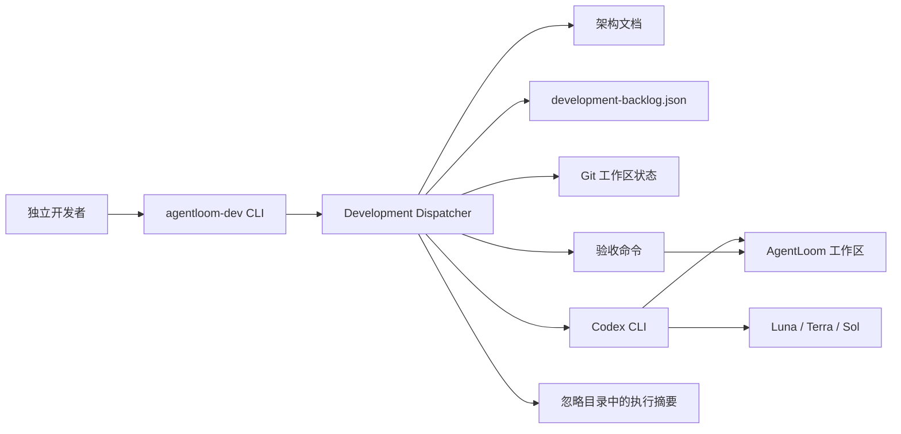
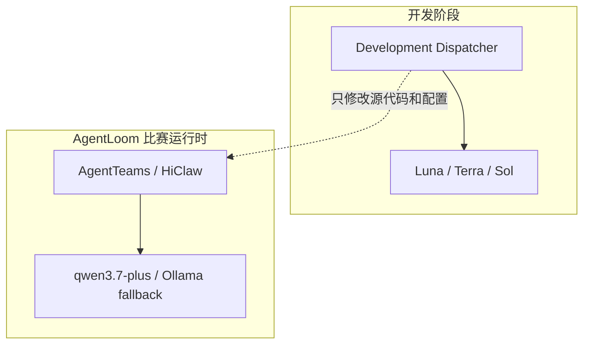
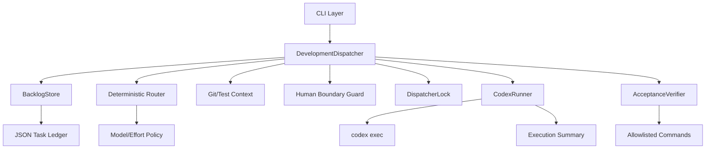
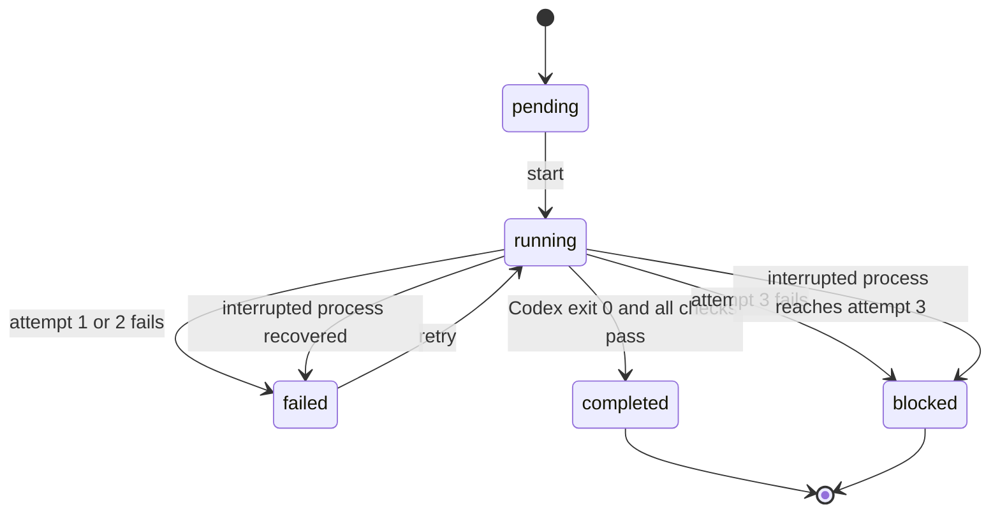
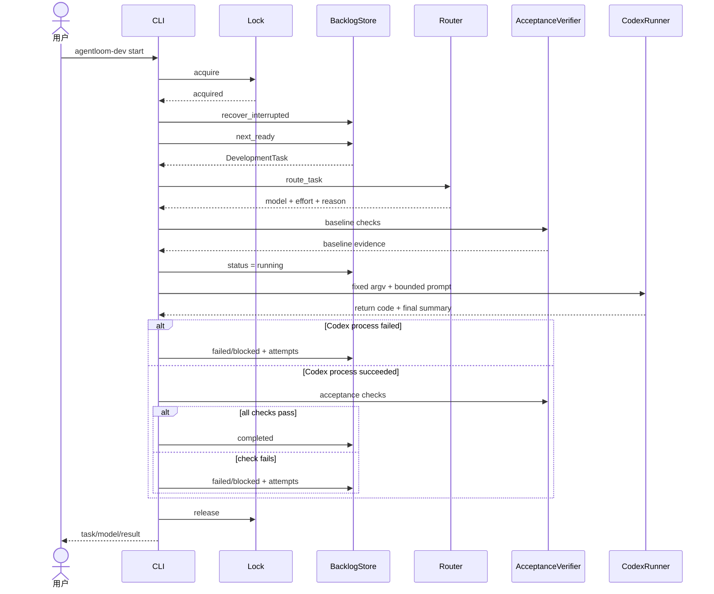

# AgentLoom Development Dispatcher 轻量版架构设计

> 文档状态：Draft for review
> 目标版本：V0.1 轻量版
> 更新日期：2026-07-31
> 代码位置：`src/agentloom/dev_dispatcher/`
> 权威任务账本：`docs/development-backlog.json`

## 1. 文档目的

本文定义 AgentLoom Development Dispatcher 轻量版的产品边界、总体架构、模块职责、数据契约、路由规则、安全边界、失败恢复、测试策略和后续实施顺序。

本文只描述**开发阶段自动调度器**。它帮助独立开发者使用 Codex 完成 AgentLoom 的代码任务，不属于 AgentLoom 比赛 Demo 的产品运行时，不替代 AgentTeams Manager/Worker，不参与 `qwen3.7-plus` 或 Ollama 的运行时模型路由。

## 2. 背景与问题

独立开发者通常不知道每个阶段应做什么、应该选择哪个模型、何时提高推理强度，也容易遗漏测试、失败恢复和人工审批边界。完全手工管理存在以下问题：

- 任务顺序依赖个人记忆，跨会话容易丢失；
- 所有任务使用最高成本模型，额度浪费；
- 低成本模型误接高风险任务，返工或安全风险增加；
- 模型执行后缺少统一验收，结果可能“看似完成、实际失败”；
- 进程中断后任务状态和锁可能残留；
- 自动执行若没有边界，可能触发推送、发布、付款、密钥访问或破坏性操作。

轻量版以“一个命令、一个有界任务、确定性验收”为核心，先解决独立开发阶段的可用性和成本问题。

## 3. 目标用户与使用场景

### 3.1 目标用户

当前唯一目标用户：AgentLoom 独立开发者，使用 Windows、Git、Python 3.12 和已登录的 Codex CLI。

### 3.2 核心场景

1. 用户执行 `agentloom-dev plan`，查看下一任务、模型和推理强度；
2. 用户执行 `agentloom-dev start`，Dispatcher 自动读取上下文并执行一个任务；
3. Dispatcher 在执行前采集 Git 和测试基线；
4. Dispatcher 调用指定 Codex 模型修改代码；
5. Dispatcher 运行固定验收命令，更新任务状态；
6. 失败后按次数升级模型，最多三次；
7. 涉及人工边界时停止，不调用模型。

## 4. 目标与非目标

### 4.1 V0.1 目标

- 自动选择下一个依赖已满足的任务；
- 自动选择 Luna、Terra、Sol 和对应推理强度；
- 自动读取架构文档、任务、Git 状态和测试基线；
- 串行调用 `codex exec`，同一仓库不并发写入；
- 使用白名单命令验证结果；
- 原子保存任务状态；
- 处理中断、失败、升级和最终阻断；
- 对凭证、付款、发布、外部写入、不可逆和破坏性任务强制人工处理；
- 默认一次执行一个任务，单次最多三个；
- 不保存密钥，不自动提交、不推送、不发布、不部署。

### 4.2 V0.1 非目标

- 不兼容任意模型和 Provider；
- 不自动评测未知模型能力；
- 不提供 Web UI、多用户、RBAC 或远程队列；
- 不提供云端 SaaS；
- 不自动创建任务或改写任务目标；
- 不解析整个架构文档生成路线图；
- 不替代 GitHub Actions；
- 不保证恶意模型无法修改仓库内任意文件；
- 不自动提交、推送、开 PR、发布或部署；
- 不负责 AgentLoom 产品运行时模型调用。

通用模型注册、能力评测、Provider Adapter、临时 worktree/容器隔离和多人协作保留到完整版。

## 5. 成功标准

V0.1 达到以下条件才算完成：

- `plan` 对当前账本稳定选择 `DEV-001` 和 `gpt-5.6-sol/high`；
- 依赖未完成的任务不能提前执行；
- Luna 一次失败后使用 Terra；Terra 累计两次失败后使用 Sol；
- 第三次失败后状态变为 `blocked`；
- 并发启动第二个 Dispatcher 时被锁拒绝；
- 进程异常结束后，下次启动能恢复旧锁和 `running` 任务；
- 非白名单验收命令不能执行；
- 高风险人工标签不能进入 Codex；
- Codex 使用 `shell=False` 和固定参数数组启动；
- 全量 `pytest`、Ruff、mypy、`git diff --check` 通过；
- README 能让用户在清洁环境完成安装、计划、启动、查看状态。

## 6. 约束与假设

### 6.1 环境约束

- Python：`>=3.12,<3.13`；
- 操作系统：当前以 Windows PowerShell 为主；
- 仓库：必须位于 Git 工作区；
- 执行器：本机 `codex` 命令已安装并登录；
- 模型：账户可访问 `gpt-5.6-luna`、`gpt-5.6-terra`、`gpt-5.6-sol`；
- 包管理：使用现有 `pyproject.toml` 和 `.venv`；
- 状态存储：单个 JSON 文件，不增加数据库；
- 并发：单仓库单进程。

### 6.2 信任假设

- 仓库、架构文档、任务账本和模型输出都按不可信输入处理；
- 用户负责保护 Codex 登录凭证和主机环境；
- V0.1 的 `workspace-write` 沙箱允许模型写仓库，尚不是强文件级隔离；
- 验收命令来自版本控制中的账本，但执行前仍经过白名单检查；
- Git Diff 和测试是完成证据，不以模型最终文字结论作为完成依据。

## 7. 技术栈

| 技术 | 用途 | 选择理由 |
| --- | --- | --- |
| Python 3.12 | Dispatcher 实现 | 与 AgentLoom 主项目一致，降低维护成本 |
| Pydantic 2 | 任务和路由契约 | 严格字段、枚举、额外字段拒绝 |
| Typer | CLI | 已有依赖，命令定义简洁 |
| Rich | 状态输出 | 已有依赖，终端表格可读 |
| JSON | 任务账本 | 标准库支持、可审查、无需新增 YAML 依赖 |
| `subprocess` | Codex、Git、测试执行 | 固定 argv、`shell=False`，边界明确 |
| Git | 工作区和 Diff 基线 | 开发过程已有权威变更记录 |
| pytest | 单元与集成测试 | 项目现有测试框架 |
| Ruff | 格式和静态规则 | 项目现有质量门禁 |
| mypy | 严格类型检查 | 项目已启用 strict 模式 |

V0.1 不增加 Redis、PostgreSQL、消息队列、Web 框架或新的模型 SDK。

## 8. 系统上下文



### 8.1 与 AgentLoom 产品运行时的边界



两套路由不得共用配置概念。开发模型变化不改变 Demo 运行模型；运行时 Provider 变化也不改变 Dispatcher 选模。

## 9. 总体架构



设计原则：

1. **确定性优先**：安全覆盖和模型升级由代码决定，不让模型自行选模型；
2. **账本权威**：任务状态只由 Dispatcher 原子更新；
3. **证据优先**：测试退出码决定成功，不采信模型自述；
4. **默认有界**：一次一任务，失败即停，最大三任务；
5. **最小依赖**：复用项目依赖和标准库；
6. **失败关闭**：无法验证、命令不安全、人工边界触发时不继续。

## 10. 核心模块设计

### 10.1 `models.py`：边界契约

职责：定义任务、账本、路由和执行结果的严格 Pydantic 模型。

主要类型：

- `DevelopmentTask`：任务目标、依赖、风险、验收、状态和失败次数；
- `DevelopmentBacklog`：`schema_version=1` 与任务集合；
- `RouteDecision`：模型、推理强度、选择理由；
- `ExecutionResult`：退出码、最终摘要、摘要文件路径。

关键约束：

- 拒绝未知字段；
- 任务 ID 只允许大写字母、数字、下划线和连字符；
- `attempts` 范围为 0–3；
- 模型 ID 和推理强度使用枚举；
- 风险标签统一转小写。

### 10.2 `backlog.py`：任务账本

职责：读取、验证、选择和原子更新 JSON 账本。

选择规则：

1. 状态为 `pending` 或 `failed`；
2. 尝试次数小于 3；
3. 所有依赖状态为 `completed`；
4. 按 `priority` 升序，再按任务 ID 排序。

一致性规则：

- 任务 ID 不得重复；
- 依赖必须存在；
- 任务不得依赖自身；
- 先写 `.tmp` 文件，再用 `os.replace` 原子替换；
- 中断遗留的 `running` 任务下次启动时转为 `failed` 或 `blocked`，并增加一次尝试。

### 10.3 `router.py`：确定性路由

职责：根据任务类型、风险和失败次数选择开发模型。

| 条件 | 模型 | 推理强度 |
| --- | --- | --- |
| 机械任务，未失败 | `gpt-5.6-luna` | `low` |
| 普通实现，或 Luna 一次失败 | `gpt-5.6-terra` | `medium` |
| 架构、审查、两次失败 | `gpt-5.6-sol` | `high` |
| 命中高风险覆盖标签 | `gpt-5.6-sol` | `high` |

高风险覆盖标签包括架构、授权、比赛合规、身份、迁移、安全和供应链等。路由器只决定模型能力层，不代表自动批准操作。

### 10.4 `dispatcher.py`：编排器

职责：串联锁、任务、路由、上下文、执行、验收和状态更新。

执行顺序：

1. 获取仓库锁；
2. 恢复中断任务；
3. 选择下一就绪任务；
4. 检查人工边界和验收命令；
5. 读取 Git 状态；
6. 执行验收命令，形成测试基线；
7. 构造受约束提示词；
8. 将任务标记为 `running`；
9. 调用 Codex；
10. 再次执行验收命令；
11. 成功则标记 `completed`；
12. 失败则增加尝试，标记 `failed` 或 `blocked`；
13. 释放锁。

### 10.5 `codex_runner.py`：Codex 进程适配器

职责：构造固定 Codex 参数并执行子进程。

命令等价形式：

```powershell
codex exec `
  -m <allowlisted-model> `
  -c model_reasoning_effort=<allowlisted-effort> `
  -C <repository> `
  --sandbox workspace-write `
  -o <ignored-output-file> `
  <bounded-prompt>
```

安全约束：

- 参数使用列表，不拼接 Shell 字符串；
- `shell=False`；
- 不使用 `--dangerously-bypass-approvals-and-sandbox`；
- 不使用 `--skip-git-repo-check`；
- 工作区必须位于 Git 仓库；
- 单次超时 3600 秒；
- 新执行前删除同名旧摘要，避免读取陈旧结果。

### 10.6 `verifier.py`：验收执行器

职责：解析白名单命令，以退出码形成验收结果。

当前允许：

- `python -m pytest ...`；
- `python -m ruff check ...`；
- `python -m mypy ...`；
- `git diff --check`；
- `git status --short`。

拒绝：

- `;`、`&`、`|`、重定向、反引号和换行；
- PowerShell、CMD、Bash；
- `git push`、`git commit`；
- Docker 启停、部署和任意脚本；
- 不在前缀白名单中的程序。

Python 命令使用当前虚拟环境的 `sys.executable`。单条命令超时 900 秒。每条输出最多保留末尾 4000 字符。

### 10.7 `lock.py`：单进程锁

职责：防止两个 Dispatcher 同时修改仓库。

- 锁文件：`.git/agentloom-dispatcher.lock`；
- 使用 `O_CREAT | O_EXCL` 原子创建；
- 锁内保存 PID；
- Windows 使用只读 `tasklist` 查询进程；
- POSIX 使用信号 0 检查进程；
- PID 不存在时替换旧锁；
- 上下文退出时删除自身持有的锁。

### 10.8 `cli.py`：用户入口

| 命令 | 行为 | 是否修改仓库 |
| --- | --- | --- |
| `agentloom-dev plan` | 显示下一任务和路由 | 否 |
| `agentloom-dev status` | 显示账本状态 | 否 |
| `agentloom-dev start` | 执行一个任务 | 是 |
| `agentloom-dev start --max-tasks 2` | 最多连续执行两个任务 | 是 |

`--max-tasks` 范围固定为 1–3。任一任务失败时立即停止，不继续消费额度。

## 11. 数据模型

### 11.1 任务结构

```json
{
  "id": "DEV-001",
  "title": "Expose Policy Broker through MCP",
  "objective": "Implement a minimal MCP server...",
  "kind": "implementation",
  "priority": 10,
  "dependencies": [],
  "risk_tags": ["authorization", "security"],
  "acceptance_commands": ["python -m pytest ..."],
  "allowed_paths": ["src/agentloom/", "tests/"],
  "status": "pending",
  "attempts": 0,
  "last_error": null,
  "selected_model": null,
  "reasoning_effort": null
}
```

### 11.2 状态机



V0.1 不支持从 `completed` 自动重开，也不提供 `blocked` 自动解除。人工检查后必须显式修改或新增任务。

## 12. 提示词与上下文设计

Dispatcher 只注入完成当前任务所需的最小上下文：

- 权威架构文档绝对路径；
- 任务 ID、标题、目标；
- 允许路径；
- Dispatcher 持有的验收命令；
- 执行前 Git 状态；
- 执行前测试基线末尾摘要；
- 禁止提交、推送、发布、部署、密钥访问、付款和破坏性操作。

架构与任务文本明确标记为不可信项目数据。若其中包含与安全约束冲突的指令，Codex 应忽略冲突内容。

提示词不包含：

- 环境变量完整内容；
- API Key、Token 或登录信息；
- 用户主目录文件；
- 整个仓库内容；
- 其他任务的执行摘要。

## 13. 安全架构

### 13.1 人工停止线

以下标签直接抛出 `HumanActionRequired`，不调用 Codex：

- `credentials`；
- `payment`；
- `publication`；
- `external-write`；
- `destructive`；
- `irreversible`。

架构、安全、授权和供应链任务可以由 Sol 分析并修改本地代码，但不能因此越过上述操作边界。

### 13.2 已实现控制

- Pydantic 严格数据契约；
- 模型和推理强度白名单；
- 固定 Codex argv；
- `shell=False`；
- Codex `workspace-write` 沙箱；
- 验收命令前缀白名单与元字符拒绝；
- Git 仓库检查；
- 单实例锁；
- 有界任务数、重试和超时；
- 摘要写入 Git 忽略目录；
- 提示词禁止外部副作用。

### 13.3 当前缺口

`allowed_paths` 当前只进入提示词，尚未在文件系统或执行后 Diff 中强制执行。Codex 的 `workspace-write` 仍可修改仓库内其他文件。因此 V0.1 只能在合成数据、无生产密钥、可审查 Git 仓库中使用。

轻量版下一安全增量：执行前保存工作树文件指纹，执行后计算新增 Diff；发现模型修改未授权路径时将任务标记失败并要求人工审查。真正强隔离留给完整版临时 worktree 或容器方案。

### 13.4 威胁与缓解

| 威胁 | 当前缓解 | 剩余风险 |
| --- | --- | --- |
| 任务账本注入 Shell | 白名单、元字符拒绝、`shell=False` | 白名单工具自身参数仍需持续审查 |
| 文档提示注入 | 标记不可信、固定安全指令 | 模型仍可能不遵守提示词 |
| 模型修改越界文件 | Git 状态、提示词 allowed paths | 尚无强制路径隔离 |
| 并发修改冲突 | PID 锁 | PID 重用极端情况仍存在 |
| 中断留下 running | 启动时恢复并计失败 | 中断时产生的代码 Diff 保留待审查 |
| 旧摘要误判 | 每次运行前删除旧摘要 | 磁盘 I/O 错误会导致任务失败 |
| 无限费用 | 默认一任务、最多三任务、三次阻断 | 尚无 Token/金额硬预算 |
| 密钥泄露 | 不采集环境变量、输出忽略 | 模型仍可读取工作区内误提交密钥 |

## 14. 执行时序



## 15. 失败、升级与恢复

### 15.1 失败分类

- Codex 非零退出；
- Codex 超时或无法启动；
- 验收命令非零退出；
- 验收命令非法；
- 账本或架构缺失；
- Dispatcher 进程中断；
- 达到三次尝试上限。

### 15.2 升级策略

- Luna 首次失败：下次使用 Terra；
- Terra 累计两次失败：下次使用 Sol；
- Sol 或任意任务累计第三次失败：`blocked`；
- 高风险任务从首次执行即使用 Sol；
- 模型不可用按一次失败处理，不静默冒充成功。

### 15.3 恢复语义

- 账本写入使用原子替换，避免半写 JSON；
- 旧 PID 不存在时锁可自动恢复；
- 遗留 `running` 视为一次失败；
- 中断产生的 Git 变更不自动删除，防止误删用户原有修改；
- 用户先检查 Diff，再决定继续、修正或重置任务。

## 16. 项目结构

```text
Agent-Infra/
├── docs/
│   ├── architecture/
│   │   ├── agentloom-architecture.md
│   │   └── development-dispatcher-architecture.md
│   └── development-backlog.json
├── src/agentloom/dev_dispatcher/
│   ├── __init__.py
│   ├── models.py
│   ├── backlog.py
│   ├── router.py
│   ├── dispatcher.py
│   ├── codex_runner.py
│   ├── verifier.py
│   ├── lock.py
│   └── cli.py
├── tests/dev_dispatcher/
│   ├── test_router.py
│   ├── test_backlog.py
│   ├── test_codex_runner.py
│   ├── test_dispatcher.py
│   └── test_lock.py
├── artifacts/dev-dispatcher/       # Git ignored
├── pyproject.toml
└── README.md
```

## 17. 命令与运维

### 17.1 安装

```powershell
cd D:\Projects\Agent-Infra
.venv\Scripts\python -m pip install -e ".[dev]"
```

### 17.2 使用

```powershell
# 只查看计划，不修改仓库
.venv\Scripts\agentloom-dev plan

# 执行一个任务
.venv\Scripts\agentloom-dev start

# 显式执行最多两个任务
.venv\Scripts\agentloom-dev start --max-tasks 2

# 查看状态
.venv\Scripts\agentloom-dev status
```

### 17.3 质量门禁

```powershell
.venv\Scripts\python -m pytest
.venv\Scripts\python -m ruff check .
.venv\Scripts\python -m mypy src tests
git diff --check
```

## 18. 可观测性与审计

V0.1 保存最小证据：

- 账本中的任务状态、尝试次数、所选模型、推理强度和末次错误；
- CLI 中的路由理由和最终结果；
- `artifacts/dev-dispatcher/<TASK-ID>.txt` 中的 Codex 最终摘要；
- Git Diff；
- 验收命令输出和退出码。

限制：当前没有结构化 JSONL 事件、Token 数、金额、耗时指标或跨任务报表。执行摘要会被同任务下一次运行覆盖。账本不是不可篡改审计日志。

## 19. 测试策略

### 19.1 单元测试

- 路由矩阵和升级规则；
- 任务依赖选择；
- JSON 原子保存；
- 未知依赖和重复任务拒绝；
- Codex argv 与危险参数拒绝；
- 验收命令白名单和元字符拒绝；
- 人工边界；
- 并发锁与旧锁恢复；
- `running` 任务恢复。

### 19.2 集成测试

- 使用 fake process runner 验证 Codex 和测试进程边界；
- 临时 Git 仓库验证固定工作目录；
- CLI `plan/status` smoke test；
- 真实 Codex 执行只作为显式手工测试，不进入默认 CI，避免消耗额度。

### 19.3 测试原则

- 不使用真实密钥；
- 不访问外部网络；
- 不调用付费模型作为单元测试；
- 不执行危险命令；
- Windows 与 POSIX 进程检查分别测试；
- 所有失败路径必须证明账本不会误标 `completed`。

## 20. 当前实施状态

| 能力 | 状态 | 说明 |
| --- | --- | --- |
| 严格任务契约 | 已实现 | Pydantic，extra forbid |
| JSON 账本与依赖选择 | 已实现 | 原子替换 |
| Luna/Terra/Sol 路由 | 已实现 | 确定性规则 |
| 人工停止线 | 已实现 | 六类强制停止标签 |
| Codex 固定 argv | 已实现 | workspace-write，shell=False |
| 验收白名单 | 已实现 | pytest/Ruff/mypy/Git check |
| 单实例锁 | 已实现 | Windows/POSIX 处理 |
| 中断恢复 | 已实现 | running 计失败 |
| CLI plan/start/status | 已实现 | 默认一个任务 |
| Git/Test 基线 | 已实现 | 摘要进入提示词 |
| 强制 allowed_paths | 未实现 | 当前仅提示词约束 |
| 结构化执行历史 | 未实现 | 当前只有覆盖式摘要 |
| Token/金额硬预算 | 未实现 | 依靠任务数限制 |
| 完整 CLI 集成测试 | 部分实现 | 核心组件已有测试 |
| 清洁环境真实 Codex smoke | 未验证 | 需要显式消耗模型额度 |

## 21. 轻量版剩余工作

按风险和依赖排序：

### P0：安全与正确性

1. 执行后校验实际修改路径；
2. 记录执行前后 Git 文件集合和 Diff 摘要；
3. CLI 捕获账本损坏、Codex 缺失和锁冲突，输出用户可读错误；
4. 为 `start` 增加 fake Codex 端到端测试；
5. 明确 `blocked` 任务人工恢复命令，避免手改 JSON。

### P1：可用性

1. 增加 `agentloom-dev retry <TASK-ID>`；
2. 增加 `agentloom-dev show <TASK-ID>`；
3. 输出执行耗时和验收摘要；
4. 增加 `--dry-run` 或保持 `plan` 作为唯一预演入口；
5. README 增加常见错误处理。

### P2：交付

1. Windows 清洁环境安装测试；
2. 一次显式真实 Codex smoke；
3. GitHub Actions 运行 pytest、Ruff、mypy；
4. 固化 V0.1 版本和变更日志；
5. 提供一个无密钥示例账本。

## 22. ADR 摘要

### ADR-DD-001：V0.1 固定使用 Codex CLI 和三模型

- **状态**：Accepted
- **背景**：当前目标是辅助 AgentLoom 独立开发，不是构建通用路由平台。
- **决定**：固定 Luna、Terra、Sol，使用 Codex 登录态，不开发 Provider Adapter。
- **原因**：最小代码、最快验证、无需管理额外 API Key。
- **代价**：模型可用性和账户能力成为运行前提；以后通用化需要迁移数据契约。

### ADR-DD-002：使用 JSON 文件作为任务账本

- **状态**：Accepted
- **替代**：SQLite、YAML、远程数据库。
- **决定**：V0.1 使用版本化 JSON 和原子替换。
- **原因**：单用户、单进程、任务量小；标准库可完成；易审查。
- **代价**：不适合多人并发、复杂查询或不可篡改审计。

### ADR-DD-003：确定性路由优先于 LLM 分类器

- **状态**：Accepted
- **替代**：让模型自选模型；本地 Qwen 分类；学习型路由。
- **决定**：任务类型、风险标签和失败次数决定路由。
- **原因**：可解释、可测试、零额外调用费用、安全覆盖稳定。
- **代价**：依赖任务标签质量，不能自动理解所有任务复杂度。

### ADR-DD-004：默认一次执行一个任务

- **状态**：Accepted
- **决定**：默认 `max_tasks=1`，显式上限为 3。
- **原因**：控制费用和变更范围；失败后立即让用户检查。
- **代价**：自动化程度低于无限循环，但更适合当前独立开发阶段。

### ADR-DD-005：不自动回滚中断产生的代码

- **状态**：Accepted
- **替代**：异常时执行 `git checkout` 或清理文件。
- **决定**：保留工作树，任务记失败，用户检查 Diff。
- **原因**：仓库可能已有用户未提交修改，自动回滚可能造成数据丢失。
- **代价**：下次重试前可能需要人工整理工作树。

## 23. 向完整版迁移

完整版启动条件：轻量版真实使用至少 10 个代表性任务，并获得路由成功率、返工率、费用和失败原因数据。

未来迁移保持以下稳定概念：

- `DevelopmentTask`；
- 任务依赖和状态机；
- `RouteDecision`；
- `Runner` 边界；
- `AcceptanceVerifier`；
- 人工停止线；
- 执行证据。

未来替换点：

- `ModelId Literal` 替换为 `ModelRegistry` 引用；
- 固定路由替换为能力画像和基准分数；
- `CodexRunner` 替换为多 Provider Runner；
- JSON 账本可迁移到 SQLite/PostgreSQL；
- 当前工作树执行迁移到临时 worktree 或容器；
- CLI 可增加 TUI/Web，但编排核心保持无 UI 依赖。

完整版不应通过在 V0.1 中预埋大量抽象实现。先用真实任务证明需要，再提取接口。

## 24. 风险与缓解

| 风险 | 影响 | 缓解 |
| --- | --- | --- |
| 模型 ID 不可用 | 任务无法启动 | `plan` 前检查；明确报错；人工改路由策略 |
| 风险标签漏标 | 高风险任务进入低层模型 | 安全关键词覆盖；账本审查；关键任务默认 Sol |
| allowed_paths 不强制 | 越界修改文件 | 当前只用于可信本地仓库；P0 增加 Diff 路径校验 |
| 基线测试耗时 | 每任务执行两遍检查 | 只保留任务相关测试；完整门禁放任务末尾 |
| 测试本身有副作用 | 污染环境 | 只允许项目内确定性测试命令；禁止任意脚本 |
| 三次失败污染工作树 | 重试上下文混乱 | 每次失败停止；用户检查 Diff；未来 worktree 隔离 |
| 账本手工修改错误 | Dispatcher 无法启动 | Pydantic 拒绝；提供清晰错误；未来增加管理命令 |
| 无金额硬限制 | 额度超支 | 默认一任务、上限三任务；运行前展示模型 |
| 文档与代码漂移 | 错误预期 | 变更 Dispatcher 行为时同时更新本文和测试 |

## 25. 维护规则

- 路由规则改变：更新第 10.3 节、测试和 ADR；
- 任务 Schema 改变：提升 `schema_version`，提供迁移说明；
- 新增验收命令：先写安全测试，再加入白名单；
- 新增人工标签：同步提示词、测试和安全章节；
- 改变默认任务数或重试上限：必须记录成本和安全理由；
- 不删除旧 ADR；决定变化时新增 superseding ADR；
- 每完成 10 个代表性任务，复盘路由成功率、升级率和返工率。

## 26. 评审清单

- [ ] 产品范围只覆盖轻量开发 Dispatcher；
- [ ] 开发路由与 AgentLoom 运行时路由明确分离；
- [ ] 已实现与计划能力没有混写；
- [ ] 数据模型、状态机、执行时序和失败恢复与代码一致；
- [ ] 安全停止线和命令白名单完整；
- [ ] `allowed_paths` 非强制限制已明确披露；
- [ ] 所有命令可直接复制执行；
- [ ] 完整版功能只作为迁移方向，不进入 V0.1 范围；
- [ ] README 链接到本文；
- [ ] pytest、Ruff、mypy、`git diff --check` 通过。
